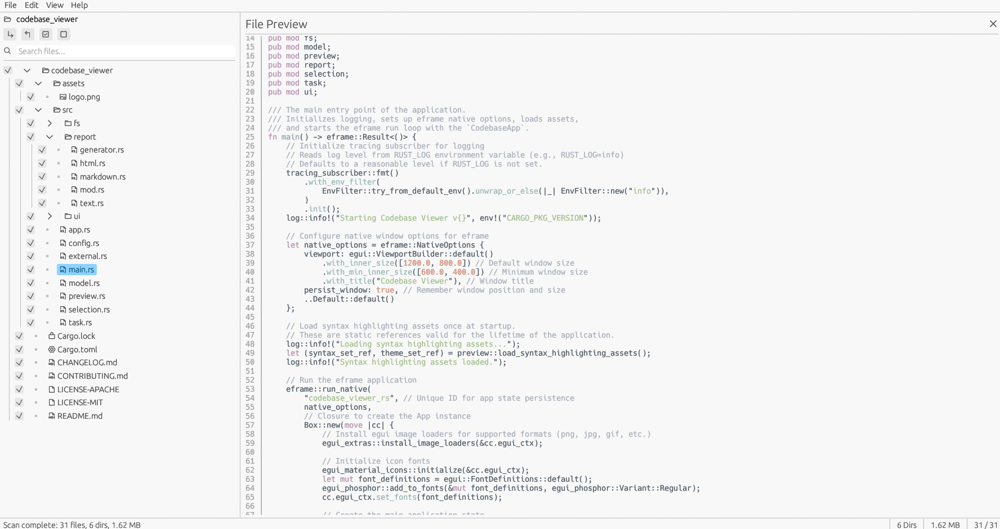
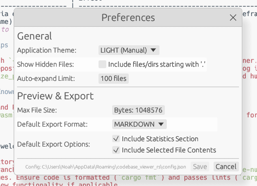
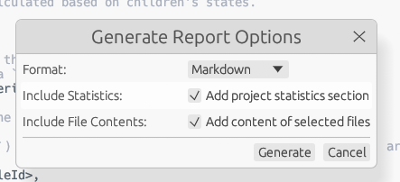

# Codebase Viewer

[](https://github.com/noahbclarkson/codebase_viewer/actions/workflows/ci.yml)

Codebase Viewer is a cross-platform desktop application—written entirely in Rust—that lets you **scan, explore, and document large codebases** with millisecond-level responsiveness.
The UI is built with [egui](https://github.com/emilk/egui) via *eframe*, giving you a native-feeling window on Windows, macOS, Linux, and the web (web support experimental).

## ✨ Key Features

| Capability                           | Details                                                                                                                                                                     |
| ------------------------------------ | --------------------------------------------------------------------------------------------------------------------------------------------------------------------------- |
| **Blazing-fast scans**               | Parallel directory walking powered by the **ignore** crate’s `WalkBuilder`, which respects `.gitignore`, global Git excludes, hidden-file masks, and uses multiple threads. |
| **Live tree UI**                     | Immediate-mode GUI rendered by egui/eframe; every file appears as soon as it’s discovered, even while the scan is still running. File icons based on type.                  |
| **Selective exports**                | Keep the *full* directory context but choose exactly which files’ contents go into HTML, Markdown, or plain-text reports—ideal for LLM ingestion or documentation.          |
| **Syntax-highlighted preview**       | On-the-fly colouring courtesy of **syntect**, using Sublime-Text grammars. Supports common text file types.                                                                 |
| **Image preview**                    | Preview common image formats (PNG, JPG, GIF, BMP, ICO, TIFF) directly within the app.                                                                                       |
| **SVG preview**                      | Preview Scalable Vector Graphics (.svg) files using the **resvg** crate.                                                                                                    |
| **Native dialogs & theme awareness** | File/dir pickers via **rfd** and automatic light/dark detection via **dark-light**.                                                                                         |
| **Cross-thread messaging**           | Non-blocking updates sent through **crossbeam-channel** for MPMC performance, keeping the UI responsive during scans and report generation.                                 |
| **Human-readable sizes**             | Byte counts formatted with **humansize**.                                                                                                                                   |
| **Config persistence**               | Settings stored in the OS-native config directory obtained with **dirs-next**.                                                                                              |
| **Selection persistence**            | Save and load the checked state of files/directories to a JSON file.                                                                                                        |

## 🚀 Quick Start

```bash
# 1. Clone and build in release mode
git clone https://github.com/noahbclarkson/codebase_viewer.git
cd codebase_viewer
cargo run --release

# 2. Open a project
File ▸ Open Directory …   # or use the recent-projects list

# 3. Explore & select
– Navigate the tree using mouse or keyboard
– Use the search bar (Ctrl+F) to filter
– Tick files/dirs you want included in reports/exports

# 4. Generate documentation
File ▸ Generate Report …
Choose Markdown / HTML / Text, select options, and hit **Generate**
```

> **System requirements**: Any modern OS with Rust 1.77+ installed. The app utilizes multiple threads for scanning via **Rayon** and **ignore**.

## 🔧 Configuration

A JSON config (`config.json`) is auto-saved to the standard user configuration directory:

* **Linux:** `$HOME/.config/codebase_viewer/`
* **Windows:** `%APPDATA%\codebase_viewer\`
* **macOS:** `~/Library/Application Support/codebase_viewer/`

Key fields:

| Key                       | Purpose                                                             | Default          |
| ------------------------- | ------------------------------------------------------------------- | ---------------- |
| `theme`                   | UI theme: `"light"`, `"dark"`, or `"system"`                        | `"system"`       |
| `show_hidden_files`       | Whether the scanner should include hidden files/directories         | `false`          |
| `auto_expand_limit`       | Auto-expand dirs whose total file count ≤ this value after scan     | `100`            |
| `max_file_size_preview`   | Size threshold (bytes) before preview/export refuses to read a file | `1048576` (1MiB) |
| `export_format`           | Default format for reports: `"markdown"`, `"html"`, `"text"`        | `"markdown"`     |
| `export_include_stats`    | Default setting for including stats in reports                      | `true`           |
| `export_include_contents` | Default setting for including file contents in reports              | `true`           |
| `recent_projects`         | List of recently opened directory paths (up to 10)                  | `[]`             |

## 🏗️ Architecture Overview

```text
src/
├── app.rs        # Top-level eframe::App state and logic orchestrator
├── config.rs     # Handles loading/saving AppConfig (serde + dirs-next)
├── external.rs   # Utility for opening paths in external apps (open crate)
├── fs/           # File system operations
│   ├── file_info.rs # Metadata struct for files/dirs
│   ├── scanner.rs   # Background directory scanner (ignore crate)
│   └── stats.rs     # Statistics collection during scan (ScanStats)
├── model.rs      # Core data structures (FileNode, FileId, Check state)
├── preview.rs    # Content preview generation (syntect, image crate)
├── report/       # Report generation logic
│   ├── generator.rs # Core report data collection and dispatch
│   ├── html.rs      # HTML report formatter
│   ├── markdown.rs  # Markdown report formatter
│   └── text.rs      # Plain text report formatter
├── selection.rs  # Saving/loading tree selection state to JSON
├── task.rs       # Enums for background task messages (ScanMessage, TaskMessage)
└── ui/           # egui UI modules
    ├── dialogs.rs     # Preferences, Report Options, About, Shortcuts windows
    ├── menu_bar.rs    # Top menu bar drawing logic
    ├── preview_panel.rs # Right panel for file content preview
    ├── status_bar.rs  # Bottom status bar drawing logic
    └── tree_panel.rs  # Left panel with file tree view and search
```

* Long-running tasks (directory scanning, report generation) happen in background threads (`std::thread`, `rayon`).
* UI updates are driven by messages received via `crossbeam-channel`, ensuring the GUI remains responsive (target 60 fps).
* Directory scanning respects `.gitignore` and other standard ignore files via the `ignore` crate.
* Reports include the full directory structure for context, followed by the selected subtree and optionally file contents.

## 🖼️ Screenshots



---



---



## 🛠️ Development

```bash
# Format code
cargo fmt --all

# Lint code (strict)
cargo clippy --all-targets --all-features -- -D warnings

# Run tests
cargo test --all-features

# Run in debug mode (with hot-reload where applicable)
cargo run

# Run optimized release build
cargo run --release
```

### Performance tips

* Always build with `--release` for optimal performance, especially for the scanner.
* On very large repositories, uncheck "Include file contents" in the report dialog if you only need the structure and stats.
* The `max_file_size_preview` setting in Preferences can prevent attempts to load huge files into the preview panel.

## Limitations / Known Issues

* Previewing PDF files is not currently supported.
* Web assembly (`wasm`) builds may work but are not actively tested or supported for v0.1.0.

## 🤝 Contributing

Contributions are welcome! Please follow these steps:

1. Fork the repository.
2. Create a new branch (`git checkout -b feature/my-new-feature` or `bugfix/issue-number`).
3. Make your changes. Ensure code is formatted (`cargo fmt`) and passes lints (`cargo clippy -- -D warnings`).
4. Add tests for new functionality if applicable.
5. Commit your changes with descriptive messages.
6. Push to your branch (`git push origin feature/my-new-feature`).
7. Open a Pull Request against the `main` branch of the original repository. Explain the purpose and scope of your changes.

Please also refer to [CONTRIBUTING.md](CONTRIBUTING.md) for more detailed guidelines.

## 📜 License

This project is dual-licensed under either the MIT License or the Apache License, Version 2.0, at your option. See the [LICENSE-MIT](LICENSE-MIT) and [LICENSE-APACHE](LICENSE-APACHE) files for details.

---

*This project demonstrates building a responsive, native-feeling desktop application using the Rust GUI ecosystem, primarily egui/eframe.*
