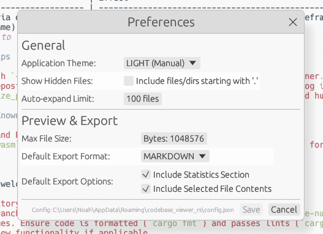
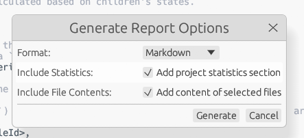

# codebase_viewer - Codebase Overview

Generated on: 2025-04-25 18:35:38
Root Path: `C:\Users\Noah\Coding\codebase_viewer`

---

## Project Statistics (Full Scan)

- **Total Files:** 34
- **Total Dirs:** 7
- **Total Size:** 2.14 MB

**File Types (Count):**

- `.rs`: 23
- `.png`: 4
- `.md`: 3
- `(no extension)`: 2
- `.lock`: 1
- `.toml`: 1

**Largest Files:**

- `assets\logo.png` (1.22 MB)
- `screenshots\main_window.png` (411.69 kB)
- `Cargo.lock` (129.06 kB)
- `screenshots\preferences_dialog.png` (78.62 kB)
- `src\app.rs` (65.87 kB)
- `screenshots\report_options_dialog.png` (32.35 kB)
- `src\preview.rs` (20.99 kB)
- `src\ui\dialogs.rs` (20.10 kB)
- `src\ui\tree_panel.rs` (18.67 kB)
- `src\ui\menu_bar.rs` (17.25 kB)
---

## Full Directory Structure

```text
codebase_viewer
├── assets
│   └── logo.png
├── screenshots
│   ├── main_window.png
│   ├── preferences_dialog.png
│   └── report_options_dialog.png
├── src
│   ├── fs
│   │   ├── file_info.rs
│   │   ├── mod.rs
│   │   ├── scanner.rs
│   │   └── stats.rs
│   ├── report
│   │   ├── generator.rs
│   │   ├── html.rs
│   │   ├── markdown.rs
│   │   ├── mod.rs
│   │   └── text.rs
│   ├── ui
│   │   ├── dialogs.rs
│   │   ├── menu_bar.rs
│   │   ├── mod.rs
│   │   ├── preview_panel.rs
│   │   ├── status_bar.rs
│   │   └── tree_panel.rs
│   ├── app.rs
│   ├── config.rs
│   ├── external.rs
│   ├── main.rs
│   ├── model.rs
│   ├── preview.rs
│   ├── selection.rs
│   └── task.rs
├── Cargo.lock
├── Cargo.toml
├── CHANGELOG.md
├── CONTRIBUTING.md
├── LICENSE-APACHE
├── LICENSE-MIT
└── README.md
```

---

## Selected Directory Structure

```text
codebase_viewer
├── assets
│   └── logo.png
├── screenshots
│   ├── main_window.png
│   ├── preferences_dialog.png
│   └── report_options_dialog.png
├── src
│   ├── fs
│   │   ├── file_info.rs
│   │   ├── mod.rs
│   │   ├── scanner.rs
│   │   └── stats.rs
│   ├── report
│   │   ├── generator.rs
│   │   ├── html.rs
│   │   ├── markdown.rs
│   │   ├── mod.rs
│   │   └── text.rs
│   ├── ui
│   │   ├── dialogs.rs
│   │   ├── menu_bar.rs
│   │   ├── mod.rs
│   │   ├── preview_panel.rs
│   │   ├── status_bar.rs
│   │   └── tree_panel.rs
│   ├── app.rs
│   ├── config.rs
│   ├── external.rs
│   ├── main.rs
│   ├── model.rs
│   ├── preview.rs
│   ├── selection.rs
│   └── task.rs
├── Cargo.toml
├── CHANGELOG.md
├── CONTRIBUTING.md
├── LICENSE-APACHE
├── LICENSE-MIT
└── README.md
```

---

## Selected File Contents

### `CHANGELOG.md`

*Size: 2.02 kB | Modified: 2025-04-25 12:58:13*

```markdown
# Changelog

All notable changes to this project will be documented in this file.

The format is based on [Keep a Changelog](https://keepachangelog.com/en/1.0.0/),
and this project adheres to [Semantic Versioning](https://semver.org/spec/v2.0.0.html).

## [0.1.0] - 2025-04-25

### Added

* Initial public release.
* Core functionality: Directory scanning, tree view, file preview (text, images), report generation (Markdown, HTML, Text).
* Configuration persistence (`config.json`).
* Selection persistence (Save/Load Selection to JSON).
* Basic UI elements: Menu bar, status bar, tree panel, preview panel.
* Dialogs: Preferences, Report Options, About, Keyboard Shortcuts.
* File icons in the tree view based on extension.
* Background processing for scanning and report generation.
* Keyboard shortcuts for common actions.
* Basic CI setup using GitHub Actions (format, lint, test, build).
* Project documentation (`README.md`, `CONTRIBUTING.md`, `CHANGELOG.md`).
* Dual licensing (MIT OR Apache-2.0).

### Changed

* Refactored `app.rs` for better state management and action handling.
* Improved commenting across the codebase (Rustdoc, inline comments).
* Cleaned up unused code and imports.
* Standardized error handling and logging.
* Refined UI layout and widget usage for consistency.
* Optimized report generation data flow.
* Improved Markdown report formatting to align with common linting rules.
* Updated dependencies to recent compatible versions.
* Made `Cargo.toml` metadata more complete.

### Fixed

* Resolved potential race conditions/borrowing issues with deferred actions.
* Corrected parent state calculation after loading selection.
* Improved handling of orphaned nodes during scanning.
* Ensured UI remains responsive during background tasks.
* Fixed minor layout issues in dialogs and panels.
* Addressed various Clippy warnings.

### Removed

* Removed unused `pulldown-cmark` dependency.
* Removed redundant or unhelpful inline comments.
```

### `CONTRIBUTING.md`

*Size: 2.73 kB | Modified: 2025-04-25 12:57:15*

```markdown
# Contributing to Codebase Viewer RS

Thank you for your interest in contributing! We welcome bug reports, feature requests, and pull requests.

## Reporting Issues

* **Bug Reports:** If you find a bug, please search the existing [GitHub Issues](https://github.com/noahbclarkson/codebase_viewer/issues) to see if it has already been reported. If not, create a new issue, providing:
  * A clear and descriptive title.
  * Steps to reproduce the bug.
  * What you expected to happen.
  * What actually happened (including error messages or screenshots if applicable).
  * Your operating system and the application version (`cargo --version` and app version from About dialog).
* **Feature Requests:** If you have an idea for a new feature or improvement, please open an issue to discuss it first. Describe the feature, why it's useful, and potential implementation ideas.

## Submitting Pull Requests

1. **Fork the Repository:** Create your own fork of the project on GitHub.
2. **Clone Your Fork:** `git clone https://github.com/noahbclarkson/codebase_viewer.git`
3. **Create a Branch:** `git checkout -b feature/your-feature-name` or `bugfix/issue-123`. Use a descriptive branch name.
4. **Make Changes:** Implement your feature or bugfix.
5. **Code Style:** Ensure your code is formatted according to the standard Rust style using `cargo fmt --all`.
6. **Linting:** Ensure your code passes lint checks using `cargo clippy --all-targets --all-features -- -D warnings`. Address any warnings reported by Clippy.
7. **Testing:** If you add new functionality, please add corresponding tests using `#[test]`. Ensure all tests pass with `cargo test --all-features`.
8. **Commit Changes:** Commit your changes with clear and concise commit messages. Reference the relevant issue number if applicable (e.g., `Fix #123: Prevent crash when opening empty directory`).
9. **Push Branch:** `git push origin feature/your-feature-name`
10. **Open Pull Request:** Go to the original repository on GitHub and open a Pull Request from your branch to the `main` branch. Provide a clear description of your changes in the PR description.

## Development Setup

* Install Rust: [https://www.rust-lang.org/tools/install](https://www.rust-lang.org/tools/install) (Version 1.77 or later recommended).
* Clone the repository.
* Build: `cargo build`
* Run: `cargo run`
* Test: `cargo test`
* Format: `cargo fmt --all`
* Lint: `cargo clippy --all-targets --all-features -- -D warnings`

## License

By contributing, you agree that your contributions will be licensed under the same dual MIT OR Apache-2.0 license as the project itself. See [LICENSE-MIT](LICENSE-MIT) and [LICENSE-APACHE](LICENSE-APACHE) for details.
```

### `Cargo.toml`

*Size: 1.45 kB | Modified: 2025-04-25 13:58:31*

```toml
[package]
name = "codebase_viewer"
version = "0.1.0"
edition = "2021"
authors = ["Noah Clarkson <mrnoahclarkson@gmail.com>"]
description = "A cross-platform desktop tool written in Rust to scan, explore, and document codebases using egui."
repository = "https://github.com/noahbclarkson/codebase_viewer"
license = "Apache-2.0 OR MIT"
keywords = ["gui", "egui", "codebase", "developer-tools", "scan", "documentation", "viewer"]
categories = ["development-tools", "gui"]
readme = "README.md"
rust-version = "1.77"

[dependencies]
anyhow = "1.0.98"
chrono = { version = "0.4.40", features = ["serde"] }
crossbeam-channel = "0.5.15"
dark-light = "2.0.0"
dirs-next = "2.0.0"
eframe = { version = "0.31.1", features = ["persistence", "glow"] }
egui = { version = "0.31.1", features = ["serde"] }
egui_extras = { version = "0.31.1", features = ["image", "serde"] }
tracing = "0.1"
tracing-subscriber = { version = "0.3", features = ["env-filter", "fmt"] }
rayon = "1.10"
humansize = { version = "2.1.3", features = ["impl_style"] }
ignore = "0.4.23"
log = "0.4.27"
num_cpus = "1.16.0"
once_cell = "1.21.3"
open = "5.3.2"
rfd = "0.15.3"
serde = { version = "1.0.219", features = ["derive"] }
serde_json = "1.0.140"
syntect = { version = "5.2.0", features = ["default-fancy"] }
image = { version = "0.25", default-features = false, features = ["png", "jpeg", "gif", "bmp", "ico", "tiff"] }
regex = "1.11"
egui-phosphor = "0.9"
egui_material_icons = "0.3.0"
```

### `LICENSE-APACHE`

*Size: 11.56 kB | Modified: 2025-04-25 13:00:03*

```text
Apache License
                           Version 2.0, January 2004
                        http://www.apache.org/licenses/

   TERMS AND CONDITIONS FOR USE, REPRODUCTION, AND DISTRIBUTION

   1. Definitions.

      "License" shall mean the terms and conditions for use, reproduction,
      and distribution as defined by Sections 1 through 9 of this document.

      "Licensor" shall mean the copyright owner or entity authorized by
      the copyright owner that is granting the License.

      "Legal Entity" shall mean the union of the acting entity and all
      other entities that control, are controlled by, or are under common
      control with that entity. For the purposes of this definition,
      "control" means (i) the power, direct or indirect, to cause the
      direction or management of such entity, whether by contract or
      otherwise, or (ii) ownership of fifty percent (50%) or more of the
      outstanding shares, or (iii) beneficial ownership of such entity.

      "You" (or "Your") shall mean an individual or Legal Entity
      exercising permissions granted by this License.

      "Source" form shall mean the preferred form for making modifications,
      including but not limited to software source code, documentation
      source, and configuration files.

      "Object" form shall mean any form resulting from mechanical
      transformation or translation of a Source form, including but
      not limited to compiled object code, generated documentation,
      and conversions to other media types.

      "Work" shall mean the work of authorship, whether in Source or
      Object form, made available under the License, as indicated by a
      copyright notice that is included in or attached to the work
      (an example is provided in the Appendix below).

      "Derivative Works" shall mean any work, whether in Source or Object
      form, that is based on (or derived from) the Work and for which the
      editorial revisions, annotations, elaborations, or other modifications
      represent, as a whole, an original work of authorship. For the purposes
      of this License, Derivative Works shall not include works that remain
      separable from, or merely link (or bind by name) to the interfaces of,
      the Work and Derivative Works thereof.

      "Contribution" shall mean any work of authorship, including
      the original version of the Work and any modifications or additions
      to that Work or Derivative Works thereof, that is intentionally
      submitted to Licensor for inclusion in the Work by the copyright owner
      or by an individual or Legal Entity authorized to submit on behalf of
      the copyright owner. For the purposes of this definition, "submitted"
      means any form of electronic, verbal, or written communication sent
      to the Licensor or its representatives, including but not limited to
      communication on electronic mailing lists, source code control systems,
      and issue tracking systems that are managed by, or on behalf of, the
      Licensor for the purpose of discussing and improving the Work, but
      excluding communication that is conspicuously marked or otherwise
      designated in writing by the copyright owner as "Not a Contribution."

      "Contributor" shall mean Licensor and any individual or Legal Entity
      on behalf of whom a Contribution has been received by Licensor and
      subsequently incorporated within the Work.

   2. Grant of Copyright License. Subject to the terms and conditions of
      this License, each Contributor hereby grants to You a perpetual,
      worldwide, non-exclusive, no-charge, royalty-free, irrevocable
      copyright license to reproduce, prepare Derivative Works of,
      publicly display, publicly perform, sublicense, and distribute the
      Work and such Derivative Works in Source or Object form.

   3. Grant of Patent License. Subject to the terms and conditions of
      this License, each Contributor hereby grants to You a perpetual,
      worldwide, non-exclusive, no-charge, royalty-free, irrevocable
      (except as stated in this section) patent license to make, have made,
      use, offer to sell, sell, import, and otherwise transfer the Work,
      where such license applies only to those patent claims licensable
      by such Contributor that are necessarily infringed by their
      Contribution(s) alone or by combination of their Contribution(s)
      with the Work to which such Contribution(s) was submitted. If You
      institute patent litigation against any entity (including a
      cross-claim or counterclaim in a lawsuit) alleging that the Work
      or a Contribution incorporated within the Work constitutes direct
      or contributory patent infringement, then any patent licenses
      granted to You under this License for that Work shall terminate
      as of the date such litigation is filed.

   4. Redistribution. You may reproduce and distribute copies of the
      Work or Derivative Works thereof in any medium, with or without
      modifications, and in Source or Object form, provided that You
      meet the following conditions:

      (a) You must give any other recipients of the Work or
          Derivative Works a copy of this License; and

      (b) You must cause any modified files to carry prominent notices
          stating that You changed the files; and

      (c) You must retain, in the Source form of any Derivative Works
          that You distribute, all copyright, patent, trademark, and
          attribution notices from the Source form of the Work,
          excluding those notices that do not pertain to any part of
          the Derivative Works; and

      (d) If the Work includes a "NOTICE" text file as part of its
          distribution, then any Derivative Works that You distribute must
          include a readable copy of the attribution notices contained
          within such NOTICE file, excluding those notices that do not
          pertain to any part of the Derivative Works, in at least one
          of the following places: within a NOTICE text file distributed
          as part of the Derivative Works; within the Source form or
          documentation, if provided along with the Derivative Works; or,
          within a display generated by the Derivative Works, if and
          wherever such third-party notices normally appear. The contents
          of the NOTICE file are for informational purposes only and
          do not modify the License. You may add Your own attribution
          notices within Derivative Works that You distribute, alongside
          or as an addendum to the NOTICE text from the Work, provided
          that such additional attribution notices cannot be construed
          as modifying the License.

      You may add Your own copyright statement to Your modifications and
      may provide additional or different license terms and conditions
      for use, reproduction, or distribution of Your modifications, or
      for any such Derivative Works as a whole, provided Your use,
      reproduction, and distribution of the Work otherwise complies with
      the conditions stated in this License.

   5. Submission of Contributions. Unless You explicitly state otherwise,
      any Contribution intentionally submitted for inclusion in the Work
      by You to the Licensor shall be under the terms and conditions of
      this License, without any additional terms or conditions.
      Notwithstanding the above, nothing herein shall supersede or modify
      the terms of any separate license agreement you may have executed
      with Licensor regarding such Contributions.

   6. Trademarks. This License does not grant permission to use the trade
      names, trademarks, service marks, or product names of the Licensor,
      except as required for reasonable and customary use in describing the
      origin of the Work and reproducing the content of the NOTICE file.

   7. Disclaimer of Warranty. Unless required by applicable law or
      agreed to in writing, Licensor provides the Work (and each
      Contributor provides its Contributions) on an "AS IS" BASIS,
      WITHOUT WARRANTIES OR CONDITIONS OF ANY KIND, either express or
      implied, including, without limitation, any warranties or conditions
      of TITLE, NON-INFRINGEMENT, MERCHANTABILITY, or FITNESS FOR A
      PARTICULAR PURPOSE. You are solely responsible for determining the
      appropriateness of using or redistributing the Work and assume any
      risks associated with Your exercise of permissions under this License.

   8. Limitation of Liability. In no event and under no legal theory,
      whether in tort (including negligence), contract, or otherwise,
      unless required by applicable law (such as deliberate and grossly
      negligent acts) or agreed to in writing, shall any Contributor be
      liable to You for damages, including any direct, indirect, special,
      incidental, or consequential damages of any character arising as a
      result of this License or out of the use or inability to use the
      Work (including but not limited to damages for loss of goodwill,
      work stoppage, computer failure or malfunction, or any and all
      other commercial damages or losses), even if such Contributor
      has been advised of the possibility of such damages.

   9. Accepting Warranty or Additional Liability. While redistributing
      the Work or Derivative Works thereof, You may choose to offer,
      and charge a fee for, acceptance of support, warranty, indemnity,
      or other liability obligations and/or rights consistent with this
      License. However, in accepting such obligations, You may act only
      on Your own behalf and on Your sole responsibility, not on behalf
      of any other Contributor, and only if You agree to indemnify,
      defend, and hold each Contributor harmless for any liability
      incurred by, or claims asserted against, such Contributor by reason
      of your accepting any such warranty or additional liability.

   END OF TERMS AND CONDITIONS

   APPENDIX: How to apply the Apache License to your work.

      To apply the Apache License to your work, attach the following
      boilerplate notice, with the fields enclosed by brackets "[]"
      replaced with your own identifying information. (Don't include
      the brackets!)  The text should be enclosed in the appropriate
      comment syntax for the file format. We also recommend that a
      file or class name and description of purpose be included on the
      same "printed page" as the copyright notice for easier
      identification within third-party archives.

   Copyright [yyyy] [name of copyright owner]

   Licensed under the Apache License, Version 2.0 (the "License");
   you may not use this file except in compliance with the License.
   You may obtain a copy of the License at

       http://www.apache.org/licenses/LICENSE-2.0

   Unless required by applicable law or agreed to in writing, software
   distributed under the License is distributed on an "AS IS" BASIS,
   WITHOUT WARRANTIES OR CONDITIONS OF ANY KIND, either express or implied.
   See the License for the specific language governing permissions and
   limitations under the License.
```

### `LICENSE-MIT`

*Size: 1.07 kB | Modified: 2025-04-25 13:00:53*

```text
Copyright 2025 Noah B. Clarkson

Permission is hereby granted, free of charge, to any person obtaining a copy of this software and associated documentation files (the “Software”), to deal in the Software without restriction, including without limitation the rights to use, copy, modify, merge, publish, distribute, sublicense, and/or sell copies of the Software, and to permit persons to whom the Software is furnished to do so, subject to the following conditions:

The above copyright notice and this permission notice shall be included in all copies or substantial portions of the Software.

THE SOFTWARE IS PROVIDED “AS IS”, WITHOUT WARRANTY OF ANY KIND, EXPRESS OR IMPLIED, INCLUDING BUT NOT LIMITED TO THE WARRANTIES OF MERCHANTABILITY, FITNESS FOR A PARTICULAR PURPOSE AND NONINFRINGEMENT. IN NO EVENT SHALL THE AUTHORS OR COPYRIGHT HOLDERS BE LIABLE FOR ANY CLAIM, DAMAGES OR OTHER LIABILITY, WHETHER IN AN ACTION OF CONTRACT, TORT OR OTHERWISE, ARISING FROM, OUT OF OR IN CONNECTION WITH THE SOFTWARE OR THE USE OR OTHER DEALINGS IN THE SOFTWARE.
```

### `README.md`

*Size: 9.59 kB | Modified: 2025-04-25 14:02:33*

```markdown
# Codebase Viewer

[](https://github.com/noahbclarkson/codebase_viewer/actions/workflows/ci.yml)

Codebase Viewer is a cross-platform desktop application—written entirely in Rust—that lets you **scan, explore, and document large codebases** with millisecond-level responsiveness.
The UI is built with [egui](https://github.com/emilk/egui) via *eframe*, giving you a native-feeling window on Windows, macOS, Linux, and the web (web support experimental).

## ✨ Key Features

| Capability                           | Details                                                                                                                                                                     |
| ------------------------------------ | --------------------------------------------------------------------------------------------------------------------------------------------------------------------------- |
| **Blazing-fast scans**               | Parallel directory walking powered by the **ignore** crate’s `WalkBuilder`, which respects `.gitignore`, global Git excludes, hidden-file masks, and uses multiple threads. |
| **Live tree UI**                     | Immediate-mode GUI rendered by egui/eframe; every file appears as soon as it’s discovered, even while the scan is still running. File icons based on type.                  |
| **Selective exports**                | Keep the *full* directory context but choose exactly which files’ contents go into HTML, Markdown, or plain-text reports—ideal for LLM ingestion or documentation.          |
| **Syntax-highlighted preview**       | On-the-fly colouring courtesy of **syntect**, using Sublime-Text grammars. Supports common text file types.                                                                 |
| **Image preview**                    | Preview common image formats (PNG, JPG, GIF, BMP, ICO, TIFF) directly within the app.                                                                                       |
| **Native dialogs & theme awareness** | File/dir pickers via **rfd** and automatic light/dark detection via **dark-light**.                                                                                         |
| **Cross-thread messaging**           | Non-blocking updates sent through **crossbeam-channel** for MPMC performance, keeping the UI responsive during scans and report generation.                                 |
| **Human-readable sizes**             | Byte counts formatted with **humansize**.                                                                                                                                   |
| **Config persistence**               | Settings stored in the OS-native config directory obtained with **dirs-next**.                                                                                              |
| **Selection persistence**            | Save and load the checked state of files/directories to a JSON file.                                                                                                        |

## 🚀 Quick Start

```bash
# 1. Clone and build in release mode
git clone https://github.com/noahbclarkson/codebase_viewer.git
cd codebase_viewer
cargo run --release

# 2. Open a project
File ▸ Open Directory …   # or use the recent-projects list

# 3. Explore & select
– Navigate the tree using mouse or keyboard
– Use the search bar (Ctrl+F) to filter
– Tick files/dirs you want included in reports/exports

# 4. Generate documentation
File ▸ Generate Report …
Choose Markdown / HTML / Text, select options, and hit **Generate**
```

> **System requirements**: Any modern OS with Rust 1.77+ installed. The app utilizes multiple threads for scanning via **Rayon** and **ignore**.

## 🔧 Configuration

A JSON config (`config.json`) is auto-saved to the standard user configuration directory:

* **Linux:** `$HOME/.config/codebase_viewer/`
* **Windows:** `%APPDATA%\codebase_viewer\`
* **macOS:** `~/Library/Application Support/codebase_viewer/`

Key fields:

| Key                       | Purpose                                                             | Default          |
| ------------------------- | ------------------------------------------------------------------- | ---------------- |
| `theme`                   | UI theme: `"light"`, `"dark"`, or `"system"`                        | `"system"`       |
| `show_hidden_files`       | Whether the scanner should include hidden files/directories         | `false`          |
| `auto_expand_limit`       | Auto-expand dirs whose total file count ≤ this value after scan     | `100`            |
| `max_file_size_preview`   | Size threshold (bytes) before preview/export refuses to read a file | `1048576` (1MiB) |
| `export_format`           | Default format for reports: `"markdown"`, `"html"`, `"text"`        | `"markdown"`     |
| `export_include_stats`    | Default setting for including stats in reports                      | `true`           |
| `export_include_contents` | Default setting for including file contents in reports              | `true`           |
| `recent_projects`         | List of recently opened directory paths (up to 10)                  | `[]`             |

## 🏗️ Architecture Overview

```text
src/
├── app.rs        # Top-level eframe::App state and logic orchestrator
├── config.rs     # Handles loading/saving AppConfig (serde + dirs-next)
├── external.rs   # Utility for opening paths in external apps (open crate)
├── fs/           # File system operations
│   ├── file_info.rs # Metadata struct for files/dirs
│   ├── scanner.rs   # Background directory scanner (ignore crate)
│   └── stats.rs     # Statistics collection during scan (ScanStats)
├── model.rs      # Core data structures (FileNode, FileId, Check state)
├── preview.rs    # Content preview generation (syntect, image crate)
├── report/       # Report generation logic
│   ├── generator.rs # Core report data collection and dispatch
│   ├── html.rs      # HTML report formatter
│   ├── markdown.rs  # Markdown report formatter
│   └── text.rs      # Plain text report formatter
├── selection.rs  # Saving/loading tree selection state to JSON
├── task.rs       # Enums for background task messages (ScanMessage, TaskMessage)
└── ui/           # egui UI modules
    ├── dialogs.rs     # Preferences, Report Options, About, Shortcuts windows
    ├── menu_bar.rs    # Top menu bar drawing logic
    ├── preview_panel.rs # Right panel for file content preview
    ├── status_bar.rs  # Bottom status bar drawing logic
    └── tree_panel.rs  # Left panel with file tree view and search
```

* Long-running tasks (directory scanning, report generation) happen in background threads (`std::thread`, `rayon`).
* UI updates are driven by messages received via `crossbeam-channel`, ensuring the GUI remains responsive (target 60 fps).
* Directory scanning respects `.gitignore` and other standard ignore files via the `ignore` crate.
* Reports include the full directory structure for context, followed by the selected subtree and optionally file contents.

## 🖼️ Screenshots


---



---



## 🛠️ Development

```bash
# Format code
cargo fmt --all

# Lint code (strict)
cargo clippy --all-targets --all-features -- -D warnings

# Run tests
cargo test --all-features

# Run in debug mode (with hot-reload where applicable)
cargo run

# Run optimized release build
cargo run --release
```

### Performance tips

* Always build with `--release` for optimal performance, especially for the scanner.
* On very large repositories, uncheck "Include file contents" in the report dialog if you only need the structure and stats.
* The `max_file_size_preview` setting in Preferences can prevent attempts to load huge files into the preview panel.

## Limitations / Known Issues

* Previewing SVG and PDF files is not currently supported.
* Web assembly (`wasm`) builds may work but are not actively tested or supported for v0.1.0.

## 🤝 Contributing

Contributions are welcome! Please follow these steps:

1. Fork the repository.
2. Create a new branch (`git checkout -b feature/my-new-feature` or `bugfix/issue-number`).
3. Make your changes. Ensure code is formatted (`cargo fmt`) and passes lints (`cargo clippy -- -D warnings`).
4. Add tests for new functionality if applicable.
5. Commit your changes with descriptive messages.
6. Push to your branch (`git push origin feature/my-new-feature`).
7. Open a Pull Request against the `main` branch of the original repository. Explain the purpose and scope of your changes.

Please also refer to [CONTRIBUTING.md](CONTRIBUTING.md) for more detailed guidelines.

## 📜 License

This project is dual-licensed under either the MIT License or the Apache License, Version 2.0, at your option. See the [LICENSE-MIT](LICENSE-MIT) and [LICENSE-APACHE](LICENSE-APACHE) files for details.

---

*This project demonstrates building a responsive, native-feeling desktop application using the Rust GUI ecosystem, primarily egui/eframe.*
```

### `assets\logo.png`

*Size: 1.22 MB | Modified: 2025-04-25 13:02:59*

```text
[Binary file content not shown]
```

### `screenshots\main_window.png`

*Size: 411.69 kB | Modified: 2025-04-25 13:38:52*

```text
[Binary file content not shown]
```

### `screenshots\preferences_dialog.png`

*Size: 78.62 kB | Modified: 2025-04-25 13:42:33*

```text
[Binary file content not shown]
```

### `screenshots\report_options_dialog.png`

*Size: 32.35 kB | Modified: 2025-04-25 13:43:36*

```text
[Binary file content not shown]
```

### `src\app.rs`

*Size: 65.87 kB | Modified: 2025-04-25 13:24:38*

```rust
//! The main application state and logic (`eframe::App` implementation).

use crate::{
    config::AppConfig,
    external,
    fs::{scanner, ScanStats}, // Use items from fs module
    model::{Check, FileId, FileNode},
    preview::{self, PreviewCache, PreviewContent}, // Use items from preview module
    report::{self, ReportFormat, ReportOptions},
    selection,
    task::{ScanMessage, TaskMessage}, // Use items from task module
    ui,                               // Use the ui module's drawing functions
};
use crossbeam_channel::{Receiver, Sender};
use egui::{style::Visuals, CentralPanel, Context, Key, Modifiers, SidePanel};
use rfd::MessageDialogResult;
use std::{
    collections::HashMap,
    fs as std_fs,
    path::{Path, PathBuf},
    sync::{
        atomic::{AtomicBool, Ordering},
        Arc, Mutex,
    },
    thread::JoinHandle,
};
use syntect::highlighting::ThemeSet;
use syntect::parsing::SyntaxSet;

/// Represents the types of background tasks the application can run.
#[allow(dead_code)]
#[derive(Debug)]
pub(crate) enum BackgroundTask {
    /// A directory scan task. Holds the thread handle and cancellation signal.
    Scan(JoinHandle<()>, Arc<AtomicBool>),
    /// A report generation task. Holds the thread handle.
    Report(JoinHandle<()>),
}

/// The main application struct, holding all state and implementing `eframe::App`.
pub struct CodebaseApp {
    // --- Configuration ---
    /// Application configuration, loaded and saved via `config.rs`.
    pub(crate) config: AppConfig,

    // --- UI State ---
    /// The ID of the currently selected node in the tree view.
    pub(crate) selected_node_id: Option<FileId>,
    /// Current text in the tree view search box.
    pub(crate) search_text: String,
    /// Message displayed in the status bar.
    pub(crate) status_message: String,
    /// Cache for the currently displayed file preview content.
    /// Wrapped in Arc<Mutex> for thread-safe access from preview generation thread.
    pub(crate) preview_cache: Option<Arc<Mutex<PreviewCache>>>,
    /// Whether the preview panel is currently visible.
    pub(crate) show_preview_panel: bool,
    /// Whether the preferences dialog is open.
    pub(crate) show_preferences_window: bool,
    /// Whether the report options dialog is open.
    pub(crate) show_report_options_window: bool,
    /// Whether the about dialog is open.
    pub(crate) show_about_window: bool,
    /// Whether the keyboard shortcuts dialog is open.
    pub(crate) show_shortcuts_window: bool,
    /// Stores the options used for the last report generation.
    pub(crate) last_report_options: ReportOptions,
    /// Flag to signal the UI to focus the search box on the next frame.
    pub(crate) focus_search_box: bool,
    /// Draft configuration used while the preferences window is open.
    pub(crate) prefs_draft: Option<AppConfig>,
    /// Draft report options used while the report options window is open.
    pub(crate) report_options_draft: Option<ReportOptions>,

    // --- Data State ---
    /// Arena storing all file tree nodes (`FileNode`). Indexed by `FileId`.
    pub(crate) nodes: Vec<FileNode>,
    /// The `FileId` of the root node of the currently loaded directory.
    pub(crate) root_id: Option<FileId>,
    /// The absolute path of the currently loaded directory.
    pub(crate) root_path: Option<PathBuf>,
    /// Statistics gathered during the last scan.
    pub(crate) scan_stats: Option<ScanStats>,
    /// Temporary storage for child nodes whose parent hasn't been received yet during scan.
    /// Key: Parent's absolute path. Value: List of (ChildId, ChildPath).
    orphaned_children: HashMap<PathBuf, Vec<(FileId, PathBuf)>>,

    // --- Background Task State ---
    /// Receiver for messages from the background scanner thread.
    pub(crate) scan_receiver: Option<Receiver<ScanMessage>>,
    /// Receiver for preview content generated by background threads.
    pub(crate) preview_receiver: Option<Receiver<(FileId, PreviewCache)>>,
    /// Sender used by the UI thread to request preview generation.
    pub(crate) preview_sender: Option<Sender<(FileId, PreviewCache)>>,
    /// Receiver for messages from the background report generation thread.
    pub(crate) task_receiver: Option<Receiver<TaskMessage>>,
    /// Sender used by the UI thread to initiate report generation.
    pub(crate) task_sender: Option<Sender<TaskMessage>>,
    /// Holds information about the currently running background task, if any.
    pub(crate) background_task: Option<BackgroundTask>,
    /// Quick flag indicating if a scan is in progress (synced with `background_task`).
    pub(crate) is_scanning: bool,
    /// Quick flag indicating if report generation is in progress (synced with `background_task`).
    pub(crate) is_generating_report: bool,

    // --- Syntax Highlighting Assets ---
    /// Reference to the loaded syntax set (from `syntect`).
    pub(crate) syntax_set: &'static SyntaxSet,
    /// Reference to the loaded theme set (from `syntect`).
    pub(crate) theme_set: &'static ThemeSet,

    // --- UI Action Deferral ---
    /// Queue for actions triggered by UI events, processed at the end of the frame.
    /// This avoids mutable borrows of `self` during UI drawing.
    pub(crate) deferred_actions: Vec<AppAction>,
}

/// Represents actions that modify the application state, often triggered by UI events.
/// These are queued in `deferred_actions` and processed after the UI draw pass.
#[derive(Debug)]
pub(crate) enum AppAction {
    /// Toggle the check state (Checked/Unchecked/Partial) of a node and its descendants.
    ToggleCheckState(FileId),
    /// Toggle the expanded/collapsed state of a directory node.
    ToggleExpandState(FileId),
    /// Select all nodes in the tree.
    SelectAllNodes,
    /// Deselect all nodes in the tree.
    DeselectAllNodes,
    /// Expand all directory nodes in the tree.
    ExpandAllNodes,
    /// Collapse all directory nodes (except the root).
    CollapseAllNodes,
    /// Select all direct children of a given directory node.
    SelectAllChildren(FileId),
    /// Deselect all direct children of a given directory node.
    DeselectAllChildren(FileId),
    /// Open the selected node's path using the system's default application.
    OpenNodeExternally(FileId),
    /// Prompt the user to save the current tree selection state to a file.
    SaveSelection,
    /// Prompt the user to load a previously saved selection state from a file.
    LoadSelection,
    /// Generate a report with the specified options.
    GenerateReport(ReportOptions),
    /// Start scanning a new directory path.
    StartScan(PathBuf),
    /// Request cancellation of the currently running scan.
    CancelScan,
    /// Set the focus to the tree view search box.
    FocusSearchBox,
}

impl CodebaseApp {
    /// Creates a new instance of the `CodebaseApp`.
    ///
    /// # Arguments
    ///
    /// * `cc` - The eframe creation context, used for accessing egui context and storage.
    /// * `syntax_set` - A static reference to the loaded `SyntaxSet`.
    /// * `theme_set` - A static reference to the loaded `ThemeSet`.
    pub fn new(
        cc: &eframe::CreationContext<'_>,
        syntax_set: &'static SyntaxSet,
        theme_set: &'static ThemeSet,
    ) -> Self {
        let config = AppConfig::load();
        Self::set_egui_theme(&cc.egui_ctx, &config.theme);

        // Create channels for background task communication
        let (preview_tx, preview_rx) = crossbeam_channel::unbounded();
        let (task_tx, task_rx) = crossbeam_channel::unbounded();

        // Initialize last report options based on loaded config
        let last_report_options = ReportOptions {
            format: match config.export_format.as_str() {
                "html" => ReportFormat::Html,
                "text" => ReportFormat::Text,
                _ => ReportFormat::Markdown, // Default to Markdown
            },
            include_stats: config.export_include_stats,
            include_contents: config.export_include_contents,
        };

        Self {
            config,
            last_report_options,
            selected_node_id: None,
            search_text: String::new(),
            status_message: "Ready. Select a directory to open (File > Open Directory)."
                .to_string(),
            preview_cache: None,
            show_preview_panel: true,
            show_preferences_window: false,
            show_report_options_window: false,
            show_about_window: false,
            show_shortcuts_window: false,
            focus_search_box: false,
            nodes: Vec::new(),
            root_id: None,
            root_path: None,
            scan_stats: Some(ScanStats::default()), // Initialize with default stats
            scan_receiver: None,
            preview_receiver: Some(preview_rx),
            preview_sender: Some(preview_tx),
            task_receiver: Some(task_rx),
            task_sender: Some(task_tx),
            background_task: None,
            is_scanning: false,
            is_generating_report: false,
            syntax_set,
            theme_set,
            deferred_actions: Vec::new(),
            orphaned_children: HashMap::new(),
            prefs_draft: None,
            report_options_draft: None,
        }
    }

    /// Queues an action to be processed after the current UI update cycle.
    pub(crate) fn queue_action(&mut self, action: AppAction) {
        self.deferred_actions.push(action);
    }

    /// Processes all actions queued in `deferred_actions`.
    fn process_deferred_actions(&mut self) {
        // Collect actions to avoid borrowing issues if an action queues another action
        let actions_to_process: Vec<AppAction> = self.deferred_actions.drain(..).collect();
        for action in actions_to_process {
            log::debug!("Processing action: {:?}", action);
            match action {
                AppAction::ToggleCheckState(id) => self.perform_toggle_check_state(id),
                AppAction::ToggleExpandState(id) => self.perform_toggle_expand_state(id),
                AppAction::SelectAllNodes => self.perform_select_all_nodes(),
                AppAction::DeselectAllNodes => self.perform_deselect_all_nodes(),
                AppAction::ExpandAllNodes => self.perform_expand_all_nodes(),
                AppAction::CollapseAllNodes => self.perform_collapse_all_nodes(),
                AppAction::SelectAllChildren(id) => self.perform_select_all_children(id),
                AppAction::DeselectAllChildren(id) => self.perform_deselect_all_children(id),
                AppAction::OpenNodeExternally(id) => self.perform_open_node_externally(id),
                AppAction::SaveSelection => self.perform_save_selection(),
                AppAction::LoadSelection => self.perform_load_selection(),
                AppAction::GenerateReport(opts) => self.perform_generate_report(opts),
                AppAction::StartScan(path) => self.perform_start_scan(path),
                AppAction::CancelScan => self.perform_cancel_scan(),
                AppAction::FocusSearchBox => self.perform_focus_search_box(),
            }
        }
    }

    // --- Action Implementations ---
    // These methods contain the core logic for each AppAction.

    /// Starts a background scan of the specified directory path.
    fn perform_start_scan(&mut self, path: PathBuf) {
        if self.is_scanning || self.is_generating_report {
            log::warn!("Cannot start scan: Another background task is running.");
            self.status_message = "Busy with another task (scan/report).".to_string();
            return;
        }

        log::info!("Starting scan for directory: {}", path.display());

        // Update state for the new scan
        self.root_path = Some(path.clone());
        self.config.add_recent_project(path.clone());
        if let Err(e) = self.config.save() {
            log::error!("Failed to save config after adding recent project: {}", e);
            // Non-critical, continue scan
        }

        self.nodes.clear();
        self.root_id = None;
        self.selected_node_id = None;
        self.scan_stats = Some(ScanStats::default());
        self.preview_cache = None; // Clear preview
        self.orphaned_children.clear(); // Clear any previous orphans
        self.status_message = format!(
            "Scanning {}...",
            path.file_name().map_or_else(
                || path.display().to_string(),
                |n| n.to_string_lossy().to_string()
            )
        );
        self.is_scanning = true;

        // Create channel for this scan
        let (sender, receiver) = crossbeam_channel::unbounded();
        self.scan_receiver = Some(receiver);

        // Spawn the scanner thread
        let (handle, cancel_signal) = scanner::scan(path, self.config.show_hidden_files, sender);
        self.background_task = Some(BackgroundTask::Scan(handle, cancel_signal));
    }

    /// Requests cancellation of the ongoing scan task.
    fn perform_cancel_scan(&mut self) {
        if let Some(BackgroundTask::Scan(_, cancel_signal)) = &self.background_task {
            log::info!("Requesting scan cancellation...");
            // Signal the scanner thread to stop
            cancel_signal.store(true, Ordering::Relaxed);
            self.status_message = "Scan cancellation requested...".to_string();
            // The scanner thread will eventually send ScanMessage::Finished
        } else {
            log::warn!("No active scan to cancel.");
        }
    }

    /// Toggles the check state of a node and updates ancestors.
    fn perform_toggle_check_state(&mut self, node_id: FileId) {
        let new_state = if let Some(node) = self.nodes.get(node_id) {
            match node.state {
                Check::Checked | Check::Partial => Check::Unchecked,
                Check::Unchecked => Check::Checked,
            }
        } else {
            log::warn!(
                "Attempted to toggle check state for invalid node ID: {}",
                node_id
            );
            return;
        };

        // Apply the new state recursively down the tree
        self.set_node_state_recursive(node_id, new_state);
        // Update the partial/checked state of parent nodes up the tree
        self.update_parent_states(node_id);
        log::trace!("Toggled check state for node {}", node_id);
    }

    /// Toggles the expanded/collapsed state of a directory node.
    fn perform_toggle_expand_state(&mut self, node_id: FileId) {
        if let Some(node) = self.nodes.get_mut(node_id) {
            if node.is_dir() {
                node.is_expanded = !node.is_expanded;
                log::trace!("Toggled expand state for node {}", node_id);
            }
        } else {
            log::warn!(
                "Attempted to toggle expand state for invalid node ID: {}",
                node_id
            );
        }
    }

    /// Sets the state of all nodes to Checked.
    fn perform_select_all_nodes(&mut self) {
        if let Some(root_id) = self.root_id {
            self.set_node_state_recursive(root_id, Check::Checked);
            // No need to update parents as everything is checked
            log::info!("Selected all nodes.");
        }
    }

    /// Sets the state of all nodes to Unchecked.
    fn perform_deselect_all_nodes(&mut self) {
        if let Some(root_id) = self.root_id {
            self.set_node_state_recursive(root_id, Check::Unchecked);
            // No need to update parents as everything is unchecked
            log::info!("Deselected all nodes.");
        }
    }

    /// Expands all directory nodes.
    fn perform_expand_all_nodes(&mut self) {
        if let Some(root_id) = self.root_id {
            self.set_node_expansion_recursive(root_id, true);
            log::info!("Expanded all nodes.");
        }
    }

    /// Collapses all directory nodes (except the root).
    fn perform_collapse_all_nodes(&mut self) {
        if let Some(root_id) = self.root_id {
            self.set_node_expansion_recursive(root_id, false);
            // Ensure the root itself remains expanded for visibility
            if let Some(node) = self.nodes.get_mut(root_id) {
                node.is_expanded = true;
            }
            log::info!("Collapsed all nodes (except root).");
        }
    }

    /// Selects all direct children of a given node.
    fn perform_select_all_children(&mut self, node_id: FileId) {
        if let Some(node) = self.nodes.get(node_id) {
            if !node.is_dir() {
                return;
            }
            let children = node.children.clone(); // Clone to avoid borrow issues
            for child_id in children {
                self.set_node_state_recursive(child_id, Check::Checked);
            }
            self.update_parent_states(node_id); // Update starting from the parent
            log::debug!("Selected all children of node {}", node_id);
        }
    }

    /// Deselects all direct children of a given node.
    fn perform_deselect_all_children(&mut self, node_id: FileId) {
        if let Some(node) = self.nodes.get(node_id) {
            if !node.is_dir() {
                return;
            }
            let children = node.children.clone(); // Clone to avoid borrow issues
            for child_id in children {
                self.set_node_state_recursive(child_id, Check::Unchecked);
            }
            self.update_parent_states(node_id); // Update starting from the parent
            log::debug!("Deselected all children of node {}", node_id);
        }
    }

    /// Opens the node's path in the default system application.
    fn perform_open_node_externally(&mut self, node_id: FileId) {
        if let Some(node) = self.nodes.get(node_id) {
            let path = node.path();
            log::info!("Attempting to open path externally: {}", path.display());
            if let Err(e) = external::open_path_in_external_app(path) {
                log::error!("Failed to open path externally: {}", e);
                self.status_message = format!("Error opening path: {}", e);
                // Optionally show a dialog
                rfd::MessageDialog::new()
                    .set_level(rfd::MessageLevel::Error)
                    .set_title("Open Error")
                    .set_description(format!("Could not open '{}':\n{}", path.display(), e))
                    .show();
            }
        } else {
            log::warn!("Attempted to open invalid node ID externally: {}", node_id);
        }
    }

    /// Saves the current selection state to a JSON file.
    fn perform_save_selection(&mut self) {
        if self.root_path.is_none() || self.root_id.is_none() {
            self.status_message = "No directory open to save selection from.".to_string();
            log::warn!("Save selection attempted with no directory open.");
            return;
        }

        // Suggest a default filename based on the root directory name
        let default_name = format!(
            "{}_selection.json",
            self.root_path
                .as_ref()
                .unwrap() // Safe unwrap due to check above
                .file_name()
                .map_or("codebase", |n| n.to_str().unwrap_or("codebase"))
        );

        // Show the save file dialog
        if let Some(save_path) = rfd::FileDialog::new()
            .add_filter("JSON Files", &["json"])
            .set_file_name(&default_name)
            .save_file()
        {
            match selection::save_selection_to_file(
                &self.nodes,
                self.root_id,
                self.root_path.as_ref().unwrap(), // Safe unwrap
                &save_path,
            ) {
                Ok(_) => {
                    self.status_message = format!("Selection saved to {}", save_path.display());
                }
                Err(e) => {
                    log::error!("Failed to save selection: {}", e);
                    self.status_message = format!("Error saving selection: {}", e);
                    rfd::MessageDialog::new()
                        .set_level(rfd::MessageLevel::Error)
                        .set_title("Save Selection Failed")
                        .set_description(format!("Could not save selection:\n{}", e))
                        .show();
                }
            }
        } else {
            self.status_message = "Save selection cancelled.".to_string();
        }
    }

    /// Loads selection state from a JSON file.
    fn perform_load_selection(&mut self) {
        if self.root_path.is_none() || self.root_id.is_none() {
            self.status_message = "No directory open to load selection into.".to_string();
            log::warn!("Load selection attempted with no directory open.");
            return;
        }

        // Show the open file dialog
        if let Some(load_path) = rfd::FileDialog::new()
            .add_filter("JSON Files", &["json"])
            .pick_file()
        {
            match selection::load_selection_from_file(&mut self.nodes, self.root_id, &load_path) {
                Ok(saved_root_path_str) => {
                    let current_root_str = self.root_path.as_ref().unwrap().display().to_string(); // Safe unwrap
                    if saved_root_path_str != current_root_str {
                        log::warn!(
                            "Loaded selection for different root ('{}') than current ('{}').",
                            saved_root_path_str,
                            current_root_str
                        );
                        self.status_message = format!(
                            "Warning: Loaded selection for different root: {}",
                            saved_root_path_str
                        );
                        // Show a warning dialog
                        rfd::MessageDialog::new()
                            .set_level(rfd::MessageLevel::Warning)
                            .set_title("Load Selection Warning")
                            .set_description(format!(
                                "The loaded selection file was created for a different directory:\n\n{}\n\nSelection has been applied based on matching relative paths.",
                                saved_root_path_str
                            ))
                            .show();
                    } else {
                        self.status_message =
                            format!("Selection loaded from {}", load_path.display());
                    }

                    // Recalculate parent states after loading to ensure consistency
                    if let Some(root_id) = self.root_id {
                        self.recalculate_all_parent_states(root_id);
                    }
                }
                Err(e) => {
                    log::error!("Failed to load selection: {}", e);
                    self.status_message = format!("Error loading selection: {}", e);
                    rfd::MessageDialog::new()
                        .set_level(rfd::MessageLevel::Error)
                        .set_title("Load Selection Failed")
                        .set_description(format!("Could not load selection:\n{}", e))
                        .show();
                }
            }
        } else {
            self.status_message = "Load selection cancelled.".to_string();
        }
    }

    /// Generates a report in a background thread based on the provided options.
    fn perform_generate_report(&mut self, options: ReportOptions) {
        if self.is_scanning || self.is_generating_report {
            log::warn!("Cannot generate report: Another background task is running.");
            self.status_message = "Busy with another task (scan/report).".to_string();
            return;
        }
        if self.root_path.is_none() || self.root_id.is_none() {
            self.status_message = "No directory open to generate report from.".to_string();
            log::warn!("Generate report attempted with no directory open.");
            return;
        }

        // Determine default file extension and name
        let default_ext = match options.format {
            ReportFormat::Markdown => "md",
            ReportFormat::Html => "html",
            ReportFormat::Text => "txt",
        };
        let default_name = format!(
            "{}_report.{}",
            self.root_path
                .as_ref()
                .unwrap() // Safe unwrap
                .file_name()
                .map_or("codebase", |n| n.to_str().unwrap_or("codebase")),
            default_ext
        );

        // Show save file dialog
        if let Some(save_path) = rfd::FileDialog::new()
            .add_filter(
                format!("{:?} Report", options.format).as_str(),
                &[default_ext],
            )
            .set_file_name(&default_name)
            .save_file()
        {
            self.status_message = "Generating report in background...".to_string();
            self.is_generating_report = true;

            // Collect data synchronously *before* spawning the thread.
            // This borrows `self` briefly but avoids complex lifetime issues with the thread.
            let report_data_result = report::collect_report_data(self, &options);
            let task_sender = self.task_sender.clone().expect("Task sender should exist");
            let report_options = options.clone(); // Clone options for the thread

            // Spawn the report generation thread
            let handle = std::thread::spawn(move || {
                match report_data_result {
                    Ok(data) => {
                        // Send progress update
                        let _ = task_sender.send(TaskMessage::ReportProgress(
                            "Formatting report...".to_string(),
                        ));

                        // Format the report content
                        match report::format_report_content(&data, &report_options) {
                            Ok(report_content) => {
                                let _ = task_sender.send(TaskMessage::ReportProgress(format!(
                                    "Saving report to {}...",
                                    save_path.display()
                                )));

                                // Write the report to the file
                                match std_fs::write(&save_path, report_content) {
                                    Ok(_) => {
                                        // Send success message
                                        let _ = task_sender
                                            .send(TaskMessage::ReportFinished(Ok(save_path)));
                                    }
                                    Err(e) => {
                                        // Send file write error message
                                        let err_msg = format!("Failed to write report file: {}", e);
                                        log::error!("{}", err_msg);
                                        let _ = task_sender
                                            .send(TaskMessage::ReportFinished(Err(err_msg)));
                                    }
                                }
                            }
                            Err(e) => {
                                // Send formatting error message
                                let err_msg = format!("Failed to format report content: {}", e);
                                log::error!("{}", err_msg);
                                let _ = task_sender.send(TaskMessage::ReportFinished(Err(err_msg)));
                            }
                        }
                    }
                    Err(e) => {
                        // Send data collection error message
                        let err_msg = format!("Failed to collect report data: {}", e);
                        log::error!("{}", err_msg);
                        let _ = task_sender.send(TaskMessage::ReportFinished(Err(err_msg)));
                    }
                }
            });

            self.background_task = Some(BackgroundTask::Report(handle));
        } else {
            self.status_message = "Report generation cancelled.".to_string();
        }
    }

    /// Sets the focus flag for the search box.
    fn perform_focus_search_box(&mut self) {
        self.focus_search_box = true;
        // The UI update loop will check this flag and request focus.
    }

    // --- Helper Methods ---

    /// Recursively sets the check state for a node and all its descendants.
    fn set_node_state_recursive(&mut self, node_id: FileId, state: Check) {
        let mut queue = vec![node_id];
        while let Some(current_id) = queue.pop() {
            if let Some(node) = self.nodes.get_mut(current_id) {
                node.state = state;
                // Only recurse if it's a directory
                if node.is_dir() {
                    queue.extend(node.children.clone()); // Clone to avoid borrow issues
                }
            }
        }
    }

    /// Recursively sets the expansion state for a node and all its descendants.
    fn set_node_expansion_recursive(&mut self, node_id: FileId, expand: bool) {
        let mut queue = vec![node_id];
        while let Some(current_id) = queue.pop() {
            if let Some(node) = self.nodes.get_mut(current_id) {
                if node.is_dir() {
                    node.is_expanded = expand;
                    queue.extend(node.children.clone()); // Clone to avoid borrow issues
                }
            }
        }
    }

    /// Updates the check state of ancestor nodes based on their children's states.
    /// Traverses up the tree from the `start_node_id`.
    fn update_parent_states(&mut self, start_node_id: FileId) {
        let mut current_id_opt = Some(start_node_id);
        while let Some(current_id) = current_id_opt {
            // Find the parent of the current node
            if let Some(parent_id) = self.find_parent_id(current_id) {
                // Calculate the new state the parent *should* have based on its children
                let new_parent_state = self.calculate_parent_check_state(parent_id);
                // Get the parent node mutably
                if let Some(parent_node) = self.nodes.get_mut(parent_id) {
                    // If the state hasn't changed, we can stop traversing up
                    if parent_node.state == new_parent_state {
                        break;
                    }
                    // Otherwise, update the parent's state and continue upwards
                    parent_node.state = new_parent_state;
                    current_id_opt = Some(parent_id);
                } else {
                    // Parent node not found (shouldn't happen in a valid tree)
                    break;
                }
            } else {
                // No parent found (reached the root or an orphaned node)
                break;
            }
        }
    }

    /// Recalculates the check state for all nodes in the subtree starting from `node_id`.
    /// Used after loading a selection to ensure parent states are correct.
    fn recalculate_all_parent_states(&mut self, node_id: FileId) {
        // Post-order traversal: Recalculate children first
        let children = self
            .nodes
            .get(node_id)
            .map_or(Vec::new(), |n| n.children.clone());
        for child_id in children {
            self.recalculate_all_parent_states(child_id);
        }

        // Then recalculate the current node if it's a directory
        if let Some(node) = self.nodes.get(node_id) {
            if node.is_dir() && !node.children.is_empty() {
                let new_state = self.calculate_parent_check_state(node_id);
                // Need mutable access again
                if let Some(node_mut) = self.nodes.get_mut(node_id) {
                    node_mut.state = new_state;
                }
            }
        }
    }

    /// Finds the `FileId` of the parent node containing `child_id`.
    fn find_parent_id(&self, child_id: FileId) -> Option<FileId> {
        // Iterate through all nodes and check if their children list contains the child_id
        self.nodes
            .iter()
            .position(|node| node.children.contains(&child_id))
    }

    /// Calculates the correct `Check` state for a parent node based on its children's states.
    fn calculate_parent_check_state(&self, parent_id: FileId) -> Check {
        if let Some(parent_node) = self.nodes.get(parent_id) {
            // If not a directory or has no children, its state is determined directly
            if !parent_node.is_dir() || parent_node.children.is_empty() {
                return parent_node.state;
            }

            let mut has_checked = false;
            let mut has_unchecked = false;
            let mut has_partial = false;

            // Check the state of each child
            for &child_id in &parent_node.children {
                if let Some(child_node) = self.nodes.get(child_id) {
                    match child_node.state {
                        Check::Checked => has_checked = true,
                        Check::Unchecked => has_unchecked = true,
                        Check::Partial => has_partial = true,
                    }
                }
                // Early exit optimization: if we have both checked/partial and unchecked, it's Partial
                if (has_checked || has_partial) && has_unchecked {
                    return Check::Partial;
                }
                // If any child is partial, the parent must be partial
                if has_partial {
                    return Check::Partial;
                }
            }

            // Determine final state based on children
            if has_checked && !has_unchecked {
                // All children are Checked
                Check::Checked
            } else if !has_checked && has_unchecked {
                // All children are Unchecked
                Check::Unchecked
            } else {
                // Mix of Checked and Unchecked (but no Partial)
                Check::Partial
            }
        } else {
            // Node not found, return default state
            Check::Unchecked
        }
    }

    /// Counts the total number of files and the number of selected files.
    /// Returns `(total_files, selected_files)`.
    pub fn count_files(&self) -> (usize, usize) {
        let mut total = 0;
        let mut selected = 0;
        for node in &self.nodes {
            if !node.is_dir() {
                // Only count files
                total += 1;
                if node.state == Check::Checked {
                    selected += 1;
                }
            }
        }
        (total, selected)
    }

    // --- Message Handling ---

    /// Processes messages received from the background scanner thread.
    fn handle_scan_messages(&mut self) {
        if let Some(receiver) = self.scan_receiver.clone() {
            // Clone receiver for the loop
            while let Ok(msg) = receiver.try_recv() {
                match msg {
                    ScanMessage::AddNode(node) => {
                        let node_path = node.path().to_path_buf();
                        let node_id = self.nodes.len(); // ID will be the next index

                        // Determine parent path
                        let parent_path_opt = node_path.parent().map(|p| p.to_path_buf());

                        // Add the node to the arena *first*
                        self.nodes.push(node); // node is moved here

                        // --- Root Node Handling ---
                        // Check if this is the root node we started scanning
                        if self.root_id.is_none() && Some(&node_path) == self.root_path.as_ref() {
                            self.root_id = Some(node_id);
                            if let Some(root_node) = self.nodes.get_mut(node_id) {
                                root_node.is_expanded = true; // Expand root by default
                            }
                            log::debug!(
                                "Root node added: ID {}, Path: {}",
                                node_id,
                                node_path.display()
                            );
                        }

                        // --- Parent Linking & Orphan Handling ---
                        let mut parent_found = false;
                        if let Some(parent_path) = parent_path_opt.as_ref() {
                            // Try to find the parent node by its path
                            if let Some(parent_id) = self.find_node_by_path(parent_path) {
                                // If parent found, add the current node as its child
                                if let Some(parent_node) = self.nodes.get_mut(parent_id) {
                                    parent_node.children.push(node_id);
                                    parent_found = true;
                                    // log::trace!("Linked node {} ({}) to parent {}", node_id, node_path.display(), parent_id);

                                    // Check if this newly added node was a missing parent for any orphans
                                    if let Some(orphans) = self.orphaned_children.remove(&node_path)
                                    {
                                        log::debug!(
                                            "Node {} ({}) resolved {} orphans.",
                                            node_id,
                                            node_path.display(),
                                            orphans.len()
                                        );
                                        // Add the resolved orphans as children of the new node
                                        if let Some(new_parent_node) = self.nodes.get_mut(node_id) {
                                            for (orphan_id, _) in orphans {
                                                new_parent_node.children.push(orphan_id);
                                            }
                                        }
                                    }
                                }
                            }
                        }

                        // --- Orphan Handling ---
                        // If parent wasn't found *and* this isn't the root node, store it as an orphan
                        if !parent_found && self.root_id != Some(node_id) {
                            if let Some(parent_path) = parent_path_opt {
                                log::trace!(
                                    "Orphaned node {} (parent {} not found yet). Storing.",
                                    node_path.display(),
                                    parent_path.display()
                                );
                                self.orphaned_children
                                    .entry(parent_path) // Group orphans by their missing parent's path
                                    .or_default()
                                    .push((node_id, node_path)); // Store child ID and path
                            } else if self.root_id.is_none() {
                                // This case should ideally not happen if root handling is correct
                                log::error!("Node {} has no parent but is not root, and root not yet found.", node_path.display());
                            }
                        }

                        // Update scan statistics using the info from the *added* node
                        if let Some(stats) = self.scan_stats.as_mut() {
                            if let Some(root_p) = &self.root_path {
                                // Access the node we just pushed
                                if let Some(added_node_info) =
                                    self.nodes.get(node_id).map(|n| &n.info)
                                {
                                    stats.add_file(added_node_info, root_p);
                                }
                            }
                        }
                    }
                    ScanMessage::Error(err_msg) => {
                        log::error!("Scan error reported: {}", err_msg);
                        self.status_message = format!("Scan error: {}", err_msg);
                        if let Some(stats) = self.scan_stats.as_mut() {
                            stats.add_error(err_msg);
                        }
                        // Consider stopping the scan or showing a dialog for critical errors
                    }
                    ScanMessage::Progress(msg) => {
                        // Update status bar message
                        self.status_message = msg;
                    }
                    ScanMessage::Stats(partial_stats) => {
                        // Merge partial stats if the scanner sends them (optional)
                        if let Some(total_stats) = self.scan_stats.as_mut() {
                            total_stats.merge(partial_stats);
                        }
                    }
                    ScanMessage::Finished => {
                        log::info!("Scan finished message received.");
                        self.is_scanning = false;
                        self.background_task = None; // Clear the task handle
                        self.scan_receiver = None; // Drop the receiver

                        // Finalize status message
                        if let Some(stats) = self.scan_stats.as_mut() {
                            stats.finalize(); // Perform any final calculations on stats
                            self.status_message = format!(
                                "Scan complete: {} files, {} dirs, {}",
                                stats.total_files,
                                stats.total_dirs,
                                stats.total_size_human()
                            );
                        } else {
                            self.status_message = "Scan complete.".to_string();
                        }

                        // Log any remaining orphans (indicates potential issues)
                        if !self.orphaned_children.is_empty() {
                            log::warn!(
                                "Scan finished with {} unresolved orphan parent path(s). This might indicate missing directory entries.",
                                self.orphaned_children.len()
                            );
                            for (parent, children) in &self.orphaned_children {
                                log::warn!(" - Missing Parent: {}", parent.display());
                                for (_, child_path) in children.iter().take(5) {
                                    log::warn!("   - Orphaned Child: {}", child_path.display());
                                }
                                if children.len() > 5 {
                                    log::warn!(
                                        "   - ...and {} more orphans for this parent",
                                        children.len() - 5
                                    );
                                }
                            }
                            // Clear the map after logging
                            self.orphaned_children.clear();
                        }

                        // Sort nodes alphabetically, directories first
                        self.sort_nodes_recursively(self.root_id);

                        // Auto-expand small directories based on config
                        if let Some(stats) = &self.scan_stats {
                            if self.config.auto_expand_limit > 0
                                && stats.total_files <= self.config.auto_expand_limit
                            {
                                log::info!(
                                    "Auto-expanding nodes as total file count ({}) <= limit ({}).",
                                    stats.total_files,
                                    self.config.auto_expand_limit
                                );
                                if let Some(root_id) = self.root_id {
                                    // Expand direct children of the root
                                    if let Some(root_node) = self.nodes.get(root_id) {
                                        let children = root_node.children.clone();
                                        for child_id in children {
                                            if let Some(child_node) = self.nodes.get_mut(child_id) {
                                                child_node.is_expanded = true;
                                            }
                                        }
                                    }
                                }
                            }
                        }
                    }
                }
            }
        }
    }

    /// Processes messages received from background task threads (currently only report generation).
    fn handle_task_messages(&mut self) {
        if let Some(receiver) = self.task_receiver.clone() {
            // Clone receiver for the loop
            while let Ok(msg) = receiver.try_recv() {
                match msg {
                    TaskMessage::ReportProgress(status) => {
                        self.status_message = status;
                    }
                    TaskMessage::ReportFinished(result) => {
                        self.is_generating_report = false;
                        self.background_task = None; // Clear the task handle

                        match result {
                            Ok(save_path) => {
                                self.status_message =
                                    format!("Report saved successfully to {}", save_path.display());
                                log::info!(
                                    "Report generated successfully to {}",
                                    save_path.display()
                                );

                                // Ask user if they want to open the generated report
                                if rfd::MessageDialog::new()
                                    .set_level(rfd::MessageLevel::Info)
                                    .set_title("Report Generated")
                                    .set_description(format!(
                                        "Report saved to:\n{}\n\nWould you like to open it?",
                                        save_path.display()
                                    ))
                                    .set_buttons(rfd::MessageButtons::YesNo)
                                    .show()
                                    == MessageDialogResult::Yes
                                {
                                    if let Err(e) = external::open_path_in_external_app(&save_path)
                                    {
                                        log::error!("Failed to open generated report file: {}", e);
                                        self.status_message =
                                            format!("Error opening report: {}", e);
                                        // Show error dialog as well
                                        rfd::MessageDialog::new()
                                            .set_level(rfd::MessageLevel::Error)
                                            .set_title("Open Report Error")
                                            .set_description(format!(
                                                "Could not open report file:\n{}",
                                                e
                                            ))
                                            .show();
                                    }
                                }
                            }
                            Err(err_msg) => {
                                log::error!("Report generation failed: {}", err_msg);
                                self.status_message =
                                    format!("Error generating report: {}", err_msg);
                                // Show error dialog to the user
                                rfd::MessageDialog::new()
                                    .set_level(rfd::MessageLevel::Error)
                                    .set_title("Report Generation Failed")
                                    .set_description(&err_msg)
                                    .show();
                            }
                        }
                    }
                }
            }
        }
    }

    /// Finds the `FileId` of a node by its absolute path.
    fn find_node_by_path(&self, path: &Path) -> Option<FileId> {
        self.nodes.iter().position(|n| n.path() == path)
    }

    /// Recursively sorts the children of each node (directories first, then alphabetically).
    fn sort_nodes_recursively(&mut self, node_id_opt: Option<FileId>) {
        if let Some(node_id) = node_id_opt {
            // 1️⃣ take a *temporary* mutable borrow, just long enough to grab the list
            if let Some(node) = self.nodes.get_mut(node_id) {
                if node.is_dir() && !node.children.is_empty() {
                    // Move the children out of the node; this ends the mutable borrow.
                    let mut children = std::mem::take(&mut node.children);

                    // 2️⃣ immutable access is now legal because the mutable borrow is over
                    children.sort_by_cached_key(|&child_id| {
                        let child = &self.nodes[child_id];
                        (!child.is_dir(), child.name().to_lowercase())
                    });

                    // 3️⃣ write the sorted list back (fresh mutable borrow)
                    if let Some(node) = self.nodes.get_mut(node_id) {
                        node.children = children.clone();
                    }

                    // 4️⃣ recurse
                    for child_id in children {
                        self.sort_nodes_recursively(Some(child_id));
                    }
                }
            }
        }
    }

    /// Initiates loading the preview content for the specified node in a background thread.
    /// The result will be sent back via the `preview_receiver`.
    pub fn load_preview_for_node(&mut self, node_id: FileId, ctx: &Context) {
        if let Some(node) = self.nodes.get(node_id) {
            // Don't load previews for directories
            if node.is_dir() {
                self.preview_cache = None; // Clear cache when selecting a directory
                return;
            }

            // --- Cache Check ---
            // Check if a valid cache entry already exists for this node and current theme.
            if let Some(cache_mutex) = &self.preview_cache {
                // Use try_lock to avoid blocking the UI thread if the cache is being updated.
                if let Ok(cache) = cache_mutex.try_lock() {
                    // Determine the theme name that *would* be used for the preview
                    let current_theme_name = self.get_current_syntax_theme_name();

                    // Check if node ID matches and if the theme used matches (only relevant for text)
                    let theme_matches = match cache.content {
                        PreviewContent::Text(_) => {
                            cache.theme_used.as_deref() == Some(&current_theme_name)
                        }
                        _ => true, // Theme doesn't matter for images or errors
                    };

                    if cache.node_id == node_id && theme_matches {
                        log::trace!("Preview cache hit for node {}", node_id);
                        return; // Cache is valid, no need to reload
                    }
                }
                // If try_lock fails, it means the preview is likely being generated, so we wait.
            }

            // --- Start Background Loading ---
            log::trace!("Initiating preview load for node {}", node_id);
            let path = node.path().to_path_buf();
            let cfg = self.config.clone(); // Clone config for the thread
            let ss = self.syntax_set; // Static refs are Send + Sync
            let ts = self.theme_set;
            let tx = self
                .preview_sender
                .as_ref()
                .expect("Preview sender missing")
                .clone();
            let ctx_clone = ctx.clone(); // Clone context for texture loading in thread

            // Spawn a background task using rayon or std::thread
            rayon::spawn_fifo(move || {
                // Generate the preview content (text, image, or error)
                let cache_entry =
                    preview::generate_preview(&cfg, ss, ts, &path, node_id, &ctx_clone);
                // Send the result back to the UI thread
                if tx.send((node_id, cache_entry)).is_err() {
                    // Log if the channel is closed (e.g., app shutting down)
                    log::warn!("Failed to send preview result: Channel closed.");
                }
            });
        } else {
            log::warn!("Attempted to load preview for invalid node ID: {}", node_id);
        }
    }

    /// Sets the egui visual theme (light/dark) based on the configuration.
    pub fn set_egui_theme(ctx: &Context, theme_name: &str) {
        log::info!("Setting application theme to: {}", theme_name);
        match theme_name {
            "dark" => ctx.set_visuals(Visuals::dark()),
            "light" => ctx.set_visuals(Visuals::light()),
            _ => {
                // "system" or unknown
                match dark_light::detect() {
                    Ok(dark_light::Mode::Dark) => {
                        log::info!("System theme detected: Dark");
                        ctx.set_visuals(Visuals::dark())
                    }
                    _ => {
                        // Light or unspecified/error
                        log::info!("System theme detected: Light (or default)");
                        ctx.set_visuals(Visuals::light())
                    }
                }
            }
        }
    }

    /// Helper to get the name of the syntax theme currently in use based on config.
    /// Used for cache validation.
    fn get_current_syntax_theme_name(&self) -> String {
        // This logic should match the theme selection in `preview.rs`
        match self.config.theme.as_str() {
            "dark" => preview::DEFAULT_DARK_THEME.to_string(),
            "light" => preview::DEFAULT_LIGHT_THEME.to_string(),
            _ => match dark_light::detect() {
                // System theme
                Ok(dark_light::Mode::Dark) => preview::DEFAULT_DARK_THEME.to_string(),
                _ => preview::DEFAULT_LIGHT_THEME.to_string(),
            },
        }
    }
} // End impl CodebaseApp

// --- eframe::App Implementation ---

impl eframe::App for CodebaseApp {
    /// Called each frame to update the application state and draw the UI.
    fn update(&mut self, ctx: &Context, _frame: &mut eframe::Frame) {
        // 1. Handle Background Task Messages
        self.handle_scan_messages();
        self.handle_task_messages(); // Handles report generation messages

        // 2. Handle Preview Results
        if let Some(rx) = &self.preview_receiver {
            for (id, cache_entry) in rx.try_iter() {
                // Only update the cache if the received preview is for the currently selected node
                if self.selected_node_id == Some(id) {
                    log::trace!("Received preview for selected node {}", id);
                    self.preview_cache = Some(Arc::new(Mutex::new(cache_entry)));
                } else {
                    // Log if we receive a preview for a node that's no longer selected
                    log::trace!(
                        "Received preview for node {}, but node {:?} is selected. Ignoring.",
                        id,
                        self.selected_node_id
                    );
                }
            }
        }

        // 3. Handle Keyboard Shortcuts
        // Define shortcuts using egui::KeyboardShortcut for cross-platform handling (Cmd/Ctrl)
        let open_shortcut = egui::KeyboardShortcut::new(Modifiers::COMMAND, Key::O);
        let save_sel_shortcut = egui::KeyboardShortcut::new(Modifiers::COMMAND, Key::S);
        let load_sel_shortcut = egui::KeyboardShortcut::new(Modifiers::COMMAND, Key::L);
        let report_shortcut = egui::KeyboardShortcut::new(Modifiers::COMMAND, Key::G);
        let select_all_shortcut = egui::KeyboardShortcut::new(Modifiers::COMMAND, Key::A);
        let deselect_all_shortcut =
            egui::KeyboardShortcut::new(Modifiers::COMMAND.plus(Modifiers::SHIFT), Key::A);
        let find_shortcut = egui::KeyboardShortcut::new(Modifiers::COMMAND, Key::F);
        let expand_all_shortcut = egui::KeyboardShortcut::new(Modifiers::COMMAND, Key::OpenBracket); // Usually Cmd+[
        let collapse_all_shortcut =
            egui::KeyboardShortcut::new(Modifiers::COMMAND, Key::CloseBracket); // Usually Cmd+]
        let toggle_preview_shortcut = egui::KeyboardShortcut::new(Modifiers::NONE, Key::F9);
        let prefs_shortcut = egui::KeyboardShortcut::new(Modifiers::COMMAND, Key::Comma); // Standard macOS prefs shortcut

        // Only process shortcuts if no text input field has focus
        if !ctx.wants_keyboard_input() {
            ctx.input_mut(|i| {
                if i.consume_shortcut(&open_shortcut) {
                    if let Some(path) = rfd::FileDialog::new().pick_folder() {
                        self.queue_action(AppAction::StartScan(path));
                    }
                } else if i.consume_shortcut(&save_sel_shortcut) && self.root_path.is_some() {
                    self.queue_action(AppAction::SaveSelection);
                } else if i.consume_shortcut(&load_sel_shortcut) && self.root_path.is_some() {
                    self.queue_action(AppAction::LoadSelection);
                } else if i.consume_shortcut(&report_shortcut)
                    && self.root_path.is_some()
                    && !self.is_scanning
                    && !self.is_generating_report
                {
                    self.show_report_options_window = true; // Open dialog first
                } else if i.consume_shortcut(&select_all_shortcut) && self.root_id.is_some() {
                    self.queue_action(AppAction::SelectAllNodes);
                } else if i.consume_shortcut(&deselect_all_shortcut) && self.root_id.is_some() {
                    self.queue_action(AppAction::DeselectAllNodes);
                } else if i.consume_shortcut(&find_shortcut) && self.root_id.is_some() {
                    self.queue_action(AppAction::FocusSearchBox);
                } else if i.consume_shortcut(&expand_all_shortcut) && self.root_id.is_some() {
                    self.queue_action(AppAction::ExpandAllNodes);
                } else if i.consume_shortcut(&collapse_all_shortcut) && self.root_id.is_some() {
                    self.queue_action(AppAction::CollapseAllNodes);
                } else if i.consume_shortcut(&toggle_preview_shortcut) {
                    self.show_preview_panel = !self.show_preview_panel;
                } else if i.consume_shortcut(&prefs_shortcut) {
                    self.show_preferences_window = true;
                }
                // Note: Exit shortcuts (Alt+F4, Cmd+Q) are usually handled by the OS/eframe directly.
            });
        }

        // 4. Draw UI Elements
        ui::draw_menu_bar(self, ctx);
        ui::draw_status_bar(self, ctx);

        // Left Panel (Tree View)
        SidePanel::left("tree_panel")
            .resizable(true)
            .default_width(350.0)
            .width_range(200.0..=800.0) // Allow wider panel
            .show(ctx, |ui| {
                let selected_before = self.selected_node_id;
                ui::draw_tree_panel(self, ui);
                let selected_after = self.selected_node_id;

                // If selection changed *and* it's a file, trigger preview load
                if selected_before != selected_after {
                    if let Some(new_id) = selected_after {
                        if let Some(node) = self.nodes.get(new_id) {
                            if !node.is_dir() {
                                self.load_preview_for_node(new_id, ctx);
                            } else {
                                // Clear preview when selecting a directory
                                self.preview_cache = None;
                            }
                        }
                    } else {
                        // Clear preview if selection is cleared
                        self.preview_cache = None;
                    }
                }
            });

        // Center/Right Panel (Preview or Placeholder)
        if self.show_preview_panel {
            CentralPanel::default().show(ctx, |ui| {
                ui::draw_preview_panel(self, ui);
            });
        } else {
            // Show a placeholder message if the preview panel is hidden
            CentralPanel::default().show(ctx, |ui| {
                ui.centered_and_justified(|ui| {
                    ui.label("Preview panel hidden (View > Show Preview Panel or F9)");
                });
            });
        }

        // Draw Modal Dialogs (if open)
        ui::draw_preferences_window(self, ctx);
        ui::draw_report_options_window(self, ctx);
        ui::draw_about_window(self, ctx);
        ui::draw_shortcuts_window(self, ctx);

        // 5. Process Deferred Actions
        // Apply state changes queued during UI drawing or shortcut handling
        let had_actions = !self.deferred_actions.is_empty();
        self.process_deferred_actions();

        // 6. Request Repaint if Necessary
        // Keep repainting if background tasks are running, actions were processed,
        // or focus needs to be set. Use a short delay to avoid busy-waiting.
        if self.is_scanning || self.is_generating_report || had_actions || self.focus_search_box {
            ctx.request_repaint_after(std::time::Duration::from_millis(30)); // Repaint fairly quickly if busy
        } else {
            // Otherwise, repaint less frequently when idle
            // ctx.request_repaint_after(std::time::Duration::from_millis(200));
            // Or rely on input events to trigger repaints (default eframe behavior)
        }
    }

    /// Called when the application is about to close.
    /// Used for saving state.
    fn save(&mut self, _storage: &mut dyn eframe::Storage) {
        log::info!("Saving configuration on exit...");
        if let Err(e) = self.config.save() {
            // Log error, but don't prevent exit
            log::error!("Failed to save config on exit: {}", e);
        }
    }

    /// Called just before the application exits.
    /// Used for cleanup, like signaling background threads to stop.
    fn on_exit(&mut self, _gl: Option<&eframe::glow::Context>) {
        log::info!("Exit requested. Cleaning up background tasks...");

        // Signal scan cancellation if active
        if let Some(BackgroundTask::Scan(_, cancel)) = &self.background_task {
            log::info!("Requesting scan cancellation on exit...");
            cancel.store(true, Ordering::Relaxed);
            // Don't explicitly join the thread here, as it might block exit indefinitely.
            // The OS will clean up threads eventually.
        }

        // Handle report generation task (less critical to cancel cleanly)
        if let Some(BackgroundTask::Report(_)) = self.background_task.take() {
            log::info!("Report generation task was running during exit.");
            // We could try to join with a timeout, but it's often simpler
            // to just let it finish or be terminated by the OS.
            // handle.join().ok(); // Avoid joining without timeout on exit path
        }
    }
}
```

### `src\config.rs`

*Size: 8.89 kB | Modified: 2025-04-25 13:46:54*

```rust
//! Handles loading, saving, and managing application configuration.

use serde::{Deserialize, Serialize};
use std::{
    fs,
    io::{BufReader, BufWriter},
    path::PathBuf,
};

/// Maximum number of recent projects to store in the configuration.
pub const MAX_RECENT_PROJECTS: usize = 10;

/// Structure holding the application's configurable settings.
/// Persisted as JSON in the user's config directory.
#[derive(Serialize, Deserialize, Debug, Clone, PartialEq, Eq)]
#[serde(default)] // Ensures new fields get default values if missing from config file
pub struct AppConfig {
    /// UI theme setting: "light", "dark", or "system".
    pub theme: String,
    // pub color_theme: String, // Example: Could be used for accent colors later
    /// Automatically expand directories with fewer than or equal to this many *files* after scan.
    pub auto_expand_limit: usize,
    /// Maximum file size in bytes allowed for previewing or including in reports.
    /// Set to -1 for no limit (use with caution!).
    pub max_file_size_preview: i64,
    /// Whether the scanner should include hidden files and directories (starting with '.').
    pub show_hidden_files: bool,
    /// Default format for generated reports: "markdown", "html", "text".
    pub export_format: String,
    /// Default setting for including scan statistics in reports.
    pub export_include_stats: bool,
    /// Default setting for including selected file contents in reports.
    pub export_include_contents: bool,
    /// List of recently opened project directory paths (absolute paths).
    pub recent_projects: Vec<PathBuf>,
}

impl Default for AppConfig {
    /// Provides default values for the application configuration.
    fn default() -> Self {
        Self {
            theme: "system".to_string(),
            // color_theme: "blue".to_string(),
            auto_expand_limit: 100,
            max_file_size_preview: 1_048_576, // 1 MiB
            show_hidden_files: false,
            export_format: "markdown".to_string(),
            export_include_stats: true,
            export_include_contents: true,
            recent_projects: Vec::new(),
        }
    }
}

impl AppConfig {
    /// Loads configuration from the default platform-specific path.
    ///
    /// If the file doesn't exist, is inaccessible, or fails to parse,
    /// it logs an error and returns the default configuration.
    pub fn load() -> Self {
        match config_file() {
            Ok(path) => {
                if path.exists() {
                    log::info!("Attempting to load configuration from {}", path.display());
                    match fs::File::open(&path) {
                        Ok(file) => {
                            let reader = BufReader::new(file);
                            match serde_json::from_reader(reader) {
                                Ok(config) => {
                                    log::info!("Configuration loaded successfully.");
                                    config
                                }
                                Err(e) => {
                                    log::error!(
                                        "Failed to parse config file {}: {}. Using defaults.",
                                        path.display(),
                                        e
                                    );
                                    // Optional: Could attempt to backup the corrupted file here
                                    Self::default()
                                }
                            }
                        }
                        Err(e) => {
                            log::error!(
                                "Failed to open config file {}: {}. Using defaults.",
                                path.display(),
                                e
                            );
                            Self::default()
                        }
                    }
                } else {
                    log::info!(
                        "Config file not found at {}. Using defaults.",
                        path.display()
                    );
                    Self::default() // No config file exists, use defaults
                }
            }
            Err(e) => {
                log::error!(
                    "Failed to determine config file path: {}. Using defaults.",
                    e
                );
                Self::default()
            }
        }
    }

    /// Saves the current configuration to the default platform-specific path.
    ///
    /// Creates the configuration directory if it doesn't exist.
    /// Logs errors encountered during saving.
    /// Returns `Ok(())` on success, `Err` on failure.
    pub fn save(&self) -> anyhow::Result<()> {
        let path = config_file()?;
        log::info!("Attempting to save configuration to {}", path.display());

        // Ensure the parent directory exists
        if let Some(parent) = path.parent() {
            fs::create_dir_all(parent).map_err(|e| {
                anyhow::anyhow!(
                    "Failed to create config directory {}: {}",
                    parent.display(),
                    e
                )
            })?;
        }

        // Write the config file using pretty JSON
        let file = BufWriter::new(fs::File::create(&path).map_err(|e| {
            anyhow::anyhow!("Failed to create config file {}: {}", path.display(), e)
        })?);
        serde_json::to_writer_pretty(file, self)
            .map_err(|e| anyhow::anyhow!("Failed to serialize or write config: {}", e))?;

        log::info!("Configuration saved successfully.");
        Ok(())
    }

    /// Adds a project path to the beginning of the recent projects list.
    ///
    /// Ensures the path is absolute and canonicalized. Removes duplicates.
    /// Truncates the list if it exceeds `MAX_RECENT_PROJECTS`.
    pub fn add_recent_project(&mut self, path: PathBuf) {
        // Attempt to get the absolute, canonical path for reliable comparison
        let abs_path = match path.canonicalize() {
            Ok(p) => p,
            Err(e) => {
                log::warn!(
                    "Failed to canonicalize path '{}': {}. Using original path if absolute.",
                    path.display(),
                    e
                );
                // Use the original path only if it's already absolute
                if path.is_absolute() {
                    path
                } else {
                    log::error!(
                        "Cannot add relative path to recent projects: {}",
                        path.display()
                    );
                    return; // Don't add relative paths that failed canonicalization
                }
            }
        };

        log::debug!("Adding recent project: {}", abs_path.display());

        // Remove any existing entry for the same path before adding it to the front
        self.recent_projects.retain(|p| {
            // Compare canonicalized paths if possible for robustness
            match p.canonicalize() {
                Ok(canon_p) => canon_p != abs_path,
                Err(_) => p != &abs_path, // Fallback to direct comparison if canonicalization fails for existing entry
            }
        });

        // Insert the new path at the beginning of the list
        self.recent_projects.insert(0, abs_path);

        // Ensure the list doesn't exceed the maximum allowed size
        self.recent_projects.truncate(MAX_RECENT_PROJECTS);
    }

    /// Clears the list of recent projects.
    pub fn clear_recent_projects(&mut self) {
        if !self.recent_projects.is_empty() {
            self.recent_projects.clear();
            log::info!("Recent projects list cleared.");
        }
    }
}

/// Returns the platform-specific configuration directory path for this application.
/// Uses `dirs-next` crate for reliable paths.
/// Example: `~/.config/codebase_viewer` on Linux.
pub fn config_dir() -> anyhow::Result<PathBuf> {
    dirs_next::config_dir()
        .ok_or_else(|| anyhow::anyhow!("Could not determine user config directory"))?
        .join("codebase_viewer") // App-specific subdirectory
        .pipe(Ok) // Use std::pipe::Pipe::pipe for cleaner chaining
}

/// Returns the full path to the configuration file (`config.json`).
pub fn config_file() -> anyhow::Result<PathBuf> {
    Ok(config_dir()?.join("config.json"))
}

// Helper trait for cleaner chaining (requires Rust 1.76+)
trait Pipe: Sized {
    fn pipe<F, R>(self, f: F) -> R
    where
        F: FnOnce(Self) -> R,
    {
        f(self)
    }
}
impl<T> Pipe for T {}
```

### `src\external.rs`

*Size: 1.24 kB | Modified: 2025-04-25 13:25:44*

```rust
//! Utilities for interacting with external applications.

use std::path::Path;

/// Opens the given path (file or directory) using the default system application.
///
/// Uses the `open` crate for cross-platform compatibility.
///
/// # Arguments
/// * `path` - The file or directory path to open.
///
/// # Returns
/// * `Ok(())` if the path was opened successfully (or the command was dispatched).
/// * `Err(anyhow::Error)` if the path could not be opened.
pub fn open_path_in_external_app(path: &Path) -> anyhow::Result<()> {
    log::info!("Requesting to open path externally: {}", path.display());
    match open::that(path) {
        Ok(_) => {
            log::info!(
                "Successfully dispatched open command for: {}",
                path.display()
            );
            Ok(())
        }
        Err(e) => {
            let err_msg = format!("Failed to open path '{}' externally: {}", path.display(), e);
            log::error!("{}", err_msg);
            // Return a user-friendly error message via anyhow
            Err(anyhow::anyhow!(
                "Could not open '{}' with the default application. System error: {}",
                path.display(),
                e
            ))
        }
    }
}
```

### `src\fs\file_info.rs`

*Size: 7.07 kB | Modified: 2025-04-25 13:25:44*

```rust
//! Defines the `FileInfo` struct containing metadata about a file or directory.

use humansize::{format_size, DECIMAL};
use serde::{Deserialize, Serialize};
use std::{
    fs::Metadata, // Keep metadata import for clarity
    io::{ErrorKind, Read},
    path::{Path, PathBuf},
    time::SystemTime,
};

/// Detailed information about a discovered file or directory entry.
#[derive(Debug, Clone, Serialize, Deserialize)]
pub struct FileInfo {
    /// The absolute path to the file or directory.
    pub path: PathBuf,
    /// True if this entry is a directory.
    pub is_dir: bool,
    /// The size of the file in bytes. Directories usually have a system-dependent size (often 0 or 4096).
    pub size: u64,
    /// Human-readable representation of the size (e.g., "1.2 MB").
    #[serde(with = "crate::fs::file_info::humansize_serde")] // Use custom serializer
    pub human_size: String,
    /// Heuristic check if the file content appears to be binary (contains null bytes).
    /// Always false for directories.
    pub is_binary: bool,
    /// The last modified timestamp, if available.
    pub modified: Option<SystemTime>,
    /// The file extension (e.g., "rs", "txt"), lowercased, if present.
    /// None for directories or files without extensions.
    pub extension: Option<String>,
}

impl FileInfo {
    /// Creates a `FileInfo` instance from an `ignore::DirEntry`.
    ///
    /// Attempts to get metadata efficiently from the `DirEntry`. Falls back to
    /// `std::fs::metadata` if the initial attempt fails (e.g., due to permissions).
    /// Performs a binary check for files.
    pub fn from_entry(entry: &ignore::DirEntry) -> anyhow::Result<Self> {
        let path = entry.path().to_path_buf();

        // Try getting metadata from the entry first (often cached by `ignore`)
        let metadata = match entry.metadata() {
            Ok(m) => m,
            Err(e) => {
                // Fallback to std::fs::metadata if ignore's fails
                // This might happen if permissions change between listing and metadata access.
                log::warn!(
                    "ignore::DirEntry metadata failed for '{}': {}. Falling back to std::fs::metadata.",
                    path.display(),
                    e
                );
                // Propagate the error if the fallback also fails
                std::fs::metadata(&path).map_err(|fs_err| {
                    anyhow::anyhow!(
                        "Failed to get metadata for '{}': ignore error ({}), fs error ({})",
                        path.display(),
                        e,
                        fs_err
                    )
                })?
            }
        };

        Self::from_metadata(path, metadata)
    }

    /// Creates a `FileInfo` instance from a path and `std::fs::Metadata`.
    /// Separated logic for potential reuse or testing.
    pub fn from_metadata(path: PathBuf, metadata: Metadata) -> anyhow::Result<Self> {
        let is_dir = metadata.is_dir();
        let size = metadata.len();
        let human_size = format_size(size, DECIMAL);
        let modified = metadata.modified().ok(); // Convert Result to Option, ignore error

        let mut file_is_binary = false;
        let mut extension = None;

        if !is_dir {
            // Check binary status only for files
            // This involves reading a small part of the file.
            file_is_binary = match is_binary(&path, 8192) {
                // Check first 8KB
                Ok(b) => b,
                Err(e) => {
                    // Log the error but don't fail the whole process; assume not binary.
                    log::warn!(
                        "Failed to perform binary check for '{}': {}. Assuming text.",
                        path.display(),
                        e
                    );
                    false
                }
            };
            // Extract and lowercase the extension
            extension = path
                .extension()
                .and_then(|s| s.to_str()) // Convert OsStr to &str
                .map(|s| s.to_lowercase()); // Convert to lowercase
        }

        Ok(Self {
            path,
            is_dir,
            size,
            human_size,
            is_binary: file_is_binary,
            modified,
            extension,
        })
    }

    /// Returns the final component of the path (file or directory name) as a string slice.
    /// Returns `None` if the path terminates in `..`.
    pub fn file_name(&self) -> Option<&str> {
        self.path.file_name().and_then(|s| s.to_str())
    }
}

/// Checks if a file appears to be binary by reading a sample and looking for null bytes.
///
/// # Arguments
/// * `path` - Path to the file to check.
/// * `sample_size` - Maximum number of bytes to read from the beginning of the file.
///
/// # Returns
/// * `Ok(true)` if a null byte is found within the sample.
/// * `Ok(false)` if no null byte is found or the file is empty/inaccessible.
/// * `Err(anyhow::Error)` for critical I/O errors (excluding NotFound).
pub fn is_binary(path: &Path, sample_size: usize) -> anyhow::Result<bool> {
    let mut file = match std::fs::File::open(path) {
        Ok(f) => f,
        // If the file disappeared between listing and checking, treat as not binary.
        Err(e) if e.kind() == ErrorKind::NotFound => return Ok(false),
        // Propagate other file opening errors.
        Err(e) => {
            return Err(anyhow::anyhow!(
                "Failed to open file '{}' for binary check: {}",
                path.display(),
                e
            ))
        }
    };

    // Use a reasonably sized buffer. Avoid allocating huge buffers.
    let buffer_size = sample_size.min(8192); // Limit buffer to 8KB max
    let mut buffer = vec![0; buffer_size];

    // Read a sample from the file
    let bytes_read = match file.read(&mut buffer) {
        Ok(n) => n,
        // If the file disappeared during read, treat as not binary.
        Err(e) if e.kind() == ErrorKind::NotFound => return Ok(false),
        // Propagate other read errors.
        Err(e) => {
            return Err(anyhow::anyhow!(
                "Failed to read file '{}' for binary check: {}",
                path.display(),
                e
            ))
        }
    };

    // Check if the read sample contains a null byte (common indicator of binary data)
    Ok(buffer[..bytes_read].contains(&0))
}

/// Serde helper module for serializing/deserializing the `human_size` field.
/// Currently, only serialization is strictly needed as it's derived, but deserialize is included for completeness.
mod humansize_serde {
    use serde::{self, Deserialize, Deserializer, Serializer};

    pub fn serialize<S>(size_str: &str, serializer: S) -> Result<S::Ok, S::Error>
    where
        S: Serializer,
    {
        serializer.serialize_str(size_str)
    }

    pub fn deserialize<'de, D>(deserializer: D) -> Result<String, D::Error>
    where
        D: Deserializer<'de>,
    {
        String::deserialize(deserializer)
    }
}
```

### `src\fs\mod.rs`

*Size: 389 B | Modified: 2025-04-25 13:25:44*

```rust
//! # Filesystem Module
//!
//! This module contains components related to file system scanning,
//! metadata extraction, and statistics gathering.

pub mod file_info;
pub mod scanner;
pub mod stats;

// Re-export key types for easier access from other modules (like app.rs)
pub use file_info::FileInfo;
pub use scanner::scan; // Re-export the main scan function
pub use stats::ScanStats;
```

### `src\fs\scanner.rs`

*Size: 6.93 kB | Modified: 2025-04-25 13:25:44*

```rust
//! Background directory scanning implementation using the `ignore` crate.

use crate::{
    fs::FileInfo, // Use FileInfo from the same module
    model::FileNode,
    task::ScanMessage,
};
use crossbeam_channel::Sender;
use ignore::{WalkBuilder, WalkState};
use std::{
    path::PathBuf,
    sync::{
        atomic::{AtomicBool, Ordering},
        Arc,
    },
    thread,
    thread::JoinHandle,
};

/// Spawns a background thread to scan the specified directory.
///
/// Uses `ignore::WalkBuilder` for parallel, gitignore-aware directory traversal.
/// Sends `ScanMessage` updates back to the UI thread via the provided `sender`.
///
/// # Arguments
/// * `root` - The root directory path to start scanning from.
/// * `show_hidden` - Whether to include hidden files/directories.
/// * `sender` - The channel sender to send `ScanMessage` updates to.
///
/// # Returns
/// A tuple containing:
/// * `JoinHandle<()>` - Handle for the spawned scanner thread.
/// * `Arc<AtomicBool>` - Signal used to request cancellation of the scan.
pub fn scan(
    root: PathBuf,
    show_hidden: bool,
    sender: Sender<ScanMessage>,
) -> (JoinHandle<()>, Arc<AtomicBool>) {
    // Create an atomic boolean flag for cancellation signalling.
    let cancel_signal = Arc::new(AtomicBool::new(false));
    let cancel_signal_clone = cancel_signal.clone(); // Clone for the thread
    let root_clone = root.clone(); // Clone root path for the thread

    log::info!(
        "Spawning scan worker thread for path: '{}', show_hidden: {}",
        root_clone.display(),
        show_hidden
    );

    // Spawn the worker thread
    let handle = thread::spawn(move || {
        scan_worker(root_clone, show_hidden, sender, cancel_signal_clone);
    });

    (handle, cancel_signal)
}

/// The core function executed by the scanner thread.
///
/// Configures and runs the `ignore::WalkParallel` iterator, processing
/// each directory entry and sending messages back to the UI thread.
fn scan_worker(
    root: PathBuf,
    show_hidden: bool,
    sender: Sender<ScanMessage>,
    cancel_signal: Arc<AtomicBool>,
) {
    log::info!("Scan worker started for path: {}", root.display());

    // Configure the parallel directory walker
    let walker = WalkBuilder::new(&root)
        .hidden(!show_hidden) // Respect hidden file setting
        .parents(true) // Include parent directories (needed for structure)
        .ignore(true) // Enable reading .ignore files
        .git_global(true) // Respect global gitignore
        .git_ignore(true) // Respect .gitignore in repository
        .git_exclude(true) // Respect .git/info/exclude
        .threads(num_cpus::get().min(8)) // Use multiple threads (up to 8 or num CPUs)
        .build_parallel(); // Build the parallel walker

    // Run the walker, processing results in parallel closures
    walker.run(|| {
        // Clone sender and cancel signal for the closure
        let sender = sender.clone();
        let cancel = cancel_signal.clone();

        // Return a boxed closure that processes each DirEntry result
        Box::new(move |result| {
            // Check for cancellation signal before processing each entry
            if cancel.load(Ordering::Relaxed) {
                return WalkState::Quit; // Stop walking if cancelled
            }

            match result {
                Ok(entry) => {
                    // Skip entries that are symbolic links to avoid cycles and redundant processing
                    // Note: `ignore` crate might handle some symlink cases, but explicit check is safer.
                    if entry.file_type().is_some_and(|ft| ft.is_symlink()) {
                        log::trace!("Skipping symlink: {}", entry.path().display());
                        return WalkState::Continue;
                    }

                    let path = entry.path();
                    // Attempt to create FileInfo from the entry
                    match FileInfo::from_entry(&entry) {
                        Ok(file_info) => {
                            // Create a FileNode from the FileInfo
                            let node = FileNode::new(file_info);
                            // Send the new node back to the UI thread
                            if sender.send(ScanMessage::AddNode(node)).is_err() {
                                // If sending fails, the UI thread likely terminated; stop scanning.
                                log::warn!(
                                    "Scan AddNode send failed: Channel closed. Quitting walk."
                                );
                                return WalkState::Quit;
                            }
                        }
                        Err(e) => {
                            // Failed to process metadata or binary check for an entry
                            let error_msg =
                                format!("Failed to process entry '{}': {}", path.display(), e);
                            log::warn!("{}", error_msg);
                            // Send the error message back to the UI thread
                            if sender.send(ScanMessage::Error(error_msg)).is_err() {
                                log::warn!(
                                    "Scan Error send failed: Channel closed. Quitting walk."
                                );
                                return WalkState::Quit;
                            }
                            // Continue walking even if one entry fails
                        }
                    }
                }
                Err(e) => {
                    // An error occurred during the directory traversal itself
                    let error_msg = format!("Filesystem walk error: {}", e);
                    log::error!("{}", error_msg);
                    // Send the error message back to the UI thread
                    if sender.send(ScanMessage::Error(error_msg)).is_err() {
                        log::warn!("Scan Error send failed: Channel closed. Quitting walk.");
                        return WalkState::Quit;
                    }
                    // Continue walking if possible after a traversal error
                }
            }
            WalkState::Continue // Continue to the next entry
        })
    });

    // Log whether the scan finished normally or was cancelled
    if cancel_signal.load(Ordering::Relaxed) {
        log::info!("Scan worker finished processing due to cancellation signal.");
    } else {
        log::info!("Scan worker finished processing path: {}", root.display());
    }

    // Always send the Finished message, regardless of cancellation status.
    // The UI thread uses this to know the task is complete.
    // Use `let _ = ...` to ignore potential send error if channel is already closed.
    let _ = sender.send(ScanMessage::Finished);
    log::info!("Scan worker thread exiting for path: {}", root.display());
}
```

### `src\fs\stats.rs`

*Size: 6.84 kB | Modified: 2025-04-25 13:25:39*

```rust
//! Defines `ScanStats` for collecting statistics during directory scanning.

use crate::fs::FileInfo; // Use FileInfo from the same module
use humansize::{format_size, DECIMAL};
use serde::{Deserialize, Serialize};
use std::{collections::HashMap, path::Path};

/// Statistics collected during a directory scan.
#[derive(Debug, Clone, Default, Serialize, Deserialize)]
pub struct ScanStats {
    /// Total number of files encountered (excluding directories).
    pub total_files: usize,
    /// Total number of directories encountered.
    pub total_dirs: usize,
    /// Total size of all files in bytes.
    pub total_size_bytes: u64,
    /// Counts of files per extension (e.g., {".rs": 10, ".toml": 2}).
    pub file_types: HashMap<String, usize>,
    /// Information about the top N largest files found.
    pub largest_files: Vec<FileStatInfo>,
    /// List of error messages encountered during the scan (e.g., permission errors).
    pub errors: Vec<String>,
    // pub empty_dirs: Vec<PathBuf>, // Example: Could track empty directories if needed
}

/// Simplified information about a file, used for tracking largest files.
#[derive(Debug, Clone, Serialize, Deserialize, PartialEq, Eq)] // Added PartialEq/Eq for potential sorting/deduplication
pub struct FileStatInfo {
    /// Path relative to the scan root. Stored as String for serialization.
    pub path: String,
    /// Size of the file in bytes.
    pub size: u64,
    /// Human-readable size string.
    pub human_size: String,
}

/// Maximum number of largest files to track and display.
const MAX_LARGEST_FILES: usize = 10;

impl ScanStats {
    /// Updates the statistics based on a discovered `FileInfo`.
    ///
    /// # Arguments
    /// * `info` - The `FileInfo` of the discovered file or directory.
    /// * `root_path` - The root path of the scan, used to calculate relative paths for largest files.
    pub fn add_file(&mut self, info: &FileInfo, root_path: &Path) {
        if info.is_dir {
            self.add_dir();
            return; // Don't process directories further for file stats
        }

        // Update file counts and size
        self.total_files += 1;
        self.total_size_bytes += info.size;

        // Update file type counts based on extension
        let extension_key = info.extension.as_deref().map_or_else(
            || "(no extension)".to_string(), // Key for files without extension
            |ext| format!(".{}", ext),       // Key like ".rs", ".txt"
        );
        *self.file_types.entry(extension_key).or_insert(0) += 1;

        // Update largest files list if this file qualifies
        // Check if the list is not full OR if this file is larger than the smallest in the list
        if info.size > 0 && // Only consider non-empty files
           (self.largest_files.len() < MAX_LARGEST_FILES ||
            info.size > self.largest_files.last().map_or(0, |f| f.size))
        {
            // Calculate relative path safely
            let relative_path = info
                .path
                .strip_prefix(root_path)
                .unwrap_or(&info.path) // Fallback to full path if strip fails (shouldn't normally happen)
                .display()
                .to_string();

            // Create info struct for the largest files list
            let stat_info = FileStatInfo {
                path: relative_path,
                size: info.size,
                human_size: info.human_size.clone(),
            };

            // Insert and maintain sorted order (descending by size)
            // Find the correct position to insert
            let pos = self
                .largest_files
                .partition_point(|f| f.size >= stat_info.size);
            // Insert if it belongs within the top N
            if pos < MAX_LARGEST_FILES {
                self.largest_files.insert(pos, stat_info);
                // Trim the list if it exceeds the max size
                self.largest_files.truncate(MAX_LARGEST_FILES);
            }
        }
    }

    /// Increments the directory count.
    pub fn add_dir(&mut self) {
        self.total_dirs += 1;
    }

    /// Adds an error message encountered during the scan.
    pub fn add_error(&mut self, error: String) {
        // Limit the number of stored errors to avoid excessive memory usage
        match self.errors.len() {
            len if len < 100 => {
                // Store up to 100 errors
                self.errors.push(error);
            }
            100 => {
                self.errors
                    .push("... more errors truncated ...".to_string());
            }
            _ => {} // Do nothing if we've already exceeded the limit
        }
    }

    /// Merges statistics from another `ScanStats` instance.
    /// Useful if partial stats are generated by parallel tasks, although
    /// the current `ignore::WalkParallel` approach aggregates implicitly.
    pub fn merge(&mut self, other: ScanStats) {
        self.total_files += other.total_files;
        self.total_dirs += other.total_dirs;
        self.total_size_bytes += other.total_size_bytes;
        self.errors.extend(other.errors);
        // Limit merged errors as well
        if self.errors.len() > 101 {
            // Allow one extra for the truncation message
            self.errors.truncate(101);
            if !self.errors.last().is_some_and(|s| s.contains("truncated")) {
                self.errors
                    .push("... more errors truncated ...".to_string());
            }
        }

        // Merge file type counts
        for (ext, count) in other.file_types {
            *self.file_types.entry(ext).or_insert(0) += count;
        }

        // Merge largest files lists (keep top N overall)
        self.largest_files.extend(other.largest_files);
        // Sort descending by size after merging
        self.largest_files
            .sort_unstable_by(|a, b| b.size.cmp(&a.size));
        // Remove duplicates that might occur if merging identical stats
        self.largest_files
            .dedup_by(|a, b| a.path == b.path && a.size == b.size);
        // Truncate to the maximum size
        self.largest_files.truncate(MAX_LARGEST_FILES);
    }

    /// Performs any final calculations or sorting after the scan is complete.
    /// Currently, sorting/truncating of `largest_files` happens incrementally,
    /// so this method is a placeholder for potential future use.
    pub fn finalize(&mut self) {
        // Example: Could sort file_types map here if needed for consistent output,
        // but reports usually sort it themselves.
        log::debug!("Finalizing scan statistics.");
    }

    /// Returns the total size formatted as a human-readable string (e.g., "1.2 GB").
    pub fn total_size_human(&self) -> String {
        format_size(self.total_size_bytes, DECIMAL)
    }
}
```

### `src\main.rs`

*Size: 3.06 kB | Modified: 2025-04-25 13:47:06*

```rust
//! # Codebase Viewer RS
//!
//! This is the main entry point for the Codebase Viewer application.
//! It sets up logging, initializes the egui framework (eframe), loads assets,
//! and runs the main application loop (`CodebaseApp`).

use crate::app::CodebaseApp;
use tracing_subscriber::EnvFilter;

// Make modules public within the crate for app.rs and others to use them easily
pub mod app;
pub mod config;
pub mod external;
pub mod fs;
pub mod model;
pub mod preview;
pub mod report;
pub mod selection;
pub mod task;
pub mod ui;

/// The main entry point of the application.
/// Initializes logging, sets up eframe native options, loads assets,
/// and starts the eframe run loop with the `CodebaseApp`.
fn main() -> eframe::Result<()> {
    // Initialize tracing subscriber for logging
    // Reads log level from RUST_LOG environment variable (e.g., RUST_LOG=info)
    // Defaults to a reasonable level if RUST_LOG is not set.
    tracing_subscriber::fmt()
        .with_env_filter(
            EnvFilter::try_from_default_env().unwrap_or_else(|_| EnvFilter::new("info")),
        )
        .init();
    log::info!("Starting Codebase Viewer v{}", env!("CARGO_PKG_VERSION"));

    // Configure native window options for eframe
    let native_options = eframe::NativeOptions {
        viewport: egui::ViewportBuilder::default()
            .with_inner_size([1200.0, 800.0]) // Default window size
            .with_min_inner_size([600.0, 400.0]) // Minimum window size
            .with_title("Codebase Viewer"), // Window title
        persist_window: true, // Remember window position and size
        ..Default::default()
    };

    // Load syntax highlighting assets once at startup.
    // These are static references valid for the lifetime of the application.
    log::info!("Loading syntax highlighting assets...");
    let (syntax_set_ref, theme_set_ref) = preview::load_syntax_highlighting_assets();
    log::info!("Syntax highlighting assets loaded.");

    // Run the eframe application
    eframe::run_native(
        "codebase_viewer", // Unique ID for app state persistence
        native_options,
        // Closure to create the App instance
        Box::new(move |cc| {
            // Install egui image loaders for supported formats (png, jpg, gif, etc.)
            egui_extras::install_image_loaders(&cc.egui_ctx);

            // Initialize icon fonts
            egui_material_icons::initialize(&cc.egui_ctx);
            let mut font_definitions = egui::FontDefinitions::default();
            egui_phosphor::add_to_fonts(&mut font_definitions, egui_phosphor::Variant::Regular);
            cc.egui_ctx.set_fonts(font_definitions);

            // Create the main application state
            log::info!("Creating App instance...");
            let app = CodebaseApp::new(cc, syntax_set_ref, theme_set_ref);
            log::info!("App instance created, starting UI loop.");

            // Return the boxed app instance
            Ok(Box::new(app))
        }),
    ) // The `?` operator propagates any error from eframe::run_native
}
```

### `src\model.rs`

*Size: 2.52 kB | Modified: 2025-04-25 13:25:44*

```rust
//! Core data model definitions for the application.

use crate::fs::FileInfo; // Use FileInfo from the fs module
use serde::{Deserialize, Serialize};
use std::path::Path;

/// Represents the tri-state selection status of a node in the file tree.
#[derive(Debug, Clone, Copy, PartialEq, Eq, Serialize, Deserialize, Default)]
pub enum Check {
    /// The node and all its descendants (if any) are deselected.
    Unchecked,
    /// The node and all its descendants (if any) are selected. This is the default.
    #[default]
    Checked,
    /// For directories, indicates that some descendants are selected and some are not.
    /// This state is calculated based on children's states.
    Partial,
}

/// Represents a node in the file tree, which can be a file or a directory.
/// Nodes are stored in a `Vec<FileNode>` arena in `CodebaseApp`.
#[derive(Debug, Clone, Serialize, Deserialize)]
pub struct FileNode {
    /// Metadata about the file or directory (path, size, type, etc.).
    pub info: FileInfo,
    /// Indices (`FileId`) of the direct children of this node in the `nodes` arena.
    /// Empty for files.
    pub children: Vec<FileId>,
    /// The current selection state of this node.
    #[serde(default)] // Ensures deserialization works if state is missing
    pub state: Check,
    /// Whether the node (if a directory) is currently expanded in the tree view.
    #[serde(default)]
    pub is_expanded: bool,
}

/// Type alias for the index into the `CodebaseApp::nodes` vector, uniquely identifying a node.
pub type FileId = usize;

impl FileNode {
    /// Creates a new `FileNode` from `FileInfo`.
    /// Initializes with default state (Checked, Collapsed).
    pub fn new(info: FileInfo) -> Self {
        Self {
            info,
            children: Vec::new(),
            state: Check::default(), // Default is Checked
            is_expanded: false,      // Default is collapsed
        }
    }

    /// Returns `true` if the node represents a directory.
    #[inline]
    pub fn is_dir(&self) -> bool {
        self.info.is_dir
    }

    /// Returns a reference to the full path of the file/directory.
    #[inline]
    pub fn path(&self) -> &Path {
        &self.info.path
    }

    /// Returns the display name (file or directory name) of the node.
    /// Falls back to the full path string if the name cannot be extracted.
    pub fn name(&self) -> &str {
        self.info
            .file_name()
            .unwrap_or_else(|| self.path().to_str().unwrap_or("[Invalid Path]"))
    }
}
```

### `src\preview.rs`

*Size: 20.99 kB | Modified: 2025-04-25 13:25:44*

```rust
//! Handles generation of file content previews (text highlighting, images).

use crate::config::AppConfig;
use egui::{text::LayoutJob, Color32, Context, FontId, Sense, TextFormat, TextureHandle, Vec2};
use image::GenericImageView;
use log;
use once_cell::sync::Lazy;
use std::{fs, path::Path, sync::Arc};
use syntect::{
    easy::HighlightLines,
    highlighting::{Theme, ThemeSet},
    parsing::{SyntaxReference, SyntaxSet},
    util::LinesWithEndings,
};

/// Default theme name used for light mode syntax highlighting.
pub const DEFAULT_LIGHT_THEME: &str = "base16-ocean.light";
/// Default theme name used for dark mode syntax highlighting.
pub const DEFAULT_DARK_THEME: &str = "base16-ocean.dark";

/// Enum representing the different types of content that can be previewed.
// Removed #[derive(Debug)] because TextureHandle doesn't implement it.
#[derive(Clone)]
pub enum PreviewContent {
    /// Syntax-highlighted text content, represented as an egui `LayoutJob`.
    Text(LayoutJob),
    /// An image, represented by an Arc-wrapped egui `TextureHandle`.
    Image(Arc<TextureHandle>),
    /// An error message indicating why the preview could not be generated.
    Error(String),
    /// Placeholder for content types not yet supported (e.g., PDF, SVG).
    Unsupported(String),
    /// State indicating the preview is currently being loaded.
    Loading,
}

/// Caches the generated preview content for a specific file node.
// Removed #[derive(Debug)] because PreviewContent doesn't implement it.
#[derive(Clone)]
pub struct PreviewCache {
    /// The `FileId` of the node this cache entry belongs to.
    pub node_id: crate::model::FileId,
    /// The actual preview content (text, image, error, etc.).
    pub content: PreviewContent,
    /// The name of the syntect theme used for highlighting (if applicable).
    /// Used for cache invalidation when the application theme changes.
    pub theme_used: Option<String>,
}

// --- Static Assets Initialization ---

// Lazily load syntax definitions once using once_cell.
static SYNTAX_SET: Lazy<SyntaxSet> = Lazy::new(SyntaxSet::load_defaults_newlines);
// Lazily load theme definitions once using once_cell.
static THEME_SET: Lazy<ThemeSet> = Lazy::new(ThemeSet::load_defaults);

// Optional: PDFium instance (requires careful initialization and thread safety)
// static PDFIUM: Lazy<Mutex<Pdfium>> = Lazy::new(|| Mutex::new(Pdfium::new(...)));

/// Loads and returns static references to the syntax and theme sets.
/// Should be called once during application startup.
pub fn load_syntax_highlighting_assets() -> (&'static SyntaxSet, &'static ThemeSet) {
    // Accessing the Lazy statics initializes them if they haven't been already.
    (Lazy::force(&SYNTAX_SET), Lazy::force(&THEME_SET))
}

// --- Theme and Syntax Selection ---

/// Gets a reference to a `syntect::highlighting::Theme` by name from the loaded `ThemeSet`.
/// Falls back to default light/dark themes if the requested theme is not found.
/// Returns the theme reference and the actual theme name used (which might be the fallback).
fn get_theme<'a>(theme_set: &'a ThemeSet, theme_name: &str) -> (&'a Theme, String) {
    let resolved_name = theme_name.to_lowercase();

    match theme_set.themes.get(&resolved_name) {
        Some(theme) => (theme, resolved_name),
        None => {
            log::warn!(
                "Theme '{}' not found in ThemeSet. Falling back.",
                theme_name
            );
            // Determine fallback based on whether the requested name suggests dark mode
            if theme_name.contains("dark") {
                (
                    theme_set.themes.get(DEFAULT_DARK_THEME).unwrap_or_else(|| {
                        log::error!("Default dark theme '{}' not found!", DEFAULT_DARK_THEME);
                        // Critical fallback: return the first available theme
                        theme_set.themes.values().next().expect("No themes loaded!")
                    }),
                    DEFAULT_DARK_THEME.to_string(),
                )
            } else {
                (
                    theme_set
                        .themes
                        .get(DEFAULT_LIGHT_THEME)
                        .unwrap_or_else(|| {
                            log::error!("Default light theme '{}' not found!", DEFAULT_LIGHT_THEME);
                            // Critical fallback: return the first available theme
                            theme_set.themes.values().next().expect("No themes loaded!")
                        }),
                    DEFAULT_LIGHT_THEME.to_string(),
                )
            }
        }
    }
}

/// Finds the most appropriate `syntect::parsing::SyntaxReference` for a given file path.
/// Uses file extension primarily, with fallbacks based on common extensions and filenames.
/// Defaults to plain text if no specific syntax is found.
fn find_syntax<'a>(syntax_set: &'a SyntaxSet, path: &Path) -> &'a SyntaxReference {
    let extension = path
        .extension()
        .and_then(|s| s.to_str())
        .unwrap_or_default()
        .to_lowercase(); // Normalize extension

    let filename = path
        .file_name()
        .and_then(|s| s.to_str())
        .unwrap_or_default();

    syntax_set
        .find_syntax_by_extension(&extension)
        // Fallbacks based on extension for common config/markup types
        .or_else(|| match extension.as_str() {
            "toml" => syntax_set.find_syntax_by_name("TOML"),
            "yaml" | "yml" => syntax_set.find_syntax_by_name("YAML"),
            "json" => syntax_set.find_syntax_by_name("JSON"),
            "html" | "htm" => syntax_set.find_syntax_by_name("HTML"),
            "xml" => syntax_set.find_syntax_by_name("XML"),
            "md" => syntax_set.find_syntax_by_name("Markdown"),
            // Add more specific extension fallbacks if needed
            _ => None,
        })
        // Fallbacks based on specific filenames
        .or_else(|| match filename {
            "Cargo.lock" => syntax_set.find_syntax_by_name("TOML"),
            "Dockerfile" => syntax_set.find_syntax_by_name("Dockerfile"),
            ".gitignore" => syntax_set.find_syntax_by_name("Git Ignore"),
            // Add more specific filename fallbacks if needed
            _ => None,
        })
        // Final fallback to plain text
        .unwrap_or_else(|| {
            log::trace!(
                "No specific syntax found for '{}', using plain text.",
                path.display()
            );
            syntax_set.find_syntax_plain_text()
        })
}

// --- Preview Generation ---

/// Generates a `PreviewCache` entry for a given file path.
/// This function determines the file type (text, image, unsupported) and calls the
/// appropriate helper function to generate the content. Executed in a background thread.
///
/// # Arguments
/// * `config` - Application configuration (for size limits, theme preference).
/// * `syntax_set` - Reference to the loaded `SyntaxSet`.
/// * `theme_set` - Reference to the loaded `ThemeSet`.
/// * `path` - The absolute path to the file to preview.
/// * `node_id` - The `FileId` associated with this path.
/// * `ctx` - The egui `Context`, needed for creating `TextureHandle`s for images.
///
/// # Returns
/// A `PreviewCache` struct containing the generated content or an error/unsupported message.
pub fn generate_preview(
    config: &AppConfig,
    syntax_set: &'static SyntaxSet,
    theme_set: &'static ThemeSet,
    path: &Path,
    node_id: crate::model::FileId,
    ctx: &Context, // Need context for texture loading
) -> PreviewCache {
    log::debug!(
        "Generating preview for node {}, path: {}",
        node_id,
        path.display()
    );
    let extension = path
        .extension()
        .and_then(|s| s.to_str())
        .unwrap_or("")
        .to_lowercase();

    // Determine file type based on extension and generate appropriate preview
    let (content, theme_used) = match extension.as_str() {
        // Image Types
        "png" | "jpg" | "jpeg" | "gif" | "bmp" | "ico" | "tiff" => {
            match generate_image_texture(path, config.max_file_size_preview, ctx) {
                Ok(texture_handle) => (PreviewContent::Image(Arc::new(texture_handle)), None),
                Err(e) => (PreviewContent::Error(e), None),
            }
        }
        // Unsupported Types (Explicitly listed)
        "svg" => (
            PreviewContent::Unsupported("SVG preview not yet implemented".to_string()),
            None,
        ),
        "pdf" => (
            PreviewContent::Unsupported("PDF preview not yet implemented".to_string()),
            None,
        ),
        // TODO: Add other known non-text/non-image types here if desired

        // Default to Text Type
        _ => {
            match highlight_text_content(config, syntax_set, theme_set, path) {
                Ok((job, theme_name)) => (PreviewContent::Text(job), Some(theme_name)),
                Err(e) => {
                    // If text highlighting fails, determine the theme that *would* have been used
                    // for cache consistency checks.
                    let fallback_theme = get_fallback_theme_name(config);
                    (PreviewContent::Error(e), Some(fallback_theme))
                }
            }
        }
    };

    PreviewCache {
        node_id,
        content,
        theme_used,
    }
}

/// Reads text file content, performs syntax highlighting, and returns an egui `LayoutJob`.
/// Also returns the name of the syntect theme used for highlighting.
fn highlight_text_content(
    config: &AppConfig,
    syntax_set: &'static SyntaxSet,
    theme_set: &'static ThemeSet,
    path: &Path,
) -> Result<(LayoutJob, String), String> {
    // 1. Read file content (handles size limit and basic encoding fallback)
    let content = read_file_content(path, config.max_file_size_preview)?;
    if content.is_empty() {
        // Return an empty LayoutJob for empty files
        return Ok((LayoutJob::default(), get_fallback_theme_name(config)));
    }

    // 2. Determine Syntax and Theme
    let syntax = find_syntax(syntax_set, path);
    log::trace!("Using syntax '{}' for '{}'", syntax.name, path.display());

    let theme_choice = match config.theme.as_str() {
        "dark" => DEFAULT_DARK_THEME,
        "light" => DEFAULT_LIGHT_THEME,
        _ => match dark_light::detect() {
            // System theme
            Ok(dark_light::Mode::Dark) => DEFAULT_DARK_THEME,
            _ => DEFAULT_LIGHT_THEME,
        },
    };
    let (theme, theme_name_used) = get_theme(theme_set, theme_choice);
    log::trace!("Using theme '{}' for '{}'", theme_name_used, path.display());

    // 3. Perform Highlighting and Build LayoutJob
    let mut highlighter = HighlightLines::new(syntax, theme);
    let mut job = LayoutJob::default();
    let font_id = FontId::monospace(12.0); // Use a consistent monospace font

    // Calculate width needed for line numbers
    let line_count = content.lines().count();
    let line_number_width = if line_count == 0 {
        1
    } else {
        (line_count as f64).log10() as usize + 1
    };

    for (i, line) in LinesWithEndings::from(&content).enumerate() {
        // Add line number (right-aligned)
        let line_num_str = format!("{:<width$} │ ", i + 1, width = line_number_width);
        job.append(
            &line_num_str,
            0.0, // Initial offset ( galley calculates actual position)
            TextFormat {
                font_id: font_id.clone(),
                color: Color32::GRAY,        // Dim color for line numbers
                valign: egui::Align::BOTTOM, // Align baseline
                ..Default::default()
            },
        );

        // Highlight the line content
        match highlighter.highlight_line(line, syntax_set) {
            Ok(ranges) => {
                for (style, text) in ranges {
                    let color = Color32::from_rgb(
                        style.foreground.r,
                        style.foreground.g,
                        style.foreground.b,
                    );
                    let italics = style
                        .font_style
                        .contains(syntect::highlighting::FontStyle::ITALIC);
                    let underline = style
                        .font_style
                        .contains(syntect::highlighting::FontStyle::UNDERLINE);
                    // let bold = style.font_style.contains(syntect::highlighting::FontStyle::BOLD); // Not directly supported by TextFormat

                    job.append(
                        text,
                        0.0,
                        TextFormat {
                            font_id: font_id.clone(),
                            color,
                            italics,
                            underline: if underline {
                                egui::Stroke::new(1.0, color)
                            } else {
                                egui::Stroke::NONE
                            },
                            // background: if style.background != theme.settings.background.unwrap_or_default() { Color32::from_rgb(style.background.r, style.background.g, style.background.b) } else { Color32::TRANSPARENT },
                            valign: egui::Align::BOTTOM, // Align baseline
                            ..Default::default()
                        },
                    );
                }
            }
            Err(e) => {
                // If highlighting fails for a line, append the raw line with an error color
                log::error!("Syntect highlighting error on line {}: {}", i + 1, e);
                job.append(
                    line, // Append the original line content
                    0.0,
                    TextFormat {
                        font_id: font_id.clone(),
                        color: Color32::RED, // Indicate error
                        valign: egui::Align::BOTTOM,
                        ..Default::default()
                    },
                );
            }
        }
    }

    Ok((job, theme_name_used))
}

/// Reads file content into a String, respecting the maximum size limit.
/// Attempts UTF-8 decoding, falling back to lossy decoding if necessary.
/// Returns an error string if the file exceeds the size limit or cannot be read.
pub(crate) fn read_file_content(path: &Path, max_size: i64) -> Result<String, String> {
    let bytes = read_file_bytes(path, max_size)?; // Use helper to read bytes first

    // Attempt UTF-8 decoding
    match String::from_utf8(bytes) {
        Ok(content) => Ok(content),
        Err(e) => {
            // If UTF-8 fails, try lossy decoding
            log::warn!(
                "UTF-8 decoding failed for '{}', trying lossy decoding. Error: {}",
                path.display(),
                e
            );
            // Get the bytes back from the error and perform lossy conversion
            let bytes_lossy = e.into_bytes();
            Ok(String::from_utf8_lossy(&bytes_lossy).to_string())
        }
    }
}

/// Reads file content into a byte vector, respecting the maximum size limit.
/// Returns an error string if the file exceeds the limit or cannot be read.
fn read_file_bytes(path: &Path, max_size: i64) -> Result<Vec<u8>, String> {
    // 1. Get metadata to check size first
    let metadata = match fs::metadata(path) {
        Ok(m) => m,
        Err(e) => {
            return Err(format!(
                "Failed to get metadata for '{}': {}",
                path.display(),
                e
            ))
        }
    };

    // 2. Check size limit
    let use_limit = max_size >= 0; // Treat negative max_size as unlimited
    let max_size_u64 = if use_limit { max_size as u64 } else { u64::MAX };

    if use_limit && metadata.len() > max_size_u64 {
        let limit_str = humansize::format_size(max_size_u64, humansize::DECIMAL);
        let file_size_str = humansize::format_size(metadata.len(), humansize::DECIMAL);
        return Err(format!(
            "File size ({}) exceeds maximum preview limit ({})",
            file_size_str, limit_str
        ));
    }

    // Handle empty files explicitly
    if metadata.len() == 0 {
        return Ok(Vec::new());
    }

    // 3. Read file bytes
    match fs::read(path) {
        Ok(bytes) => Ok(bytes),
        Err(e) => Err(format!("Failed to read file '{}': {}", path.display(), e)),
    }
}

/// Loads an image file, converts it to an egui `TextureHandle`, respecting size limits.
fn generate_image_texture(
    path: &Path,
    max_size: i64,
    ctx: &Context, // Need egui context to load texture
) -> Result<TextureHandle, String> {
    log::debug!("Generating image texture for: {}", path.display());
    let bytes = read_file_bytes(path, max_size)?;
    if bytes.is_empty() {
        return Err("Image file is empty or could not be read".to_string());
    }

    // Load image using the image crate
    let img = match image::load_from_memory(&bytes) {
        Ok(img) => img,
        Err(e) => {
            return Err(format!(
                "Failed to decode image '{}': {}",
                path.display(),
                e
            ))
        }
    };
    log::trace!(
        "Image loaded successfully, dimensions: {:?}",
        img.dimensions()
    );

    // Convert to egui::ColorImage (needs RGBA format)
    let size = [img.width() as _, img.height() as _];
    let rgba_image = img.to_rgba8(); // Convert to RGBA format
    let pixels = rgba_image.into_raw(); // Get flat pixel data Vec<u8>

    // Create egui ColorImage (ensure correct pixel order and format)
    let color_image = egui::ColorImage::from_rgba_unmultiplied(size, &pixels);

    // Create TextureHandle using egui context's texture manager
    let texture_options = egui::TextureOptions::LINEAR; // Use linear filtering for better scaling
    let texture_handle = ctx.load_texture(
        path.display().to_string(), // Debug name for the texture
        color_image,
        texture_options,
    );

    log::debug!(
        "Image texture generated successfully for: {}",
        path.display()
    );
    Ok(texture_handle)
}

// --- Helper Functions ---

/// Helper to get the effective theme name based on AppConfig.
/// Used for determining theme for error messages or cache validation.
fn get_fallback_theme_name(config: &AppConfig) -> String {
    match config.theme.as_str() {
        "dark" => DEFAULT_DARK_THEME.to_string(),
        "light" => DEFAULT_LIGHT_THEME.to_string(),
        _ => match dark_light::detect() {
            // System theme
            Ok(dark_light::Mode::Dark) => DEFAULT_DARK_THEME.to_string(),
            _ => DEFAULT_LIGHT_THEME.to_string(),
        },
    }
}

/// Helper function to render a `PreviewContent` enum variant into the UI.
/// Handles text layout, image scaling, and error/unsupported messages.
pub(crate) fn render_preview_content(ui: &mut egui::Ui, content: &PreviewContent) {
    match content {
        PreviewContent::Text(layout_job) => {
            // Allow text selection by making the label sensitive
            ui.add(egui::Label::new(layout_job.clone()).sense(Sense::click_and_drag()));
        }
        PreviewContent::Image(texture_handle_arc) => {
            // Calculate max width/height for the image based on available panel size
            let max_size = ui.available_size() - Vec2::splat(10.0); // Leave some padding

            if max_size.x <= 0.0 || max_size.y <= 0.0 {
                ui.label("[Panel too small to display image]");
                return;
            }

            // Get image dimensions from the texture handle
            let img_size = texture_handle_arc.size_vec2();

            // Calculate scaled size to fit within max_size while maintaining aspect ratio
            let aspect_ratio = img_size.x / img_size.y;
            let mut display_size = img_size;

            if display_size.x > max_size.x {
                display_size.x = max_size.x;
                display_size.y = display_size.x / aspect_ratio;
            }
            if display_size.y > max_size.y {
                display_size.y = max_size.y;
                display_size.x = display_size.y * aspect_ratio;
            }

            // Ensure display size is positive
            display_size = display_size.max(Vec2::splat(1.0));

            // Display the image using the TextureHandle's ID and the calculated size
            ui.image((texture_handle_arc.id(), display_size));
        }
        PreviewContent::Error(err_msg) => {
            ui.colored_label(Color32::RED, format!("Preview Error: {}", err_msg));
        }
        PreviewContent::Unsupported(msg) => {
            ui.label(format!("Preview not available: {}", msg));
        }
        PreviewContent::Loading => {
            ui.horizontal(|ui| {
                ui.spinner();
                ui.label("Loading preview...");
            });
        }
    }
}
```

### `src\report\generator.rs`

*Size: 12.48 kB | Modified: 2025-04-25 13:25:44*

```rust
//! Core logic for report generation: data collection and formatting dispatch.

use super::{FileDetail, ReportData, ReportFormat, ReportOptions};
use crate::{
    app::CodebaseApp,
    model::{self, Check}, // Use model types
    preview,              // Use preview module for reading file content
};
use std::path::Path;

/// Generates the full report content as a string based on options.
///
/// This function orchestrates the process:
/// 1. Collects necessary data from the `CodebaseApp` state (`collect_report_data`).
/// 2. Formats the collected data into the desired output string (`format_report_content`).
///
/// This function is suitable for simple, synchronous report generation. For background
/// generation, `collect_report_data` and `format_report_content` should be used separately.
pub fn generate_report(app: &CodebaseApp, options: &ReportOptions) -> anyhow::Result<String> {
    log::info!("Starting report generation with options: {:?}", options);
    // 1. Collect data
    let data = collect_report_data(app, options)?;
    log::info!("Report data collected successfully.");
    // 2. Format data
    let report_string = format_report_content(&data, options)?;
    log::info!("Report formatting complete.");
    Ok(report_string)
}

/// Collects all necessary data from the application state for report generation.
///
/// This function gathers information like project name, paths, tree structures,
/// selected file details (potentially reading file content), and scan statistics.
/// It returns an owned `ReportData` struct, suitable for passing to background threads.
///
/// # Arguments
/// * `app` - A reference to the main `CodebaseApp` state.
/// * `options` - The `ReportOptions` specifying what data to include.
///
/// # Returns
/// * `Ok(ReportData)` containing the collected information.
/// * `Err(anyhow::Error)` if essential data (like `root_path`) is missing.
pub fn collect_report_data(
    app: &CodebaseApp,
    options: &ReportOptions,
) -> anyhow::Result<ReportData> {
    log::debug!("Collecting report data...");
    // Ensure a directory is open
    let root_path = app.root_path.as_ref().ok_or_else(|| {
        anyhow::anyhow!("Cannot generate report: No directory is currently open.")
    })?;

    let project_name = root_path
        .file_name()
        .map(|s| s.to_string_lossy().to_string())
        .unwrap_or_else(|| "Unknown Project".to_string());
    let timestamp = chrono::Local::now().format("%Y-%m-%d %H:%M:%S").to_string();

    // Generate tree structure strings
    log::debug!("Generating full tree structure string...");
    let full_tree_structure = generate_tree_string(app, false); // Include all nodes
    log::debug!("Generating selected tree structure string...");
    let selected_tree_structure = generate_tree_string(app, true); // Include only selected nodes/ancestors

    // Collect details for selected files (including content if requested)
    let file_details = if options.include_contents {
        log::debug!("Collecting file details (including content)...");
        collect_file_details(app, app.config.max_file_size_preview)
    } else {
        log::debug!("Collecting file details (excluding content)...");
        // Collect details but skip content reading
        collect_file_details_metadata_only(app)
    };
    log::debug!(
        "Collected details for {} selected files.",
        file_details.len()
    );

    // Include scan statistics if requested
    let stats = if options.include_stats {
        log::debug!("Including scan statistics.");
        app.scan_stats.clone() // Clone the Option<ScanStats>
    } else {
        log::debug!("Excluding scan statistics.");
        None
    };

    // Construct the owned ReportData struct
    Ok(ReportData {
        project_name,
        timestamp,
        root_path: root_path.display().to_string(),
        full_tree_structure,
        selected_tree_structure,
        file_details,
        stats,
    })
}

/// Formats the collected `ReportData` into the final report string based on `ReportOptions`.
///
/// This function dispatches to the appropriate formatting function (Markdown, HTML, Text).
/// It's designed to be called after `collect_report_data`, potentially in a background thread.
pub fn format_report_content(data: &ReportData, options: &ReportOptions) -> anyhow::Result<String> {
    log::debug!("Formatting report content as {:?}", options.format);
    let report_content = match options.format {
        ReportFormat::Markdown => super::markdown::format_markdown(data),
        ReportFormat::Html => super::html::format_html(data),
        ReportFormat::Text => super::text::format_text(data),
    };
    // Basic validation or post-processing could happen here if needed
    Ok(report_content)
}

// --- Helper Functions ---

/// Generates a text representation of the file tree structure.
///
/// # Arguments
/// * `app` - Reference to the application state.
/// * `selected_only` - If true, only includes nodes that are Checked or Partial,
///   and their ancestors. If false, includes all nodes.
fn generate_tree_string(app: &CodebaseApp, selected_only: bool) -> String {
    let mut output = String::new();
    if let Some(root_id) = app.root_id {
        if let Some(root_node) = app.nodes.get(root_id) {
            // Check if the root itself should be included based on selection status
            if !selected_only || root_node.state != Check::Unchecked {
                output.push_str(root_node.name()); // Add root node name
                output.push('\n');

                // Filter children based on selection status if needed
                let children_to_render: Vec<_> = root_node
                    .children
                    .iter()
                    .filter(|&&child_id| {
                        !selected_only
                            || app
                                .nodes
                                .get(child_id)
                                .is_some_and(|n| n.state != Check::Unchecked)
                    })
                    .cloned()
                    .collect();

                let num_children = children_to_render.len();
                for (i, &child_id) in children_to_render.iter().enumerate() {
                    // Start recursion for children
                    build_tree_string_recursive(
                        app,
                        &mut output,
                        child_id,
                        "",                    // Initial prefix
                        i == num_children - 1, // is_last flag
                        selected_only,
                    );
                }
            } else if selected_only {
                // If root is unchecked and we only want selected, the tree is empty
                return "(Root directory not selected)".to_string();
            }
        }
    } else {
        return "(No directory loaded)".to_string();
    }
    output.trim_end().to_string() // Trim trailing newline
}

/// Recursive helper function for building the tree string with ASCII art connectors.
fn build_tree_string_recursive(
    app: &CodebaseApp,
    output: &mut String,
    node_id: model::FileId,
    prefix: &str,
    is_last: bool, // Is this the last sibling in the current level?
    selected_only: bool,
) {
    let node = match app.nodes.get(node_id) {
        Some(n) => n,
        None => {
            log::error!(
                "generate_tree_string: Invalid node ID {} encountered.",
                node_id
            );
            return; // Skip invalid nodes
        }
    };

    // Determine the connector based on whether it's the last sibling
    let connector = if is_last { "└── " } else { "├── " };
    let line = format!("{}{}{}\n", prefix, connector, node.name());
    output.push_str(&line);

    // If it's a directory, recurse into its children
    if node.is_dir() {
        // Calculate the prefix for the children's lines
        let child_prefix = format!("{}{}", prefix, if is_last { "    " } else { "│   " });

        // Filter children if only selected nodes are needed
        let children_to_render: Vec<_> = node
            .children
            .iter()
            .filter(|&&child_id| {
                !selected_only
                    || app
                        .nodes
                        .get(child_id)
                        .is_some_and(|n| n.state != Check::Unchecked)
            })
            .cloned()
            .collect();

        let num_children = children_to_render.len();
        for (i, &child_id) in children_to_render.iter().enumerate() {
            build_tree_string_recursive(
                app,
                output,
                child_id,
                &child_prefix,
                i == num_children - 1, // Pass is_last flag to children
                selected_only,
            );
        }
    }
}

/// Collects content and metadata for all *selected* files.
/// Reads file content based on `max_size` limit.
fn collect_file_details(app: &CodebaseApp, max_size: i64) -> Vec<FileDetail> {
    let mut details = Vec::new();
    let root_path = app.root_path.as_deref().unwrap_or_else(|| Path::new(""));

    for node in &app.nodes {
        // Only include files that are explicitly checked
        if !node.is_dir() && node.state == Check::Checked {
            let path = node.path();
            let relative_path = path
                .strip_prefix(root_path)
                .unwrap_or(path) // Fallback to absolute if strip fails
                .display()
                .to_string();

            // Format modification time
            let modified_str = node
                .info
                .modified
                .map(|st| {
                    let datetime: chrono::DateTime<chrono::Local> = st.into();
                    datetime.format("%Y-%m-%d %H:%M:%S").to_string()
                })
                .unwrap_or_else(|| "N/A".to_string());

            // Attempt to read content, handling binary files and size limits
            let content_result = if node.info.is_binary {
                Err("[Binary file content not shown]".to_string())
            } else {
                // Use the preview module's reader which handles size limits and encoding
                preview::read_file_content(path, max_size)
                // Map potential read errors to the Err variant of the content result
                // .map_err(|e| format!("[Error reading file: {}]", e))
            };

            details.push(FileDetail {
                relative_path,
                size: node.info.human_size.clone(),
                modified: modified_str,
                content: content_result,
            });
        }
    }
    // Sort details alphabetically by relative path for consistent report output
    details.sort_by(|a, b| a.relative_path.cmp(&b.relative_path));
    details
}

/// Collects metadata (but not content) for all *selected* files.
/// Used when `ReportOptions::include_contents` is false.
fn collect_file_details_metadata_only(app: &CodebaseApp) -> Vec<FileDetail> {
    let mut details = Vec::new();
    let root_path = app.root_path.as_deref().unwrap_or_else(|| Path::new(""));

    for node in &app.nodes {
        // Only include files that are explicitly checked
        if !node.is_dir() && node.state == Check::Checked {
            let path = node.path();
            let relative_path = path
                .strip_prefix(root_path)
                .unwrap_or(path) // Fallback to absolute if strip fails
                .display()
                .to_string();

            // Format modification time
            let modified_str = node
                .info
                .modified
                .map(|st| {
                    let datetime: chrono::DateTime<chrono::Local> = st.into();
                    datetime.format("%Y-%m-%d %H:%M:%S").to_string()
                })
                .unwrap_or_else(|| "N/A".to_string());

            details.push(FileDetail {
                relative_path,
                size: node.info.human_size.clone(),
                modified: modified_str,
                // Indicate content was explicitly excluded
                content: Err("[File content excluded by report options]".to_string()),
            });
        }
    }
    // Sort details alphabetically by relative path
    details.sort_by(|a, b| a.relative_path.cmp(&b.relative_path));
    details
}
```

### `src\report\html.rs`

*Size: 9.26 kB | Modified: 2025-04-25 13:25:44*

```rust
//! Formats the collected `ReportData` into an HTML report string.

use super::ReportData;

/// Generates an HTML report string from the provided `ReportData`.
///
/// Creates a self-contained HTML document with basic styling.
pub fn format_html(data: &ReportData) -> String {
    // Use a String buffer for efficient concatenation
    let mut html = String::with_capacity(estimate_html_capacity(data)); // Pre-allocate buffer

    // --- HTML Header ---
    html.push_str("<!DOCTYPE html>\n<html lang=\"en\">\n<head>\n");
    html.push_str("  <meta charset=\"UTF-8\">\n");
    html.push_str("  <meta name=\"viewport\" content=\"width=device-width, initial-scale=1.0\">\n");
    html.push_str(&format!(
        "  <title>Codebase Report: {}</title>\n",
        html_escape(&data.project_name)
    ));
    // Basic CSS for styling
    html.push_str("  <style>\n");
    html.push_str("    body { font-family: -apple-system, BlinkMacSystemFont, 'Segoe UI', Roboto, Oxygen, Ubuntu, Cantarell, 'Open Sans', 'Helvetica Neue', sans-serif; line-height: 1.5; margin: 20px; color: #333; }\n");
    html.push_str("    h1, h2, h3 { border-bottom: 1px solid #eee; padding-bottom: 0.3em; margin-top: 1.8em; margin-bottom: 0.8em; color: #111; }\n");
    html.push_str("    h1 { font-size: 1.8em; }\n");
    html.push_str("    h2 { font-size: 1.5em; }\n");
    html.push_str("    h3 { font-size: 1.2em; border-bottom-style: dashed; }\n");
    html.push_str("    pre { background-color: #f8f8f8; padding: 1em; border: 1px solid #ddd; border-radius: 4px; white-space: pre-wrap; word-wrap: break-word; font-size: 0.9em; line-height: 1.4; }\n");
    html.push_str("    code { font-family: 'SFMono-Regular', Consolas, 'Liberation Mono', Menlo, Courier, monospace; background-color: #eee; padding: 0.15em 0.4em; border-radius: 3px; font-size: 0.95em; }\n");
    html.push_str("    pre > code { background-color: transparent; padding: 0; border-radius: 0; font-size: 1em; }\n"); // Reset code style inside pre
    html.push_str("    .file-header { margin-top: 2.5em; border-bottom: 1px solid #eee; padding-bottom: 0.5em; }\n");
    html.push_str("    .file-meta { font-size: 0.9em; color: #555; margin-bottom: 0.5em; }\n");
    html.push_str("    ul { padding-left: 25px; margin-top: 0.5em; }\n");
    html.push_str("    li { margin-bottom: 0.4em; }\n");
    html.push_str("    hr { border: 0; border-top: 1px solid #ccc; margin: 2.5em 0; }\n");
    html.push_str("    .error-text { color: #c00; }\n");
    html.push_str("    .report-header p { margin: 0.3em 0; color: #444; }\n");
    html.push_str("  </style>\n");
    html.push_str("</head>\n<body>\n");

    // --- Report Header ---
    html.push_str("<header class=\"report-header\">\n");
    html.push_str(&format!(
        "  <h1>{} - Codebase Overview</h1>\n",
        html_escape(&data.project_name)
    ));
    html.push_str(&format!(
        "  <p>Generated on: {}</p>\n",
        html_escape(&data.timestamp)
    ));
    html.push_str(&format!(
        "  <p>Root Path: <code>{}</code></p>\n",
        html_escape(&data.root_path)
    ));
    html.push_str("</header>\n");
    html.push_str("<hr>\n");

    // --- Statistics Section ---
    if let Some(stats) = &data.stats {
        html.push_str("<section id=\"statistics\">\n");
        html.push_str("  <h2>Project Statistics (Full Scan)</h2>\n  <ul>\n");
        html.push_str(&format!(
            "    <li><strong>Total Files:</strong> {}</li>\n",
            stats.total_files
        ));
        html.push_str(&format!(
            "    <li><strong>Total Dirs:</strong> {}</li>\n",
            stats.total_dirs
        ));
        html.push_str(&format!(
            "    <li><strong>Total Size:</strong> {}</li>\n",
            html_escape(&stats.total_size_human())
        ));
        html.push_str("  </ul>\n");

        // File Types
        if !stats.file_types.is_empty() {
            html.push_str("  <h3>File Types (Count):</h3>\n  <ul>\n");
            let mut sorted_types: Vec<_> = stats.file_types.iter().collect();
            sorted_types.sort_by(|a, b| b.1.cmp(a.1)); // Sort by count descending
            for (ext, count) in sorted_types.iter().take(20) {
                // Show top 20
                html.push_str(&format!(
                    "    <li><code>{}</code>: {}</li>\n",
                    html_escape(ext),
                    count
                ));
            }
            if sorted_types.len() > 20 {
                html.push_str("    <li>... and more</li>\n");
            }
            html.push_str("  </ul>\n");
        }

        // Largest Files
        if !stats.largest_files.is_empty() {
            html.push_str("  <h3>Largest Files:</h3>\n  <ul>\n");
            for file_info in &stats.largest_files {
                html.push_str(&format!(
                    "    <li><code>{}</code> ({})</li>\n",
                    html_escape(&file_info.path),
                    html_escape(&file_info.human_size)
                ));
            }
            html.push_str("  </ul>\n");
        }

        // Scan Errors
        if !stats.errors.is_empty() {
            html.push_str("  <h3>Scan Errors:</h3>\n  <pre><code class=\"error-text\">");
            for error in stats.errors.iter().take(10) {
                // Show top 10 errors
                html.push_str(&format!("- {}\n", html_escape(error)));
            }
            if stats.errors.len() > 10 {
                html.push_str("- ... and more errors truncated\n");
            }
            html.push_str("</code></pre>\n");
        }
        html.push_str("</section>\n");
        html.push_str("<hr>\n");
    }

    // --- Full Tree Structure Section ---
    html.push_str("<section id=\"full-tree\">\n");
    html.push_str("  <h2>Full Directory Structure</h2>\n  <pre><code>");
    html.push_str(&html_escape(&data.full_tree_structure));
    html.push_str("</code></pre>\n");
    html.push_str("</section>\n");
    html.push_str("<hr>\n");

    // --- Selected Tree Structure Section ---
    html.push_str("<section id=\"selected-tree\">\n");
    html.push_str("  <h2>Selected Directory Structure</h2>\n  <pre><code>");
    let selected_tree_content = if data.selected_tree_structure.trim().is_empty() {
        "(No items selected)".to_string()
    } else {
        html_escape(&data.selected_tree_structure)
    };
    html.push_str(&selected_tree_content);
    html.push_str("</code></pre>\n");
    html.push_str("</section>\n");
    html.push_str("<hr>\n");

    // --- Selected File Contents Section ---
    html.push_str("<section id=\"file-contents\">\n");
    html.push_str("  <h2>Selected File Contents</h2>\n");
    if !data.file_details.is_empty() {
        for detail in &data.file_details {
            html.push_str("  <div class=\"file-header\">\n");
            html.push_str(&format!(
                "    <h3><code>{}</code></h3>\n",
                html_escape(&detail.relative_path)
            ));
            html.push_str(&format!(
                "    <div class=\"file-meta\">Size: {} | Modified: {}</div>\n",
                html_escape(&detail.size),
                html_escape(&detail.modified)
            ));
            html.push_str("  </div>\n"); // End file-header
            html.push_str("  <pre><code>"); // Code block for content
            match &detail.content {
                Ok(content) => html.push_str(&html_escape(content)),
                Err(reason) => html.push_str(&format!(
                    "<span class=\"error-text\">{}</span>",
                    html_escape(reason)
                )),
            }
            html.push_str("</code></pre>\n");
        }
    } else {
        // Check if stats were included to determine if content was just disabled or truly empty
        let message = if data.stats.is_some() {
            "<em>(File content inclusion disabled or no files selected)</em>"
        } else {
            "<em>(No files selected)</em>"
        };
        html.push_str(&format!("  <p>{}</p>\n", message));
    }
    html.push_str("</section>\n");

    // --- HTML Footer ---
    html.push_str("\n</body>\n</html>\n");
    html
}

/// Basic HTML escaping helper function.
/// Replaces characters that have special meaning in HTML.
fn html_escape(input: &str) -> String {
    input
        .replace('&', "&amp;")
        .replace('<', "&lt;")
        .replace('>', "&gt;")
        .replace('"', "&quot;")
        .replace('\'', "&#x27;") // Escape single quotes as well
}

/// Estimates the required capacity for the HTML string buffer.
/// This is a rough estimate to potentially reduce reallocations.
fn estimate_html_capacity(data: &ReportData) -> usize {
    let base_size = 2048; // Base HTML structure, CSS, headers
    let tree_size = data.full_tree_structure.len() + data.selected_tree_structure.len();
    let stats_size = if data.stats.is_some() { 1024 } else { 0 };
    let file_meta_size = data.file_details.len() * 200; // Estimate for path, size, modified per file
    let file_content_size: usize = data
        .file_details
        .iter()
        .map(|d| d.content.as_ref().map_or(50, |s| s.len())) // Estimate content size or error msg size
        .sum();

    base_size + tree_size + stats_size + file_meta_size + file_content_size
}
```

### `src\report\markdown.rs`

*Size: 8.69 kB | Modified: 2025-04-25 12:52:29*

```rust
//! Formats the collected `ReportData` into a Markdown report string.

use super::ReportData;
use once_cell::sync::Lazy;
use regex::Regex;
use std::collections::HashMap;
use std::path::Path;

// --- Static Mappings and Regex ---

// Map file extensions (lowercase) to Markdown language hints for code fences.
// Add more mappings as needed for common languages/formats.
static LANG_MAP: Lazy<HashMap<&'static str, &'static str>> = Lazy::new(|| {
    HashMap::from([
        // Code
        ("rs", "rust"),
        ("toml", "toml"),
        ("html", "html"),
        ("htm", "html"),
        ("css", "css"),
        ("js", "javascript"),
        ("ts", "typescript"),
        ("jsx", "jsx"),
        ("tsx", "tsx"),
        ("py", "python"),
        ("java", "java"),
        ("c", "c"),
        ("h", "c"),
        ("cpp", "cpp"),
        ("hpp", "cpp"),
        ("cs", "csharp"),
        ("go", "go"),
        ("rb", "ruby"),
        ("php", "php"),
        ("swift", "swift"),
        ("kt", "kotlin"),
        ("sql", "sql"),
        ("sh", "bash"),
        ("bash", "bash"),
        ("ps1", "powershell"),
        ("rb", "ruby"),
        // Markup & Data
        ("md", "markdown"),
        ("json", "json"),
        ("yaml", "yaml"),
        ("yml", "yaml"),
        ("xml", "xml"),
        // Config & Other
        ("lock", "toml"), // e.g., Cargo.lock
        ("gitignore", "gitignore"),
        ("dockerfile", "dockerfile"),
        ("conf", "plaintext"),
        ("cfg", "plaintext"),
        ("ini", "ini"),
        ("log", "log"),
        ("diff", "diff"),
        ("patch", "diff"),
        ("txt", "text"),
        // Add more...
    ])
});

// Regex to replace three or more consecutive newlines with exactly two.
// Helps enforce Markdown linting rule MD012 (no multiple consecutive blank lines).
static MULTIPLE_BLANKS_RE: Lazy<Regex> = Lazy::new(|| Regex::new(r"\n{3,}").unwrap());

/// Generates a Markdown report string from the provided `ReportData`.
///
/// Applies formatting rules for headers, lists, code blocks, etc., aiming
/// for compatibility with common Markdown renderers and linters.
pub fn format_markdown(data: &ReportData) -> String {
    let mut md = String::with_capacity(estimate_markdown_capacity(data)); // Pre-allocate buffer

    // --- Report Header ---
    // MD041: First line should be a top-level heading
    md.push_str(&format!("# {} - Codebase Overview\n\n", data.project_name));
    md.push_str(&format!("Generated on: {}\n", data.timestamp));
    // MD047: Files should end with a single newline character (handled at the end)
    // Use inline code for the path to handle special characters
    md.push_str(&format!("Root Path: `{}`\n\n", data.root_path));
    md.push_str("---\n\n"); // Thematic break

    // --- Statistics Section ---
    if let Some(stats) = &data.stats {
        // MD025: Multiple top-level headings (allowed if logical sections)
        md.push_str("## Project Statistics (Full Scan)\n\n");
        // MD032: Lists should be surrounded by blank lines (handled by `\n\n` around sections)
        // Use dashes for unordered lists (consistent style)
        md.push_str(&format!("- **Total Files:** {}\n", stats.total_files));
        md.push_str(&format!("- **Total Dirs:** {}\n", stats.total_dirs));
        md.push_str(&format!("- **Total Size:** {}\n", stats.total_size_human()));

        // File Types
        if !stats.file_types.is_empty() {
            md.push_str("\n**File Types (Count):**\n\n");
            let mut sorted_types: Vec<_> = stats.file_types.iter().collect();
            sorted_types.sort_by(|a, b| b.1.cmp(a.1)); // Sort by count descending
            for (ext, count) in sorted_types.iter().take(20) {
                // Show top 20
                md.push_str(&format!("- `{}`: {}\n", ext, count)); // Use inline code for extension
            }
            if sorted_types.len() > 20 {
                md.push_str("- ... and more\n");
            }
        }

        // Largest Files
        if !stats.largest_files.is_empty() {
            md.push_str("\n**Largest Files:**\n\n");
            for file_info in &stats.largest_files {
                // Use inline code for path
                md.push_str(&format!(
                    "- `{}` ({})\n",
                    file_info.path, file_info.human_size
                ));
            }
        }

        // Scan Errors
        if !stats.errors.is_empty() {
            md.push_str("\n**Scan Errors:**\n\n");
            // MD031: Fenced code blocks should be surrounded by blank lines
            md.push_str("```log\n"); // Use 'log' hint for errors
            for error in stats.errors.iter().take(10) {
                // Show top 10 errors
                // Assume errors don't contain Markdown formatting characters that need escaping
                md.push_str(&format!("- {}\n", error));
            }
            if stats.errors.len() > 10 {
                md.push_str("- ... and more errors truncated\n");
            }
            md.push_str("```\n\n"); // Ensure blank line after fence
        }
        md.push_str("---\n\n");
    }

    // --- Full Tree Structure Section ---
    md.push_str("## Full Directory Structure\n\n");
    md.push_str("```text\n"); // Use 'text' hint for generic tree structure
    md.push_str(&data.full_tree_structure);
    md.push_str("\n```\n\n"); // Ensure blank line after fence

    md.push_str("---\n\n");

    // --- Selected Tree Structure Section ---
    md.push_str("## Selected Directory Structure\n\n");
    md.push_str("```text\n");
    md.push_str(if data.selected_tree_structure.trim().is_empty() {
        "(No items selected)"
    } else {
        &data.selected_tree_structure
    });
    md.push_str("\n```\n\n"); // Ensure blank line after fence

    md.push_str("---\n\n");

    // --- Selected File Contents Section ---
    md.push_str("## Selected File Contents\n\n");
    if !data.file_details.is_empty() {
        for detail in &data.file_details {
            // MD022: Headings should be surrounded by blank lines (handled by `\n\n`)
            // Use level 3 heading with inline code for the file path
            md.push_str(&format!("### `{}`\n\n", detail.relative_path));
            // Use italics for metadata, not a heading
            md.push_str(&format!(
                "*Size: {} | Modified: {}*\n\n",
                detail.size, detail.modified
            ));

            // Determine language hint for fenced code block
            let ext = Path::new(&detail.relative_path)
                .extension()
                .and_then(|s| s.to_str())
                .unwrap_or("");
            let lang_hint = LANG_MAP.get(ext).copied().unwrap_or("text"); // Default to 'text'

            md.push_str(&format!("```{}\n", lang_hint));
            match &detail.content {
                // Trim whitespace from content before adding to avoid extra blank lines inside fence
                Ok(content) => md.push_str(content.trim()),
                Err(reason) => md.push_str(reason),
            }
            md.push_str("\n```\n\n"); // Ensure blank line after fence
        }
    } else {
        // Check if stats were included to determine if content was just disabled or truly empty
        let message = if data.stats.is_some() {
            "_(File content inclusion disabled or no files selected)_\n\n"
        } else {
            "_(No files selected)_\n\n"
        };
        md.push_str(message);
    }

    // --- Post-processing ---
    // MD012: No multiple consecutive blank lines
    let cleaned_md = MULTIPLE_BLANKS_RE.replace_all(&md, "\n\n");

    // MD047: Ensure single trailing newline
    let mut final_output = cleaned_md.trim_end().to_string();
    final_output.push('\n');

    final_output
}

/// Estimates the required capacity for the Markdown string buffer.
fn estimate_markdown_capacity(data: &ReportData) -> usize {
    // Similar estimation logic as HTML, potentially slightly smaller due to less markup
    let base_size = 1024;
    let tree_size = data.full_tree_structure.len() + data.selected_tree_structure.len();
    let stats_size = if data.stats.is_some() { 512 } else { 0 };
    let file_meta_size = data.file_details.len() * 150;
    let file_content_size: usize = data
        .file_details
        .iter()
        .map(|d| d.content.as_ref().map_or(50, |s| s.len()))
        .sum();

    base_size + tree_size + stats_size + file_meta_size + file_content_size
}
```

### `src\report\mod.rs`

*Size: 2.91 kB | Modified: 2025-04-25 12:51:49*

```rust
//! # Report Generation Module
//!
//! This module defines the structures and functions for generating
//! reports (Markdown, HTML, Text) based on the scanned codebase data
//! and user selections.

use crate::fs::ScanStats; // Use ScanStats from the fs module
use serde::{Deserialize, Serialize};

/// Defines the output format for the generated report.
#[derive(Debug, Clone, Copy, Serialize, Deserialize, Default, PartialEq, Eq)]
pub enum ReportFormat {
    /// Markdown format (.md).
    #[default]
    Markdown,
    /// HTML format (.html).
    Html,
    /// Plain text format (.txt).
    Text,
}

/// Options controlling the content and format of the generated report.
#[derive(Debug, Clone, Serialize, Deserialize, PartialEq, Eq)] // Added traits for potential saving/comparison
pub struct ReportOptions {
    /// The desired output format.
    pub format: ReportFormat,
    /// Whether to include the overall scan statistics section.
    pub include_stats: bool,
    /// Whether to include the content of selected files.
    pub include_contents: bool,
}

/// Holds details about a single file included in the report content section.
#[derive(Debug, Clone)]
pub struct FileDetail {
    /// Path relative to the scanned root directory.
    pub relative_path: String,
    /// Human-readable file size (e.g., "12.3 kB").
    pub size: String,
    /// Formatted last modified timestamp (e.g., "YYYY-MM-DD HH:MM:SS").
    pub modified: String,
    /// The content of the file, or an error message explaining why it wasn't included.
    /// `Ok(content)` or `Err(reason)`. Reasons include being binary, exceeding size limit, or read errors.
    pub content: Result<String, String>,
}

/// Contains all the necessary data collected from the application state
/// required to generate a report in any supported format.
/// This struct is passed to the formatting functions (markdown, html, text).
#[derive(Debug, Clone)]
pub struct ReportData {
    /// Name of the project (usually the root directory name).
    pub project_name: String,
    /// Timestamp when the report generation started.
    pub timestamp: String,
    /// The absolute root path of the scanned directory.
    pub root_path: String,
    /// A string representing the full directory tree structure.
    pub full_tree_structure: String,
    /// A string representing the tree structure of only the selected items.
    pub selected_tree_structure: String,
    /// Details (including content, if requested) of selected files.
    pub file_details: Vec<FileDetail>,
    /// Overall scan statistics, if requested (`ReportOptions::include_stats`).
    pub stats: Option<ScanStats>,
}

// --- Submodules ---
pub mod generator;
pub mod html;
pub mod markdown;
pub mod text;

// --- Re-exports ---
// Expose the primary functions for use by the main application logic.
pub use generator::{collect_report_data, format_report_content, generate_report};
```

### `src\report\text.rs`

*Size: 5.95 kB | Modified: 2025-04-25 12:52:47*

```rust
//! Formats the collected `ReportData` into a plain text report string.

use super::ReportData;

/// Generates a plain text report string from the provided `ReportData`.
///
/// Uses simple separators for readability in text-based environments.
pub fn format_text(data: &ReportData) -> String {
    let mut txt = String::with_capacity(estimate_text_capacity(data)); // Pre-allocate buffer
    let sep = "=".repeat(70);
    let sub_sep = "-".repeat(70);

    // --- Report Header ---
    txt.push_str(&format!("{}\n", sep));
    txt.push_str(&format!(
        "{} - CODEBASE OVERVIEW\n",
        data.project_name.to_uppercase()
    ));
    txt.push_str(&format!("{}\n", sep));
    txt.push_str(&format!("Generated on: {}\n", data.timestamp));
    txt.push_str(&format!("Root Path:    {}\n", data.root_path));
    txt.push_str(&format!("{}\n\n", sep));

    // --- Statistics Section ---
    if let Some(stats) = &data.stats {
        txt.push_str("PROJECT STATISTICS (FULL SCAN)\n");
        txt.push_str(&format!("{}\n", sub_sep));
        txt.push_str(&format!("Total Files:    {}\n", stats.total_files));
        txt.push_str(&format!("Total Dirs:     {}\n", stats.total_dirs));
        txt.push_str(&format!("Total Size:     {}\n", stats.total_size_human()));

        // File Types
        if !stats.file_types.is_empty() {
            txt.push_str("\nFile Types (Count):\n");
            let mut sorted_types: Vec<_> = stats.file_types.iter().collect();
            sorted_types.sort_by(|a, b| b.1.cmp(a.1)); // Sort by count descending
            for (ext, count) in sorted_types.iter().take(20) {
                // Show top 20
                // Basic alignment for readability
                txt.push_str(&format!("  {:<15}: {}\n", ext, count));
            }
            if sorted_types.len() > 20 {
                txt.push_str("  ... and more\n");
            }
        }

        // Largest Files
        if !stats.largest_files.is_empty() {
            txt.push_str("\nLargest Files:\n");
            for file_info in &stats.largest_files {
                txt.push_str(&format!(
                    "  {} ({})\n",
                    file_info.path, file_info.human_size
                ));
            }
        }

        // Scan Errors
        if !stats.errors.is_empty() {
            txt.push_str("\nScan Errors:\n");
            for error in stats.errors.iter().take(10) {
                // Show top 10 errors
                txt.push_str(&format!("- {}\n", error));
            }
            if stats.errors.len() > 10 {
                txt.push_str("- ... and more errors truncated\n");
            }
        }
        txt.push_str(&format!("{}\n\n", sub_sep));
    }

    // --- Full Tree Structure Section ---
    txt.push_str("FULL DIRECTORY STRUCTURE\n");
    txt.push_str(&format!("{}\n", sub_sep));
    txt.push_str(&data.full_tree_structure);
    txt.push_str(&format!("\n{}\n\n", sub_sep)); // Add newline before separator

    // --- Selected Tree Structure Section ---
    txt.push_str("SELECTED DIRECTORY STRUCTURE\n");
    txt.push_str(&format!("{}\n", sub_sep));
    txt.push_str(if data.selected_tree_structure.trim().is_empty() {
        "(No items selected)\n"
    } else {
        &data.selected_tree_structure
    });
    txt.push_str(&format!("\n{}\n\n", sub_sep)); // Add newline before separator

    // --- Selected File Contents Section ---
    txt.push_str("SELECTED FILE CONTENTS\n");
    txt.push_str(&format!("{}\n", sep)); // Use main separator for this section
    if !data.file_details.is_empty() {
        for detail in &data.file_details {
            // File header
            txt.push_str(&format!("\n--- File: {} ---\n", detail.relative_path));
            txt.push_str(&format!(
                "(Size: {} | Modified: {})\n",
                detail.size, detail.modified
            ));
            txt.push_str(&format!("{}\n", sub_sep)); // Sub-separator before content

            // File content or reason for exclusion
            match &detail.content {
                Ok(content) => {
                    // Trim trailing whitespace/newlines from content itself before printing
                    txt.push_str(content.trim_end());
                }
                Err(reason) => txt.push_str(reason),
            }
            // Add exactly two newlines after content block for separation before next file
            txt.push_str("\n\n");
        }
        // Remove the last two extra newlines added by the loop
        txt.truncate(txt.trim_end().len());
        txt.push('\n'); // Ensure one trailing newline for the section
        txt.push_str(&format!("{}\n", sep)); // End separator for the section
    } else {
        // Check if stats were included to determine if content was just disabled or truly empty
        let message = if data.stats.is_some() {
            "(File content inclusion disabled or no files selected)\n"
        } else {
            "(No files selected)\n"
        };
        txt.push_str(message);
        txt.push_str(&format!("{}\n", sep));
    }

    // Ensure final string ends with a single newline
    txt.trim_end().to_string() + "\n"
}

/// Estimates the required capacity for the text report string buffer.
fn estimate_text_capacity(data: &ReportData) -> usize {
    // Similar estimation logic as Markdown/HTML
    let base_size = 1024;
    let tree_size = data.full_tree_structure.len() + data.selected_tree_structure.len();
    let stats_size = if data.stats.is_some() { 512 } else { 0 };
    let file_meta_size = data.file_details.len() * 150;
    let file_content_size: usize = data
        .file_details
        .iter()
        .map(|d| d.content.as_ref().map_or(50, |s| s.len()))
        .sum();

    base_size + tree_size + stats_size + file_meta_size + file_content_size
}
```

### `src\selection.rs`

*Size: 10.32 kB | Modified: 2025-04-25 13:08:53*

```rust
//! Handles saving and loading the selection state of the file tree.

use crate::model::{Check, FileId, FileNode};
use serde::{Deserialize, Serialize};
use std::{
    collections::HashMap,
    fs::File,
    io::{BufReader, BufWriter}, // Removed unused ErrorKind
    path::{Path, PathBuf},
};

/// Structure for serializing selection data to JSON.
#[derive(Serialize, Deserialize, Debug)]
struct SelectionData {
    /// Version of the application that saved the file.
    app_version: String,
    /// Timestamp when the selection was saved (RFC3339 format).
    timestamp: String,
    /// The absolute root path of the directory when the selection was saved.
    root_path: String,
    /// Map where keys are relative paths from the root, and values are the `Check` state.
    selection: HashMap<String, Check>,
}

/// Saves the current selection state of the tree nodes to a JSON file.
///
/// Only saves the state of nodes relative to the `root_id`.
///
/// # Arguments
/// * `nodes` - Slice containing all `FileNode`s in the application's arena.
/// * `root_id` - The `FileId` of the root node of the current tree.
/// * `root_path` - The absolute path of the root directory.
/// * `file_path` - The path where the JSON selection file should be saved.
///
/// # Returns
/// * `Ok(())` on successful save.
/// * `Err(anyhow::Error)` on failure (e.g., I/O error, serialization error).
pub fn save_selection_to_file(
    nodes: &[FileNode],
    root_id: Option<FileId>,
    root_path: &Path,
    file_path: &Path,
) -> anyhow::Result<()> {
    let root_id = match root_id {
        Some(id) => id,
        None => {
            log::warn!("Attempted to save selection, but no root node ID is set.");
            return Ok(()); // Nothing to save if no root
        }
    };

    log::info!("Collecting selection state for saving...");
    let mut selection_map = HashMap::new();

    // Start recursion from the children of the root node.
    // The root node itself isn't typically saved by relative path,
    // unless a special key like "." is used (currently not implemented).
    if let Some(root_node) = nodes.get(root_id) {
        let root_relative_path = PathBuf::new(); // Start with an empty relative path
        for &child_id in &root_node.children {
            collect_selection_recursive(nodes, child_id, &root_relative_path, &mut selection_map);
        }
        // Optionally save root state itself if needed:
        // selection_map.insert(".".to_string(), root_node.state);
    } else {
        log::error!("Root node ID {} is invalid during save selection.", root_id);
        return Err(anyhow::anyhow!("Invalid root node ID during save."));
    }

    log::info!("Collected state for {} nodes.", selection_map.len());

    // Create the data structure to serialize
    let data = SelectionData {
        app_version: env!("CARGO_PKG_VERSION").to_string(),
        timestamp: chrono::Local::now().to_rfc3339(), // Use standard RFC3339 timestamp
        root_path: root_path.display().to_string(),
        selection: selection_map,
    };

    // Serialize and write to file
    log::info!("Saving selection state to {}", file_path.display());
    let file = BufWriter::new(File::create(file_path).map_err(|e| {
        anyhow::anyhow!(
            "Failed to create selection file '{}': {}",
            file_path.display(),
            e
        )
    })?);
    serde_json::to_writer_pretty(file, &data)
        .map_err(|e| anyhow::anyhow!("Failed to serialize or write selection data: {}", e))?;

    log::info!("Selection state saved successfully.");
    Ok(())
}

/// Recursive helper to collect the `Check` state of nodes relative to the root.
fn collect_selection_recursive(
    nodes: &[FileNode],
    node_id: FileId,
    current_relative_path: &Path, // Path relative to the *parent*
    selection_map: &mut HashMap<String, Check>,
) {
    let node = match nodes.get(node_id) {
        Some(n) => n,
        None => return, // Should not happen in a valid tree
    };

    // Calculate the relative path for *this* node
    let node_name = node.name();
    let relative_path = current_relative_path.join(node_name);
    // Convert path to string, handling potential non-UTF8 names lossily
    let relative_path_str = relative_path.to_string_lossy().to_string();

    // Store the node's state using its relative path as the key
    selection_map.insert(relative_path_str, node.state);

    // Recurse into children if it's a directory
    if node.is_dir() {
        for &child_id in &node.children {
            // Pass the *current* node's relative path to the children
            collect_selection_recursive(nodes, child_id, &relative_path, selection_map);
        }
    }
}

/// Loads selection state from a JSON file and applies it to the current tree nodes.
///
/// Matches nodes based on their relative paths from the root.
///
/// # Arguments
/// * `nodes` - Mutable slice containing all `FileNode`s in the application's arena.
/// * `root_id` - The `FileId` of the root node of the current tree.
/// * `file_path` - The path to the JSON selection file to load.
///
/// # Returns
/// * `Ok(String)` containing the root path stored in the loaded selection file.
/// * `Err(anyhow::Error)` on failure (e.g., I/O error, deserialization error, missing root).
pub fn load_selection_from_file(
    nodes: &mut [FileNode],
    root_id: Option<FileId>,
    file_path: &Path,
) -> anyhow::Result<String> {
    log::info!("Loading selection state from {}", file_path.display());

    // Read and deserialize the file
    let file = BufReader::new(File::open(file_path).map_err(|e| {
        anyhow::anyhow!(
            "Failed to open selection file '{}': {}",
            file_path.display(),
            e
        )
    })?);
    let data: SelectionData = serde_json::from_reader(file).map_err(|e| {
        anyhow::anyhow!(
            "Failed to parse selection file '{}': {}",
            file_path.display(),
            e
        )
    })?;
    let saved_root_path = data.root_path.clone();
    log::info!(
        "Selection file (v{}) loaded successfully. Saved for root: {}",
        data.app_version,
        saved_root_path
    );

    let root_id = match root_id {
        Some(id) => id,
        None => {
            log::warn!(
                "Attempted to load selection, but no root node ID is set in the current tree."
            );
            // Return the saved path, but indicate that nothing was applied
            return Ok(saved_root_path);
        }
    };

    // --- Apply Selection ---
    // 1. Build a map from relative path string to FileId for the *current* tree
    log::debug!("Building path map of current tree for applying selection...");
    let mut path_to_id_map: HashMap<String, FileId> = HashMap::new();
    if let Some(root_node) = nodes.get(root_id) {
        let root_relative_path = PathBuf::new();
        for &child_id in &root_node.children {
            build_path_map_recursive(nodes, child_id, &root_relative_path, &mut path_to_id_map);
        }
        // If root state was saved with ".", map it:
        // path_to_id_map.insert(".".to_string(), root_id);
    } else {
        log::error!("Root node ID {} is invalid during load selection.", root_id);
        return Err(anyhow::anyhow!("Invalid root node ID during load."));
    }
    log::debug!("Path map built with {} entries.", path_to_id_map.len());

    // 2. Iterate through the loaded selection data and apply states
    log::debug!("Applying loaded selection states...");
    let mut applied_count = 0;
    let mut not_found_count = 0;
    for (relative_path_str, saved_state) in data.selection {
        // Find the corresponding node ID in the current tree using the relative path
        if let Some(&node_id) = path_to_id_map.get(&relative_path_str) {
            // Get mutable access to the node and update its state
            if let Some(node) = nodes.get_mut(node_id) {
                node.state = saved_state;
                applied_count += 1;
            } else {
                // This should not happen if path_to_id_map is correct
                log::error!(
                    "Mapped node ID {} not found in nodes vector for path '{}'.",
                    node_id,
                    relative_path_str
                );
            }
        } else {
            // Path from the save file doesn't exist in the current tree
            log::trace!(
                "Path '{}' from selection file not found in current tree.",
                relative_path_str
            );
            not_found_count += 1;
        }
    }

    if not_found_count > 0 {
        log::warn!(
            "{} paths from the selection file were not found in the current directory structure.",
            not_found_count
        );
    }
    log::info!("Applied selection state to {} nodes.", applied_count);

    // IMPORTANT: After loading, the parent states (Partial/Checked/Unchecked) might be inconsistent.
    // The caller (`CodebaseApp::perform_load_selection`) is responsible for calling
    // `recalculate_all_parent_states` on the root node to fix this.

    Ok(saved_root_path) // Return the root path stored in the file for comparison/warning
}

/// Recursive helper to build a map from relative path string to `FileId`.
fn build_path_map_recursive(
    nodes: &[FileNode], // Use immutable slice here
    node_id: FileId,
    current_relative_path: &Path,
    path_map: &mut HashMap<String, FileId>,
) {
    let node = match nodes.get(node_id) {
        Some(n) => n,
        None => return,
    };

    let node_name = node.name();
    let relative_path = current_relative_path.join(node_name);
    let relative_path_str = relative_path.to_string_lossy().to_string();

    // Insert the mapping for the current node
    path_map.insert(relative_path_str, node_id);

    // Recurse into children if it's a directory
    if node.is_dir() {
        for &child_id in &node.children {
            build_path_map_recursive(nodes, child_id, &relative_path, path_map);
        }
    }
}
```

### `src\task.rs`

*Size: 1.44 kB | Modified: 2025-04-25 13:25:44*

```rust
//! Defines message types used for communication between the UI thread and background tasks.

use crate::{
    fs::ScanStats,   // Use ScanStats from fs module
    model::FileNode, // Use FileNode from model module
};
use std::path::PathBuf;

/// Messages sent from the background scanner thread (`fs::scanner`) to the UI thread (`app.rs`).
#[derive(Debug)]
pub enum ScanMessage {
    /// A new file or directory node has been discovered.
    AddNode(FileNode),
    /// An error occurred during scanning (e.g., permission denied).
    Error(String),
    /// A progress update message (e.g., "Scanning file X...").
    Progress(String),
    /// Partial scan statistics (optional, if scanner aggregates incrementally).
    Stats(ScanStats),
    /// Indicates that the scan process has finished (normally or due to cancellation/error).
    Finished,
}

/// Messages sent from generic background tasks (currently report generation) to the UI thread.
#[derive(Debug)]
pub enum TaskMessage {
    /// A progress update message from the task (e.g., "Formatting report...").
    ReportProgress(String),
    /// Indicates that the report generation task has finished.
    /// `Ok` contains the path where the report was saved successfully.
    /// `Err` contains an error message describing the failure.
    ReportFinished(Result<PathBuf, String>),
    // Could add other task types here later, e.g., PreviewFinished(Result<PreviewCache, String>)
}
```

### `src\ui\dialogs.rs`

*Size: 20.10 kB | Modified: 2025-04-25 13:40:20*

```rust
//! Functions for drawing modal dialog windows (Preferences, Report Options, About, Shortcuts).

use crate::{
    app::{AppAction, CodebaseApp},
    report::ReportFormat,
};
use egui::{Button, Color32, Context, DragValue, Grid, RichText, ScrollArea, Window};
use egui_phosphor::regular::*; // Import icons

/// Draws the Preferences window (modal).
/// Uses a draft copy of the config to allow cancellation.
pub fn draw_preferences_window(app: &mut CodebaseApp, ctx: &Context) {
    // Only proceed if the window should be shown
    if !app.show_preferences_window {
        app.prefs_draft = None; // Ensure draft is cleared when window is not shown
        return;
    }

    // Initialize the draft config the first time the window is opened
    if app.prefs_draft.is_none() {
        app.prefs_draft = Some(app.config.clone());
    }

    // Use flags to track button clicks within the window closure
    let mut save_clicked = false;
    let mut cancel_clicked = false;
    let mut is_open = true; // Controls window visibility via `open()`

    // Pre-calculate if the draft differs from the current config for enabling the Save button
    let is_dirty = app.prefs_draft.as_ref() != Some(&app.config);

    // Borrow the draft mutably inside a limited scope
    if let Some(draft) = app.prefs_draft.as_mut() {
        Window::new("Preferences")
            .open(&mut is_open) // `is_open` will be set to false if user clicks 'x'
            .resizable(false)
            .collapsible(false)
            .anchor(egui::Align2::CENTER_CENTER, [0.0, 0.0]) // Center the window
            .show(ctx, |ui| {
                ScrollArea::vertical().show(ui, |ui| { // Allow scrolling if content overflows
                    ui.heading("General");
                    ui.add_space(4.0);
                    Grid::new("prefs_general_grid")
                        .num_columns(2)
                        .spacing([40.0, 8.0])
                        .striped(true)
                        .show(ui, |ui| {
                            ui.label("Application Theme:");
                            egui::ComboBox::from_id_salt("theme_combo")
                                .selected_text(format!("{} ({})", draft.theme.to_uppercase(), if draft.theme == "system" { "Auto" } else { "Manual" }))
                                .show_ui(ui, |ui| {
                                    ui.selectable_value(&mut draft.theme, "light".into(), "Light");
                                    ui.selectable_value(&mut draft.theme, "dark".into(), "Dark");
                                    ui.selectable_value(&mut draft.theme, "system".into(), "System (Auto)");
                                });
                            ui.end_row();

                            ui.label("Show Hidden Files:");
                            ui.checkbox(&mut draft.show_hidden_files, "Include files/dirs starting with '.'");
                            ui.end_row();

                            ui.label("Auto-expand Limit:");
                            ui.add(
                                // Use range instead of deprecated clamp_range
                                DragValue::new(&mut draft.auto_expand_limit)
                                    .speed(1.0) // Adjust drag speed
                                    .range(0..=10000) // Set reasonable range
                                    .suffix(" files")
                            ).on_hover_text("Automatically expand directories containing fewer than or equal to this many files after scanning.");
                            ui.end_row();
                        });

                    ui.separator();
                    ui.heading("Preview & Export");
                    ui.add_space(4.0);
                    Grid::new("prefs_export_grid")
                        .num_columns(2)
                        .spacing([40.0, 8.0])
                        .striped(true)
                        .show(ui, |ui| {
                            ui.label("Max File Size:");
                            // Use DragValue for numeric input
                             ui.add(
                                // Use range instead of deprecated clamp_range
                                DragValue::new(&mut draft.max_file_size_preview)
                                    .speed(1024.0) // Adjust drag speed (bytes)
                                    .range(-1..=i64::MAX) // Allow -1 for unlimited
                                    .prefix("Bytes: ")
                            ).on_hover_text("Maximum size (in bytes) for file preview and inclusion in reports. Set to -1 for unlimited (use with caution).");
                            ui.end_row();

                            ui.label("Default Export Format:");
                            egui::ComboBox::from_id_salt("export_format_combo")
                                .selected_text(draft.export_format.to_uppercase())
                                .show_ui(ui, |ui| {
                                    ui.selectable_value(&mut draft.export_format, "markdown".into(), "Markdown");
                                    ui.selectable_value(&mut draft.export_format, "html".into(), "HTML");
                                    ui.selectable_value(&mut draft.export_format, "text".into(), "Text");
                                });
                            ui.end_row();

                            ui.label("Default Export Options:");
                            // Checkboxes for default report content
                            ui.vertical(|ui| {
                                ui.checkbox(&mut draft.export_include_stats, "Include Statistics Section");
                                ui.checkbox(&mut draft.export_include_contents, "Include Selected File Contents");
                            });
                            ui.end_row();
                        });
                }); // End ScrollArea

                ui.separator();
                // Action buttons at the bottom
                ui.horizontal(|ui| {
                    ui.with_layout(egui::Layout::right_to_left(egui::Align::Center), |ui| {
                        if ui.button("Cancel").clicked() { cancel_clicked = true; }
                        // Use the pre-calculated `is_dirty` flag here
                        if ui.add_enabled(is_dirty, Button::new("Save")).on_hover_text("Save changes").clicked() { save_clicked = true; }
                         // Show original config path for reference
                        if let Ok(config_path) = crate::config::config_file() {
                             ui.label(RichText::new(format!("Config: {}", config_path.display())).small().weak());
                        }
                    });
                });
            }); // End Window
    } // Draft borrow ends here

    // Handle window closure (via 'x' button or Cancel)
    if cancel_clicked || !is_open {
        app.prefs_draft = None; // Discard changes
        app.show_preferences_window = false;
        return;
    }

    // Handle Save button click
    if save_clicked {
        if let Some(new_cfg) = app.prefs_draft.take() {
            // Take ownership of the draft
            let theme_changed = new_cfg.theme != app.config.theme;
            let hidden_changed = new_cfg.show_hidden_files != app.config.show_hidden_files;

            // Apply the new config
            app.config = new_cfg;

            // Apply immediate effects of config changes
            if theme_changed {
                CodebaseApp::set_egui_theme(ctx, &app.config.theme);
                // Invalidate preview cache as theme affects highlighting
                app.preview_cache = None;
                if app.show_preview_panel && app.selected_node_id.is_some() {
                    // Trigger reload of current preview if visible
                    app.load_preview_for_node(app.selected_node_id.unwrap(), ctx);
                }
            }
            // If hidden file setting changed, trigger a rescan if a directory is open
            if hidden_changed {
                if let Some(root) = app.root_path.clone() {
                    log::info!(
                        "Hidden file setting changed, triggering rescan of '{}'",
                        root.display()
                    );
                    app.queue_action(AppAction::StartScan(root));
                }
            }

            // Attempt to save the new config to disk
            match app.config.save() {
                Ok(_) => {
                    app.status_message = "Preferences saved successfully.".into();
                    app.show_preferences_window = false; // Close window on successful save
                }
                Err(e) => {
                    app.status_message = format!("Error saving preferences: {}", e);
                    log::error!("Failed to save preferences: {}", e);
                    // Keep window open so user can see the error and potentially retry
                    // Put the config back into the draft for retry
                    app.prefs_draft = Some(app.config.clone());
                    // Show error dialog
                    rfd::MessageDialog::new()
                        .set_level(rfd::MessageLevel::Error)
                        .set_title("Save Preferences Failed")
                        .set_description(format!("Could not save preferences:\n{}", e))
                        .show();
                }
            }
        }
    }
}

/// Draws the Report Options window (modal) before generation.
/// Uses a draft copy of the options.
pub fn draw_report_options_window(app: &mut CodebaseApp, ctx: &Context) {
    // Only proceed if the window should be shown
    if !app.show_report_options_window {
        app.report_options_draft = None; // Ensure draft is cleared
        return;
    }

    // Initialize draft options based on the last used options
    if app.report_options_draft.is_none() {
        app.report_options_draft = Some(app.last_report_options.clone());
    }

    let mut generate_clicked = false;
    let mut cancel_clicked = false;
    let mut is_open = true;

    if let Some(draft) = app.report_options_draft.as_mut() {
        Window::new("Generate Report Options")
            .open(&mut is_open)
            .resizable(false)
            .collapsible(false)
            .anchor(egui::Align2::CENTER_CENTER, [0.0, 0.0])
            .show(ctx, |ui| {
                Grid::new("report_opts_grid")
                    .num_columns(2)
                    .spacing([40.0, 8.0])
                    .striped(true)
                    .show(ui, |ui| {
                        ui.label("Format:");
                        egui::ComboBox::from_id_salt("report_format_combo")
                            .selected_text(format!("{:?}", draft.format)) // Show enum variant name
                            .show_ui(ui, |ui| {
                                ui.selectable_value(
                                    &mut draft.format,
                                    ReportFormat::Markdown,
                                    "Markdown (.md)",
                                );
                                ui.selectable_value(
                                    &mut draft.format,
                                    ReportFormat::Html,
                                    "HTML (.html)",
                                );
                                ui.selectable_value(
                                    &mut draft.format,
                                    ReportFormat::Text,
                                    "Text (.txt)",
                                );
                            });
                        ui.end_row();

                        ui.label("Include Statistics:");
                        ui.checkbox(&mut draft.include_stats, "Add project statistics section");
                        ui.end_row();

                        ui.label("Include File Contents:");
                        ui.checkbox(&mut draft.include_contents, "Add content of selected files");
                        ui.end_row();
                    });

                ui.separator();
                // Action buttons
                ui.horizontal(|ui| {
                    ui.with_layout(egui::Layout::right_to_left(egui::Align::Center), |ui| {
                        if ui.button("Cancel").clicked() {
                            cancel_clicked = true;
                        }
                        // Disable Generate button if a task is already running
                        if ui
                            .add_enabled(
                                !app.is_scanning && !app.is_generating_report,
                                Button::new("Generate"),
                            )
                            .on_hover_text("Generate the report file")
                            .clicked()
                        {
                            generate_clicked = true;
                        }
                        if app.is_scanning || app.is_generating_report {
                            ui.label(RichText::new("Busy...").color(Color32::RED).small());
                        }
                    });
                });
            }); // End Window
    } // Draft borrow ends

    // Handle window closure (via 'x' or Cancel)
    if cancel_clicked || !is_open {
        app.report_options_draft = None; // Discard changes
        app.show_report_options_window = false;
        return;
    }

    // Handle Generate button click
    if generate_clicked {
        if let Some(opts) = app.report_options_draft.take() {
            // Take ownership of draft
            app.last_report_options = opts.clone(); // Update last used options
            app.queue_action(AppAction::GenerateReport(opts)); // Queue the generation action
            app.show_report_options_window = false; // Close the dialog
        }
    }
}

/// Draws the About window (modal).
pub fn draw_about_window(app: &mut CodebaseApp, ctx: &Context) {
    if !app.show_about_window {
        return;
    }
    let mut is_open = app.show_about_window;

    Window::new("About Codebase Viewer RS")
        .open(&mut is_open)
        .resizable(false)
        .collapsible(false)
        .anchor(egui::Align2::CENTER_CENTER, [0.0, 0.0])
        .show(ctx, |ui| {
            ui.vertical_centered(|ui| {
                ui.add_space(10.0);
                // Use a relevant icon if desired, e.g., INFO or CODE
                ui.label(RichText::new(CODE).size(48.0));
                ui.add_space(5.0);
                ui.heading("Codebase Viewer");
                ui.label(format!("Version: {}", env!("CARGO_PKG_VERSION")));
                ui.add_space(10.0);
                ui.label("A tool for exploring and documenting code repositories.");
                ui.label("Written in Rust using the egui library.");
                ui.add_space(10.0);
                ui.separator();
                ui.add_space(10.0);
                ui.label("© 2024-2025 Noah B. Clarkson");
                ui.hyperlink_to(
                    "View Source on GitHub",
                    "https://github.com/noahbclarkson/codebase_viewer",
                );
                ui.add_space(15.0);
                if ui.button("Close").clicked() {
                    app.show_about_window = false;
                }
                ui.add_space(10.0);
            });
        });

    // Update state if the window was closed via the 'x' button
    if !is_open {
        app.show_about_window = false;
    }
}

/// Draws the Keyboard Shortcuts help window (modal).
pub fn draw_shortcuts_window(app: &mut CodebaseApp, ctx: &Context) {
    if !app.show_shortcuts_window {
        return;
    }
    let mut is_open = app.show_shortcuts_window;

    // Define shortcuts here for display consistency using egui's cross-platform Modifiers::COMMAND
    let shortcuts = [
        (
            "Open Directory",
            egui::KeyboardShortcut::new(egui::Modifiers::COMMAND, egui::Key::O),
        ),
        (
            "Save Selection",
            egui::KeyboardShortcut::new(egui::Modifiers::COMMAND, egui::Key::S),
        ),
        (
            "Load Selection",
            egui::KeyboardShortcut::new(egui::Modifiers::COMMAND, egui::Key::L),
        ),
        (
            "Generate Report",
            egui::KeyboardShortcut::new(egui::Modifiers::COMMAND, egui::Key::G),
        ),
        (
            "Select All (Tree)",
            egui::KeyboardShortcut::new(egui::Modifiers::COMMAND, egui::Key::A),
        ),
        (
            "Deselect All (Tree)",
            egui::KeyboardShortcut::new(
                egui::Modifiers::COMMAND.plus(egui::Modifiers::SHIFT),
                egui::Key::A,
            ),
        ),
        (
            "Find in Tree",
            egui::KeyboardShortcut::new(egui::Modifiers::COMMAND, egui::Key::F),
        ),
        (
            "Expand All",
            egui::KeyboardShortcut::new(egui::Modifiers::COMMAND, egui::Key::OpenBracket),
        ), // Cmd/Ctrl + [
        (
            "Collapse All",
            egui::KeyboardShortcut::new(egui::Modifiers::COMMAND, egui::Key::CloseBracket),
        ), // Cmd/Ctrl + ]
        (
            "Toggle Preview Panel",
            egui::KeyboardShortcut::new(egui::Modifiers::NONE, egui::Key::F9),
        ),
        (
            "Preferences",
            egui::KeyboardShortcut::new(egui::Modifiers::COMMAND, egui::Key::Comma),
        ),
        // Exit shortcuts are typically handled by OS/window manager, but can be listed
        // ("Exit", egui::KeyboardShortcut::new(egui::Modifiers::ALT, egui::Key::F4)), // Alt+F4 (Win/Linux)
        // ("Exit", egui::KeyboardShortcut::new(egui::Modifiers::COMMAND, egui::Key::Q)), // Cmd+Q (Mac) / Ctrl+Q
    ];

    Window::new("Keyboard Shortcuts")
        .open(&mut is_open)
        .resizable(true) // Allow resizing
        .anchor(egui::Align2::CENTER_CENTER, [0.0, 0.0])
        .show(ctx, |ui| {
            ScrollArea::vertical().show(ui, |ui| {
                ui.add_space(5.0);
                Grid::new("shortcuts_grid")
                    .num_columns(2)
                    .spacing([30.0, 6.0]) // Adjust spacing
                    .striped(true)
                    .show(ui, |ui| {
                        // Grid Header
                        ui.label(RichText::new("Action").strong());
                        ui.label(RichText::new("Shortcut").strong());
                        ui.end_row();

                        // Populate grid with shortcuts
                        for (action, shortcut) in shortcuts {
                            ui.label(action);
                            ui.label(ctx.format_shortcut(&shortcut));
                            ui.end_row();
                        }

                        // Manually add exit shortcuts description if needed
                        ui.label("Exit Application");
                        ui.label(format!(
                            "{} / {}",
                            ctx.format_shortcut(&egui::KeyboardShortcut::new(
                                egui::Modifiers::ALT,
                                egui::Key::F4
                            )),
                            ctx.format_shortcut(&egui::KeyboardShortcut::new(
                                egui::Modifiers::COMMAND,
                                egui::Key::Q
                            ))
                        ));
                        ui.end_row();
                    });
                ui.add_space(5.0);
            }); // End ScrollArea

            ui.separator();
            // Centered Close button
            ui.vertical_centered(|ui| {
                ui.add_space(5.0);
                if ui.button("Close").clicked() {
                    app.show_shortcuts_window = false;
                }
                ui.add_space(5.0);
            });
        });

    // Update state if window closed via 'x'
    if !is_open {
        app.show_shortcuts_window = false;
    }
}
```

### `src\ui\menu_bar.rs`

*Size: 17.25 kB | Modified: 2025-04-25 13:39:47*

```rust
//! Draws the main menu bar at the top of the application window.

use crate::{
    app::{AppAction, CodebaseApp},
    config, // Use config for MAX_RECENT_PROJECTS
    external,
};
use egui::{Context, Key, Modifiers, TopBottomPanel};
use std::path::PathBuf;

/// Draws the top menu bar using `egui::menu::bar`.
pub fn draw_menu_bar(app: &mut CodebaseApp, ctx: &Context) {
    TopBottomPanel::top("menu_bar").show(ctx, |ui| {
        egui::menu::bar(ui, |ui| {
            // --- File Menu ---
            ui.menu_button("File", |ui| {
                // Open Directory
                let open_shortcut = ui
                    .ctx()
                    .format_shortcut(&egui::KeyboardShortcut::new(Modifiers::COMMAND, Key::O));
                if ui
                    .button(format!("Open Directory... ({})", open_shortcut))
                    .clicked()
                {
                    ui.close_menu();
                    if let Some(path) = rfd::FileDialog::new().pick_folder() {
                        app.queue_action(AppAction::StartScan(path));
                    }
                }

                // Recent Projects Submenu
                let recent_enabled = !app.config.recent_projects.is_empty();
                ui.add_enabled_ui(recent_enabled, |ui| {
                    ui.menu_button("Recent Projects", |ui| {
                        if app.config.recent_projects.is_empty() {
                            // Should be disabled by add_enabled_ui, but check anyway
                            ui.label("(No recent projects)");
                        } else {
                            let mut path_to_open: Option<PathBuf> = None;
                            // Iterate over a clone to avoid borrowing issues if clearing
                            let recent_projects = app.config.recent_projects.clone();
                            for (i, path) in recent_projects
                                .iter()
                                .take(config::MAX_RECENT_PROJECTS)
                                .enumerate()
                            {
                                // Attempt to create a concise display label
                                let display_path = path.display().to_string();
                                let label = path
                                    .file_name()
                                    .map(|name| name.to_string_lossy().to_string())
                                    .unwrap_or_else(|| {
                                        // Fallback for paths like "/" or "C:\"
                                        if display_path.len() > 40 {
                                            format!(
                                                "...{}",
                                                &display_path[display_path.len() - 37..]
                                            )
                                        } else {
                                            display_path.clone()
                                        }
                                    });
                                // Add number shortcut hint (1-9, 0)
                                let shortcut_num = match i {
                                    0..=8 => (i + 1).to_string(),
                                    9 => "0".to_string(),
                                    _ => "".to_string(),
                                };
                                let button_text = if shortcut_num.is_empty() {
                                    label
                                } else {
                                    format!("{}. {}", shortcut_num, label)
                                };

                                if ui
                                    .button(button_text)
                                    .on_hover_text(&display_path)
                                    .clicked()
                                {
                                    path_to_open = Some(path.clone());
                                    ui.close_menu(); // Close outer menu as well
                                }
                            }
                            ui.separator();
                            if ui.button("Clear Recent Projects").clicked() {
                                app.config.clear_recent_projects();
                                // Attempt to save config change immediately
                                if let Err(e) = app.config.save() {
                                    log::error!(
                                        "Failed to save config after clearing recent projects: {}",
                                        e
                                    );
                                    app.status_message = format!("Error saving config: {}", e);
                                }
                                ui.close_menu();
                            }
                            // If a recent project was clicked, queue the scan action
                            if let Some(path) = path_to_open {
                                app.queue_action(AppAction::StartScan(path));
                            }
                        }
                    })
                    .response // Access the response of the menu button itself
                    .on_hover_text("Open a recently used directory");
                }); // End Recent Projects submenu

                ui.separator();

                // Save/Load Selection
                let selection_enabled = app.root_path.is_some(); // Enable only if a directory is open
                let save_shortcut = ui
                    .ctx()
                    .format_shortcut(&egui::KeyboardShortcut::new(Modifiers::COMMAND, Key::S));
                if ui
                    .add_enabled(
                        selection_enabled,
                        egui::Button::new(format!("Save Selection... ({})", save_shortcut)),
                    )
                    .clicked()
                {
                    ui.close_menu();
                    app.queue_action(AppAction::SaveSelection);
                }
                let load_shortcut = ui
                    .ctx()
                    .format_shortcut(&egui::KeyboardShortcut::new(Modifiers::COMMAND, Key::L));
                if ui
                    .add_enabled(
                        selection_enabled,
                        egui::Button::new(format!("Load Selection... ({})", load_shortcut)),
                    )
                    .clicked()
                {
                    ui.close_menu();
                    app.queue_action(AppAction::LoadSelection);
                }

                ui.separator();

                // Generate Report
                // Disable if no directory is open OR if a scan/report task is already running
                let report_enabled =
                    app.root_path.is_some() && !app.is_scanning && !app.is_generating_report;
                let report_shortcut = ui
                    .ctx()
                    .format_shortcut(&egui::KeyboardShortcut::new(Modifiers::COMMAND, Key::G));
                if ui
                    .add_enabled(
                        report_enabled,
                        egui::Button::new(format!("Generate Report... ({})", report_shortcut)),
                    )
                    .clicked()
                {
                    ui.close_menu();
                    app.show_report_options_window = true; // Open the options dialog first
                }

                ui.separator();

                // Exit
                let exit_shortcut = ui
                    .ctx()
                    .format_shortcut(&egui::KeyboardShortcut::new(Modifiers::COMMAND, Key::Q)); // Or Alt+F4
                if ui.button(format!("Exit ({})", exit_shortcut)).clicked() {
                    // Request the window to close via eframe's viewport command
                    ctx.send_viewport_cmd(egui::ViewportCommand::Close);
                }
            }); // End File Menu

            // --- Edit Menu ---
            ui.menu_button("Edit", |ui| {
                let tree_loaded = app.root_id.is_some(); // Enable actions only if tree is loaded

                let select_all_shortcut = ui
                    .ctx()
                    .format_shortcut(&egui::KeyboardShortcut::new(Modifiers::COMMAND, Key::A));
                if ui
                    .add_enabled(
                        tree_loaded,
                        egui::Button::new(format!("Select All ({})", select_all_shortcut)),
                    )
                    .clicked()
                {
                    ui.close_menu();
                    app.queue_action(AppAction::SelectAllNodes);
                }

                let deselect_all_shortcut = ui.ctx().format_shortcut(&egui::KeyboardShortcut::new(
                    Modifiers::COMMAND.plus(Modifiers::SHIFT),
                    Key::A,
                ));
                if ui
                    .add_enabled(
                        tree_loaded,
                        egui::Button::new(format!("Deselect All ({})", deselect_all_shortcut)),
                    )
                    .clicked()
                {
                    ui.close_menu();
                    app.queue_action(AppAction::DeselectAllNodes);
                }

                ui.separator();

                // Find in Tree
                let find_shortcut = ui
                    .ctx()
                    .format_shortcut(&egui::KeyboardShortcut::new(Modifiers::COMMAND, Key::F));
                if ui
                    .add_enabled(
                        tree_loaded,
                        egui::Button::new(format!("Find... ({})", find_shortcut)),
                    )
                    .clicked()
                {
                    ui.close_menu();
                    app.queue_action(AppAction::FocusSearchBox); // Queue action to focus search box
                }

                ui.separator();

                // Preferences
                let prefs_shortcut = ui
                    .ctx()
                    .format_shortcut(&egui::KeyboardShortcut::new(Modifiers::COMMAND, Key::Comma));
                if ui
                    .button(format!("Preferences... ({})", prefs_shortcut))
                    .clicked()
                {
                    ui.close_menu();
                    app.show_preferences_window = true;
                }
            }); // End Edit Menu

            // --- View Menu ---
            ui.menu_button("View", |ui| {
                let tree_loaded = app.root_id.is_some();

                let expand_shortcut = ui.ctx().format_shortcut(&egui::KeyboardShortcut::new(
                    Modifiers::COMMAND,
                    Key::OpenBracket,
                ));
                if ui
                    .add_enabled(
                        tree_loaded,
                        egui::Button::new(format!("Expand All ({})", expand_shortcut)),
                    )
                    .clicked()
                {
                    ui.close_menu();
                    app.queue_action(AppAction::ExpandAllNodes);
                }

                let collapse_shortcut = ui.ctx().format_shortcut(&egui::KeyboardShortcut::new(
                    Modifiers::COMMAND,
                    Key::CloseBracket,
                ));
                if ui
                    .add_enabled(
                        tree_loaded,
                        egui::Button::new(format!("Collapse All ({})", collapse_shortcut)),
                    )
                    .clicked()
                {
                    ui.close_menu();
                    app.queue_action(AppAction::CollapseAllNodes);
                }

                ui.separator();

                // Toggle Preview Panel
                let toggle_preview_shortcut = ui
                    .ctx()
                    .format_shortcut(&egui::KeyboardShortcut::new(Modifiers::NONE, Key::F9));
                if ui
                    .checkbox(
                        &mut app.show_preview_panel,
                        format!("Show Preview Panel ({})", toggle_preview_shortcut),
                    )
                    .clicked()
                {
                    // State change handled by checkbox binding
                    ui.close_menu();
                }

                ui.separator();

                // Theme Selection Combo Box (within the menu)
                let current_theme_str = app.config.theme.clone(); // Clone for display
                egui::ComboBox::from_label("Theme")
                    .selected_text(current_theme_str.to_uppercase())
                    .show_ui(ui, |ui| {
                        let mut theme_changed = false;
                        theme_changed |= ui
                            .selectable_value(&mut app.config.theme, "light".to_string(), "Light")
                            .changed();
                        theme_changed |= ui
                            .selectable_value(&mut app.config.theme, "dark".to_string(), "Dark")
                            .changed();
                        theme_changed |= ui
                            .selectable_value(&mut app.config.theme, "system".to_string(), "System")
                            .changed();

                        if theme_changed {
                            log::info!("Theme changed via menu to: {}", app.config.theme);
                            // Apply the theme change immediately
                            CodebaseApp::set_egui_theme(ctx, &app.config.theme);
                            // Attempt to save the config change
                            if let Err(e) = app.config.save() {
                                log::error!("Failed to save config after theme change: {}", e);
                                app.status_message = format!("Error saving config: {}", e);
                            }
                            // Invalidate preview cache as theme affects highlighting
                            app.preview_cache = None;
                            if app.show_preview_panel && app.selected_node_id.is_some() {
                                // Trigger reload of current preview if visible
                                app.load_preview_for_node(app.selected_node_id.unwrap(), ctx);
                            }
                            ui.close_menu(); // Close menu after selection
                        }
                    });

                ui.separator();

                // Show Hidden Files Checkbox
                if ui
                    .checkbox(&mut app.config.show_hidden_files, "Show Hidden Files")
                    .changed()
                {
                    log::info!(
                        "Show hidden files toggled via menu to: {}",
                        app.config.show_hidden_files
                    );
                    // If a directory is loaded, trigger a rescan
                    if let Some(root_path) = app.root_path.clone() {
                        app.queue_action(AppAction::StartScan(root_path));
                    }
                    // Attempt to save the config change
                    if let Err(e) = app.config.save() {
                        log::error!("Failed to save config after hidden file toggle: {}", e);
                        app.status_message = format!("Error saving config: {}", e);
                    }
                    ui.close_menu();
                }
            }); // End View Menu

            // --- Help Menu ---
            ui.menu_button("Help", |ui| {
                // Link to repository or documentation website
                let doc_url = "https://github.com/noahbclarkson/codebase_viewer";
                if ui.button("Documentation / Source Code").clicked() {
                    ui.close_menu();
                    if let Err(e) = external::open_path_in_external_app(doc_url.as_ref()) {
                        log::error!("Failed to open documentation URL '{}': {}", doc_url, e);
                        app.status_message = format!("Error opening URL: {}", e);
                        // Show dialog on failure
                        rfd::MessageDialog::new()
                            .set_level(rfd::MessageLevel::Error)
                            .set_title("Open URL Error")
                            .set_description(format!(
                                "Could not open the documentation URL:\n{}",
                                e
                            ))
                            .show();
                    }
                }

                // Show Shortcuts Window
                if ui.button("Keyboard Shortcuts").clicked() {
                    ui.close_menu();
                    app.show_shortcuts_window = true;
                }

                ui.separator();

                // Show About Window
                if ui.button("About").clicked() {
                    ui.close_menu();
                    app.show_about_window = true;
                }
            }); // End Help Menu
        }); // End menu bar
    }); // End TopBottomPanel
}
```

### `src\ui\mod.rs`

*Size: 691 B | Modified: 2025-04-25 13:25:44*

```rust
//! # UI Module
//!
//! This module contains all the components responsible for drawing the
//! application's user interface using `egui`. It includes panels, dialogs,
//! menus, and status bars.

pub mod dialogs;
pub mod menu_bar;
pub mod preview_panel;
pub mod status_bar;
pub mod tree_panel;

// Re-export the main drawing functions for each UI component
// This allows `app.rs` to call `ui::draw_menu_bar(...)` etc.
pub use dialogs::{
    draw_about_window, draw_preferences_window, draw_report_options_window, draw_shortcuts_window,
};
pub use menu_bar::draw_menu_bar;
pub use preview_panel::draw_preview_panel;
pub use status_bar::draw_status_bar;
pub use tree_panel::draw_tree_panel;
```

### `src\ui\preview_panel.rs`

*Size: 6.17 kB | Modified: 2025-04-25 13:25:44*

```rust
//! Draws the right-hand panel displaying the file preview content.

use crate::{app::CodebaseApp, preview};
use egui::{Color32, Layout, RichText, ScrollArea, Ui};
use egui_phosphor::regular::*;

/// Draws the file preview panel.
pub fn draw_preview_panel(app: &mut CodebaseApp, ui: &mut Ui) {
    // --- Panel Header ---
    ui.horizontal(|ui| {
        ui.heading("File Preview");
        ui.with_layout(Layout::right_to_left(egui::Align::Center), |ui| {
            // Button to hide the panel (using an 'X' icon)
            let close_button = ui
                .add(egui::Button::new(RichText::new(X).size(16.0)).frame(false))
                .on_hover_text("Hide Preview Panel (F9)");
            if close_button.clicked() {
                app.show_preview_panel = false;
            }
            // Add more header controls here if needed (e.g., word wrap toggle)
        });
    });
    ui.separator();

    // --- Content Area ---
    // Use remaining vertical space
    ScrollArea::vertical()
        .id_salt(egui::Id::new("preview_scroll_area")) // Give scroll area a unique ID
        .auto_shrink([false; 2]) // Fill available space
        .show(ui, |ui| {
            // Check if a node is selected
            if let Some(selected_id) = app.selected_node_id {
                // Get the selected node's data
                if let Some(node) = app.nodes.get(selected_id) {
                    // Display File Path and Basic Info Header
                    ui.horizontal_wrapped(|ui| {
                        ui.label(
                            RichText::new(node.path().display().to_string())
                                .weak()
                                .small(),
                        );
                    });
                    let modified_str = node
                        .info
                        .modified
                        .map(|st| {
                            let datetime: chrono::DateTime<chrono::Local> = st.into();
                            datetime.format("%Y-%m-%d %H:%M:%S").to_string()
                        })
                        .unwrap_or_else(|| "N/A".to_string());
                    ui.label(
                        RichText::new(format!(
                            "Size: {} | Modified: {}",
                            node.info.human_size, modified_str
                        ))
                        .small()
                        .color(ui.visuals().text_color().gamma_multiply(0.7)), // Dim color
                    );
                    ui.separator();
                    ui.add_space(4.0);

                    // Display Preview Content based on cache state
                    match &app.preview_cache {
                        Some(cache_mutex) => {
                            match cache_mutex.try_lock() {
                                Ok(cache) => {
                                    // Check if the cached content is for the currently selected node
                                    if cache.node_id == selected_id {
                                        // Render the cached content (text, image, error, etc.)
                                        preview::render_preview_content(ui, &cache.content);
                                    } else {
                                        // Cache is for a different node, show loading state
                                        ui.horizontal(|ui| {
                                            ui.spinner();
                                            ui.label("Loading preview...");
                                        });
                                        // Request load (should already be triggered by selection change)
                                        // app.load_preview_for_node(selected_id, ui.ctx());
                                    }
                                }
                                Err(_) => {
                                    // Mutex is locked, likely means preview is being generated
                                    ui.horizontal(|ui| {
                                        ui.spinner();
                                        ui.label("Generating preview...");
                                    });
                                }
                            }
                        }
                        None => {
                            // No cache entry exists
                            if node.is_dir() {
                                // Display info for directories
                                ui.vertical_centered(|ui| {
                                    ui.add_space(ui.available_height() * 0.3);
                                    ui.label(
                                        RichText::new(FOLDER_OPEN)
                                            .size(48.0)
                                            .color(ui.visuals().weak_text_color()),
                                    );
                                    ui.label(RichText::new("Directory Selected").strong());
                                    // Could show directory stats here if desired
                                });
                            } else {
                                // File selected, but no cache yet (should be loading)
                                ui.horizontal(|ui| {
                                    ui.spinner();
                                    ui.label("Loading preview...");
                                });
                                // Trigger load if needed (already handled by selection logic in app.rs)
                            }
                        }
                    }
                } else {
                    // This case should ideally not happen if selected_node_id is valid
                    ui.colored_label(Color32::RED, "Error: Selected node data not found.");
                }
            } else {
                // No node selected, show placeholder message
                ui.centered_and_justified(|ui| {
                    ui.label("Select a file from the tree to preview.");
                });
            }
        }); // End ScrollArea
}
```

### `src\ui\status_bar.rs`

*Size: 3.27 kB | Modified: 2025-04-25 13:23:24*

```rust
//! Draws the status bar at the bottom of the application window.

use crate::app::{AppAction, CodebaseApp};
use egui::{Align, Context, Layout, RichText, TopBottomPanel};

/// Draws the bottom status bar, showing messages, scan progress, and file counts.
pub fn draw_status_bar(app: &mut CodebaseApp, ctx: &Context) {
    TopBottomPanel::bottom("status_bar")
        .show_separator_line(true) // Add a visual line above the status bar
        .show(ctx, |ui| {
            ui.horizontal(|ui| {
                // --- Left Aligned: Status Message ---
                // Use a label that can wrap if the message is long
                // Use a tooltip to show the full message if it's truncated visually
                let _ = ui
                    .label(app.status_message.as_str())
                    .on_hover_text(&app.status_message);

                // Allocate remaining space to the right-aligned elements
                ui.allocate_ui_with_layout(
                    ui.available_size_before_wrap(), // Use available horizontal space
                    Layout::right_to_left(Align::Center), // Align elements to the right
                    |ui| {
                        // --- Right Aligned Elements ---

                        // File Counts (Selected / Total)
                        let (total_files, selected_files) = app.count_files(); // Use helper method
                        ui.label(format!("{} / {}", selected_files, total_files))
                            .on_hover_text("Selected Files / Total Files");
                        ui.separator();

                        // Scan Statistics Summary (if available)
                        if let Some(stats) = &app.scan_stats {
                            ui.label(stats.total_size_human().to_string())
                                .on_hover_text("Total size of scanned files");
                            ui.separator();
                            ui.label(format!("{} Dirs", stats.total_dirs))
                                .on_hover_text("Total scanned directories");
                            ui.separator();
                            // Total files already shown above
                            // ui.label(format!("{} Files", stats.total_files));
                            // ui.separator();
                        }

                        // Spinner and Cancel Button (if scanning)
                        if app.is_scanning {
                            if ui.button("Cancel Scan").clicked() {
                                app.queue_action(AppAction::CancelScan); // Queue cancellation
                            }
                            ui.spinner(); // Show spinner last (far right)
                            ui.separator();
                        }
                        // Spinner (if generating report) - No cancel button for now
                        else if app.is_generating_report {
                            ui.label(RichText::new("Generating Report...").small().weak());
                            ui.spinner();
                            ui.separator();
                        }
                    },
                ); // End right-to-left layout
            }); // End horizontal layout
        }); // End TopBottomPanel
}
```

### `src\ui\tree_panel.rs`

*Size: 18.67 kB | Modified: 2025-04-25 13:25:44*

```rust
//! Draws the left-hand panel containing the file tree view and controls.

use crate::{
    app::{AppAction, CodebaseApp},
    model::{Check, FileId},
};
// Removed unused Response import
use egui::{Button, Color32, CornerRadius, Id, RichText, ScrollArea, Ui};
use egui_phosphor::regular::*; // Import icons
use once_cell::sync::Lazy;
use std::collections::HashMap;

// --- Static Icon Mapping ---
// Lazily initialized HashMap to map file extensions (lowercase) to Phosphor icon characters.
static ICONS: Lazy<HashMap<&'static str, &'static str>> = Lazy::new(|| {
    HashMap::from([
        // Programming & Markup
        ("rs", FILE_RS),
        ("toml", GEAR_SIX),
        ("md", FILE_MD),
        ("html", FILE_HTML),
        ("htm", FILE_HTML),
        ("css", FILE_CSS),
        ("js", FILE_JS),
        ("jsx", FILE_JSX),
        ("ts", FILE_TS),
        ("tsx", FILE_TSX),
        ("py", FILE_PY),
        ("java", COFFEE),
        // Use CODE_SIMPLE for C/C++ headers
        ("c", FILE_C),
        ("h", CODE_SIMPLE),
        ("cpp", FILE_CPP),
        ("hpp", CODE_SIMPLE),
        // Use FILE_CODE for C# and PHP as specific icons are missing
        ("cs", FILE_CODE),
        ("go", GOOGLE_LOGO), // Using Google logo as a placeholder for Go Gopher
        ("rb", DIAMOND),
        ("php", FILE_CODE),
        // Use BIRD for Swift, TRIANGLE for Kotlin
        ("swift", BIRD),
        ("kt", TRIANGLE),
        ("json", BRACKETS_CURLY),
        ("yaml", LIST_BULLETS),
        ("yml", LIST_BULLETS),
        ("xml", CODE),
        ("sh", TERMINAL_WINDOW),
        ("bash", TERMINAL_WINDOW),
        ("ps1", TERMINAL),
        ("sql", DATABASE),
        ("lock", LOCK_SIMPLE),
        ("gitignore", GIT_BRANCH),
        ("dockerfile", PACKAGE),
        ("patch", BANDAIDS),
        ("diff", GIT_DIFF),
        // Images
        ("png", IMAGE),
        ("jpg", IMAGE),
        ("jpeg", IMAGE),
        ("gif", GIF),
        ("bmp", IMAGE),
        ("ico", IMAGE_SQUARE),
        ("tiff", IMAGE),
        ("svg", FILE_SVG),
        // Documents
        ("pdf", FILE_PDF),
        ("txt", FILE_TEXT),
        ("doc", FILE_DOC),
        ("docx", MICROSOFT_WORD_LOGO),
        ("xls", MICROSOFT_EXCEL_LOGO),
        ("xlsx", MICROSOFT_EXCEL_LOGO),
        ("ppt", MICROSOFT_POWERPOINT_LOGO),
        ("pptx", MICROSOFT_POWERPOINT_LOGO),
        // Archives
        ("zip", FILE_ZIP),
        ("rar", FILE_ARCHIVE),
        ("gz", FILE_ARCHIVE),
        ("tar", FILE_ARCHIVE),
        ("7z", FILE_ARCHIVE),
        // Audio/Video
        ("mp3", FILE_AUDIO),
        ("wav", FILE_AUDIO),
        ("mp4", FILE_VIDEO),
        ("mov", FILE_VIDEO),
        ("avi", FILE_VIDEO),
        // Config / Other
        ("cfg", GEAR),
        ("conf", GEAR),
        ("ini", GEAR),
        ("log", SCROLL),
        ("exe", GEAR_FINE),
        ("dll", GEAR_FINE),
        ("so", GEAR_FINE),
        ("a", GEAR_FINE),
        ("lib", GEAR_FINE),
        ("o", GEAR_FINE),
        // Default handled later (FILE icon)
    ])
});

/// Draws the tree panel UI, including toolbar and the scrollable tree view.
pub fn draw_tree_panel(app: &mut CodebaseApp, ui: &mut Ui) {
    // --- Toolbar Area ---
    ui.vertical(|ui| {
        // Path Display (Show root directory name or full path if no name)
        ui.horizontal(|ui| {
            ui.label(FOLDER_NOTCH_OPEN); // Icon for directory path
            let path_text = match &app.root_path {
                Some(p) => p.file_name().map_or_else(
                    || p.display().to_string(), // Show full path if root has no name (e.g., "/")
                    |n| n.to_string_lossy().into_owned(), // Show directory name
                ),
                None => "No directory selected".to_string(),
            };
            // Use a tooltip for the full path
            ui.label(RichText::new(&path_text).strong()).on_hover_text(
                app.root_path
                    .as_ref()
                    .map_or("", |p| p.to_str().unwrap_or("")),
            );
        });
        ui.add_space(2.0);

        // Tree Control Buttons
        ui.horizontal(|ui| {
            let tree_loaded = app.root_id.is_some();
            let button_size = egui::vec2(20.0, 20.0); // Smaller buttons

            // Use icons for buttons for a cleaner look
            if ui
                .add_enabled(
                    tree_loaded,
                    Button::new(ARROW_ELBOW_DOWN_RIGHT)
                        .small()
                        .min_size(button_size),
                )
                .on_hover_text("Expand All")
                .clicked()
            {
                app.queue_action(AppAction::ExpandAllNodes);
            }
            if ui
                .add_enabled(
                    tree_loaded,
                    Button::new(ARROW_ELBOW_UP_LEFT)
                        .small()
                        .min_size(button_size),
                )
                .on_hover_text("Collapse All")
                .clicked()
            {
                app.queue_action(AppAction::CollapseAllNodes);
            }
            if ui
                .add_enabled(
                    tree_loaded,
                    Button::new(CHECK_SQUARE).small().min_size(button_size),
                )
                .on_hover_text("Select All")
                .clicked()
            {
                app.queue_action(AppAction::SelectAllNodes);
            }
            if ui
                .add_enabled(
                    tree_loaded,
                    Button::new(SQUARE).small().min_size(button_size),
                )
                .on_hover_text("Deselect All")
                .clicked()
            {
                app.queue_action(AppAction::DeselectAllNodes);
            }
        });
        ui.add_space(4.0);

        // Search Box
        ui.horizontal(|ui| {
            ui.label(MAGNIFYING_GLASS); // Search icon
            let search_box_id = Id::new("tree_search_box"); // Unique ID for the search box
                                                            // Keep the response, it's needed for focus logic
            let search_response = ui.add(
                egui::TextEdit::singleline(&mut app.search_text)
                    .hint_text("Search files...")
                    .id(search_box_id) // Assign the ID
                    .desired_width(f32::INFINITY), // Take available width
            );

            // Handle focus request (e.g., from Ctrl+F)
            if app.focus_search_box {
                // Use the response's ID to request focus
                ui.memory_mut(|mem| mem.request_focus(search_response.id));
                app.focus_search_box = false; // Reset the flag
            }

            // Add a clear button if there's text in the search box
            // Collapsed the nested if as suggested by clippy
            if !app.search_text.is_empty()
                && ui
                    .add(Button::new(X_CIRCLE).small().frame(false))
                    .on_hover_text("Clear search")
                    .clicked()
            {
                app.search_text.clear();
                // Optionally clear focus or keep it
            }

            // Log changes for debugging if needed
            // if search_response.changed() {
            //     log::debug!("Search text changed: {}", app.search_text);
            // }
        });
    }); // End Toolbar Area

    ui.separator();

    // --- Tree View Area ---
    ScrollArea::vertical()
        .id_salt(egui::Id::new("tree_scroll_area")) // Unique ID for scroll area state
        .auto_shrink([false; 2]) // Fill available space
        .show(ui, |ui| {
            if let Some(root_id) = app.root_id {
                // Start drawing the tree recursively from the root
                draw_tree_node_recursive(app, ui, root_id);
            } else if app.is_scanning {
                // Show loading indicator if scanning
                ui.horizontal(|ui| {
                    ui.spinner();
                    ui.label("Scanning directory...");
                });
            } else {
                // Show placeholder message if no directory is loaded
                ui.centered_and_justified(|ui| {
                    ui.label("Open a directory (File > Open Directory...)");
                });
            }
        }); // End ScrollArea
}

/// Recursively draws a node and its children in the tree view.
/// Handles indentation, icons, selection, expansion, filtering, and context menus.
fn draw_tree_node_recursive(app: &mut CodebaseApp, ui: &mut Ui, node_id: FileId) {
    // Get the node data immutably first
    let node = match app.nodes.get(node_id) {
        Some(n) => n,
        None => {
            log::error!("Attempted to draw invalid node ID: {}", node_id);
            return; // Don't draw if node ID is invalid
        }
    };

    // --- Filtering Logic ---
    // Check if the node itself or any descendant matches the search text
    let is_match = check_search_match_recursive(app, node_id, &app.search_text);
    if !is_match {
        return; // Skip drawing this node and its children if no match found
    }

    // --- Node Data Extraction ---
    // Clone necessary data to avoid borrowing issues later
    let is_dir = node.is_dir();
    let name = node.name().to_string(); // Clone name string
    let node_state = node.state;
    let is_expanded = node.is_expanded;
    let children_ids = node.children.clone(); // Clone children IDs
    let extension = node.info.extension.as_deref().unwrap_or("");

    // --- Icon Selection ---
    let icon = if is_dir {
        // Use different icons for open/closed folders
        if is_expanded {
            FOLDER_OPEN
        } else {
            FOLDER
        }
    } else {
        // Look up icon based on extension, default to generic file icon
        ICONS.get(extension).copied().unwrap_or(FILE)
    };

    // --- Row Layout ---
    // Use a horizontal layout for each node's row
    let _row_response = ui
        .horizontal(|ui| {
            // Assign to _ to silence unused variable warning if response isn't used
            // Indentation (visual only, using spaces) - Adjust space size as needed
            // let indent_level = ui.indentation_level(); // Not directly available, manage manually if needed
            // ui.add_space(indent_level * 10.0); // Example manual indent

            // 1. Checkbox
            let initial_check_state = match node_state {
                Check::Unchecked => false,
                Check::Checked | Check::Partial => true,
            };
            let mut current_check_state = initial_check_state; // Temporary state for the checkbox widget

            // Create the checkbox widget
            let checkbox_response = ui.add(egui::Checkbox::new(&mut current_check_state, ""));

            // Draw the indeterminate state (partial) manually if needed
            if node_state == Check::Partial {
                let rect = checkbox_response.rect;
                // Draw a smaller filled square inside the checkbox bounds
                let smaller_rect = rect.shrink(rect.width() * 0.3);
                ui.painter().rect_filled(
                    smaller_rect,
                    CornerRadius::ZERO, // Sharp corners for the inner square
                    ui.visuals().strong_text_color(), // Use a contrasting color
                );
            }

            // If the checkbox was clicked, queue the action to toggle the state
            if checkbox_response.clicked() {
                app.queue_action(AppAction::ToggleCheckState(node_id));
            }

            // 2. Expand/Collapse Toggle (for directories)
            if is_dir {
                // Use a clickable label with a caret icon
                let toggle_icon = if is_expanded { CARET_DOWN } else { CARET_RIGHT };
                // Make the toggle visually distinct but small
                if ui
                    .selectable_label(false, RichText::new(toggle_icon).size(14.0))
                    .clicked()
                {
                    app.queue_action(AppAction::ToggleExpandState(node_id));
                }
            } else {
                // Add spacing for files to align them with directory names
                ui.label(RichText::new(DOT_OUTLINE).size(14.0).weak()); // Placeholder dot for files
            }

            // 3. Icon and Name Label
            let label_text = format!("{} {}", icon, name);
            let is_selected = app.selected_node_id == Some(node_id);

            // Highlight text if it matches the search query
            let display_text = if !app.search_text.is_empty()
                && name
                    .to_lowercase()
                    .contains(&app.search_text.to_lowercase())
            {
                RichText::new(label_text)
                    .strong()
                    .color(ui.visuals().hyperlink_color) // Use hyperlink color for matches
            } else {
                RichText::new(label_text)
            };

            // Create the main selectable label for the node name
            let label_response = ui.selectable_label(is_selected, display_text);

            // Handle click on the label (selects the node)
            if label_response.clicked() {
                app.selected_node_id = Some(node_id);
                // Preview loading is handled in app.rs based on selection change
            }

            // Handle double-click (toggle expansion for dirs, maybe open file externally?)
            if label_response.double_clicked() {
                if is_dir {
                    app.queue_action(AppAction::ToggleExpandState(node_id));
                } else {
                    // Optional: Open file on double click?
                    // app.queue_action(AppAction::OpenNodeExternally(node_id));
                }
            }

            // 4. Context Menu
            label_response.context_menu(|ui| {
                // Clone the node_id to avoid borrow issues
                let node_id_clone = node_id;

                // Get node data again safely inside the closure
                if let Some(ctx_node) = app.nodes.get(node_id) {
                    let node_name = ctx_node.name().to_string();
                    let node_path = ctx_node.path().display().to_string();
                    let is_expanded = ctx_node.is_expanded;

                    ui.label(RichText::new(node_name).strong());
                    ui.label(RichText::new(node_path).small().weak());
                    ui.separator();

                    if ui.button("Toggle Selection").clicked() {
                        app.queue_action(AppAction::ToggleCheckState(node_id_clone));
                        if ui
                            .button(if is_expanded {
                                "Collapse Node"
                            } else {
                                "Expand Node"
                            })
                            .clicked()
                        {
                            app.queue_action(AppAction::ToggleExpandState(node_id_clone));
                            ui.close_menu();
                        }
                        if ui.button("Select All Children").clicked() {
                            app.queue_action(AppAction::SelectAllChildren(node_id_clone));
                            ui.close_menu();
                        }
                        if ui.button("Deselect All Children").clicked() {
                            app.queue_action(AppAction::DeselectAllChildren(node_id_clone));
                            ui.close_menu();
                        }
                    } else {
                        // Action specific to files
                        if ui.button("Preview File").clicked() {
                            app.selected_node_id = Some(node_id_clone);
                            // Preview loading handled by selection change logic in app.rs
                            app.show_preview_panel = true; // Ensure preview panel is visible
                            ui.close_menu();
                        }
                    }

                    ui.separator();
                    if ui.button("Open Externally").clicked() {
                        app.queue_action(AppAction::OpenNodeExternally(node_id_clone));
                        ui.close_menu();
                    }
                    if ui.button("Open Externally").clicked() {
                        app.queue_action(AppAction::OpenNodeExternally(node_id));
                        ui.close_menu();
                    }
                } else {
                    ui.label(RichText::new("Error: Node data unavailable").color(Color32::RED));
                }
            }); // End context menu
        })
        .response; // Get the response of the horizontal layout

    // --- Draw Children Recursively ---
    // If the node is an expanded directory, draw its children indented
    if is_dir && is_expanded {
        // Use egui's indentation helper
        ui.indent(format!("indent_{}", node_id), |ui| {
            if children_ids.is_empty() {
                // Optionally indicate empty directories
                // ui.label(RichText::new(" (empty)").weak().small());
            } else {
                // Recursively draw each child node
                for child_id in children_ids {
                    draw_tree_node_recursive(app, ui, child_id);
                }
            }
        });
    }
}

/// Helper function to check if a node or any of its descendants match the search text (case-insensitive).
/// Used for filtering the tree view.
fn check_search_match_recursive(app: &CodebaseApp, node_id: FileId, search_text: &str) -> bool {
    // If search text is empty, everything matches
    if search_text.is_empty() {
        return true;
    }

    // Normalize search text once
    let lower_search = search_text.to_lowercase();

    // Check the current node
    if let Some(node) = app.nodes.get(node_id) {
        // Check if the node name contains the search text
        if node.name().to_lowercase().contains(&lower_search) {
            return true;
        }

        // If it's a directory, check if any children match recursively
        if node.is_dir() {
            return node.children.iter().any(|&child_id| {
                // Short-circuit recursion if a match is found
                check_search_match_recursive(app, child_id, &lower_search) // Pass normalized search text down
            });
        }
    }

    // No match found for this node or its descendants
    false
}
```
